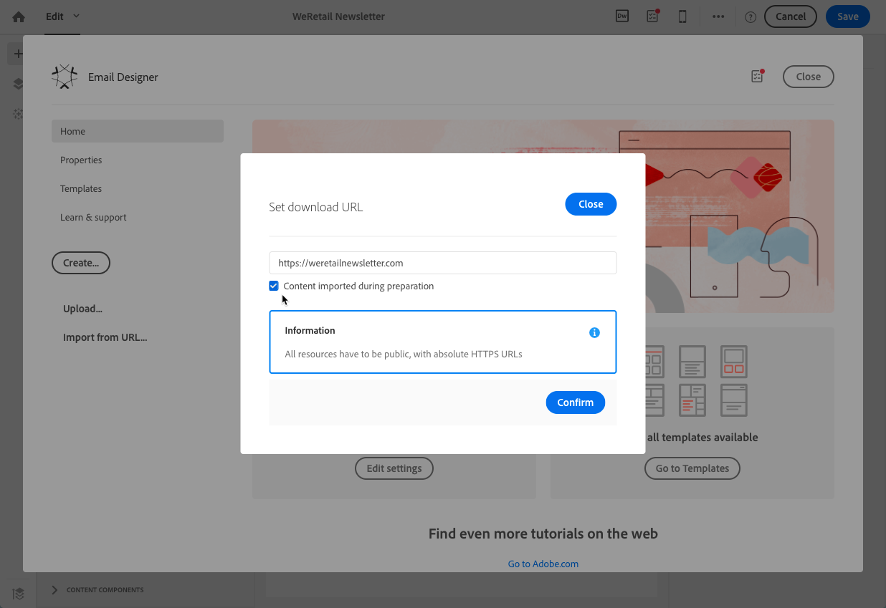

# Importing content from a URL{#importing-content-from-a-url}

從URL匯入內容之前，請先確定其符合下列需求：

* 此URL需要公開提供內容。
* For security reasons, only URLs beginning with **[!UICONTROL https]** are allowed.
* 請確定所有資源(影像、CSS)皆設定在絕對連結和HTTPS中。否則，傳送電子郵件後，就會顯示沒有其資源的鏡像頁面。以下是絕對連結定義的範例：

   ```
   <a href="https://www.mywebsite.com/images/myimage.png">
   ```

>[!NOTE]
>
>從URL載入內容僅適用於電子郵件頻道。

若要擷取現有內容的URL，請遵循下列步驟：

1. From the Email Designer home page, select the **[!UICONTROL Import from URL]** button.

   

1. 定義將擷取內容的URL。
1. Click **[!UICONTROL Confirm]**.

**相關主題：**

[從URL](https://helpx.adobe.com/campaign/kt/acs/using/acs-email-designer-tutorial.html#Workingwithexistingcontent) 影片匯入內容

## Retrieving content from a URL automatically at preparation time {#retrieving-content-from-a-url-automatically-at-preparation-time}

在準備訊息期間從URL匯入內容，可讓您每次準備電子郵件時擷取最新的HTML內容。如此一來，循環電子郵件的內容就隨時在傳送時隨時保持最新狀態。此功能也可讓您建立排程於特定日期的訊息，即使內容尚未準備好。

若要在準備時間擷取內容，請遵循下列步驟：

1. Select the **[!UICONTROL Content imported during preparation]** option.

   

1. URL內容在編輯器中顯示為唯讀。

   >[!CAUTION]
   >
   >在此步驟中，不應考量內容編輯器中的HTML顯示。將會在準備階段中擷取。

1. To preview the URL content that has been retrieved, open the message once it is created then click the **[!UICONTROL Preview]** button.

您可以個人化將擷取內容的遠端URL。若要執行此動作，請執行下列步驟：

1. Click the email label on top of the screen to acces the Email Designer **[!UICONTROL Properties]** tab.
1. Find the **[!UICONTROL Remote URL]** field.

   

1. 插入所需的個人化欄位、內容區塊或動態文字。

   **[!UICONTROL Current date - YYYYMMDD]** 例如，內容區塊可讓您插入當天日期。

   >[!NOTE]
   >
   >The available personalization fields are linked to **Delivery** attributes only (email creation date, status, campaign label...).

