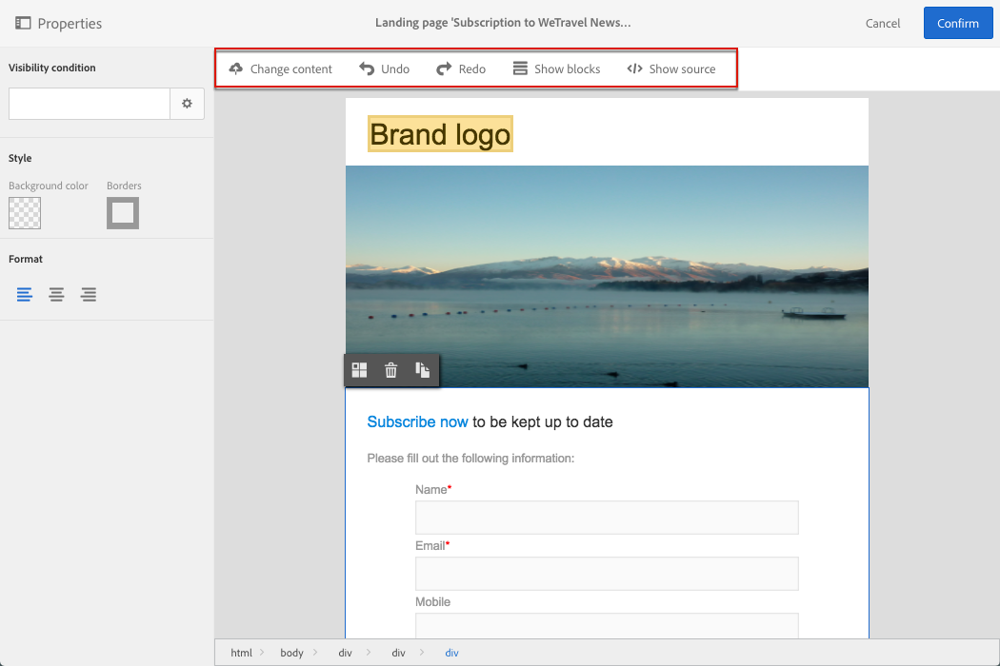

# Landing page content editor interface{#landing-page-content-editor-interface}

著陸頁面內容編輯器可讓您輕鬆定義、修改和個人化Adobe Campaign中的內容。To access it, click the **[!UICONTROL Content]** block in a landing page dashboard.

內容編輯器可分為三個不同區段。這些區段可讓您檢視和編輯內容。

1. The **palette** on the left-hand side of the screen allows you to modify the general options linked to a selected block. 可修改的選項為：背景顏色、邊框、文字對齊、可見度條件等。See [Inserting a personalization field](../../designing/using/inserting-a-personalization-field.md).
1. **動作列** 包含頁面的一般選項。您可以選取範本並變更顯示模式。See [Landing page editor action bar](../../designing/using/landing-page-content-editor-interface.md#landing-page-editor-action-bar).
1. The main **editing zone** allows you to directly interact with the content using the contextual toolbar: insert a link into an image, change the font, delete a field, etc. See [Landing page editor toolbar](../../designing/using/landing-page-content-editor-interface.md#landing-page-editor-toolbar).

## Landing page editor action bar {#landing-page-editor-action-bar}

動作列包含不同的按鈕，可讓您與正在建立的內容互動。

<table> 
 <thead> 
  <tr> 
   <th> Icon  </th> 
   <th> Button name  </th> 
   <th> Channel  </th> 
   <th> Description  </th> 
  </tr> 
 </thead> 
 <tbody> 
  <tr> 
   <td>    </td> 
   <td> 變更內容  </td> 
   <td> Landing page and email  </td> 
   <td> 可讓您選取立即可用的內容，或匯入您自己的HTML內容。Refer to <a href="../../designing/using/selecting-an-existing-content.md">Loading an existing content</a>.  </td> 
  </tr> 
  <tr> 
   <td>    </td> 
   <td> 還原  </td> 
   <td> All  </td> 
   <td> Cancels the last action carried out.  </td> 
  </tr> 
  <tr> 
   <td>    </td> 
   <td> 重做  </td> 
   <td> All  </td> 
   <td> Redoes the last action that you canceled.  </td> 
  </tr> 
  <tr> 
   <td>    </td> 
   <td> 顯示區塊  </td> 
   <td> Landing page and email  </td> 
   <td> Allows you to show the boxes around the content blocks (corresponds to the <strong>&lt;div&gt;</strong> HTML tag).  </td> 
  </tr> 
  <tr> 
   <td>    </td> 
   <td> 顯示來源  </td> 
   <td> Landing page and email  </td> 
   <td> Allows you to show the HTML source code of the page.  </td> 
  </tr> 
 </tbody> 
</table>

## Landing page editor toolbar {#landing-page-editor-toolbar}

The toolbar is a **contextual element** of the editor interface that offers various functionalities depending on the zone selected. 它包含動作按鈕和按鈕，可讓您變更文字樣式。執行的修改一律適用於選取的區域。當您選取區塊後，可以刪除或複製它。在區塊中選取文字後，您可以將它轉換為連結或使其大膽。

>[!CAUTION]
>
>某些工具列函數可讓您格式化HTML內容。However, if the page contains a CSS style sheet, the **instructions** from the style sheet may prove to take **priority** over the instructions specified via the toolbar.

<table> 
 <thead> 
  <tr> 
   <th> Icon  </th> 
   <th> Button name  </th> 
   <th> Context  </th> 
   <th> Description  </th> 
  </tr> 
 </thead> 
 <tbody> 
  <tr> 
   <td>    </td> 
   <td> 連結至外部URL  </td> 
   <td> Any element  </td> 
   <td> 可讓您新增URL連結。<a href="../../designing/using/inserting-a-link.md">插入連結</a> 區段中會顯示如何設定連結的詳細資訊。  </td> 
  </tr> 
  <tr> 
   <td>    </td> 
   <td> 連結至登陸頁面  </td> 
   <td> Any element  </td> 
   <td> 允許存取Adobe Campaign登陸頁面。<a href="../../designing/using/inserting-a-link.md">插入連結</a> 區段中會顯示如何設定連結的詳細資訊。  </td> 
  </tr> 
  <tr> 
   <td>    </td> 
   <td> 訂閱連結  </td> 
   <td> Any element  </td> 
   <td> 可讓您插入服務訂閱連結。<a href="../../designing/using/inserting-a-link.md">插入連結</a> 區段中會顯示如何設定連結的詳細資訊。  </td> 
  </tr> 
  <tr> 
   <td>    </td> 
   <td> 取消訂閱連結  </td> 
   <td> Any element  </td> 
   <td> 可讓您插入服務取消訂閱連結。<a href="../../designing/using/inserting-a-link.md">插入連結</a> 區段中會顯示如何設定連結的詳細資訊。  </td> 
  </tr> 
  <tr> 
   <td>    </td> 
   <td> 移除連結  </td> 
   <td> Link  </td> 
   <td> Allows you to delete the link, as well as all the configurations linked to it, after confirming.  </td> 
  </tr> 
  <tr> 
   <td>    </td> 
   <td> 插入個人化欄位  </td> 
   <td> Text element  </td> 
   <td> 可讓您將欄位從資料庫新增至內容。Refer to <a href="../../designing/using/inserting-a-personalization-field.md">Inserting a personalization field</a>.  </td> 
  </tr> 
  <tr> 
   <td>    </td> 
   <td> 插入內容區塊  </td> 
   <td> Text element  </td> 
   <td> 可讓您新增個人化區塊至內容。Refer to <a href="../../designing/using/adding-a-content-block.md">Adding a content block</a>.  </td> 
  </tr> 
  <tr> 
   <td>    </td> 
   <td> 啓用動態內容  </td> 
   <td> Text element  </td> 
   <td> 可讓您在內容中插入動態內容。Refer to <a href="../../designing/using/defining-dynamic-content-in-a-landing-page.md">Defining dynamic content</a>.  </td> 
  </tr> 
  <tr> 
   <td>    </td> 
   <td> 停用動態內容  </td> 
   <td> Text element  </td> 
   <td> Allows you to delete dynamic content.  </td> 
  </tr> 
  <tr> 
   <td>    </td> 
   <td> 大型字體  </td> 
   <td> Text element  </td> 
   <td> Increases the size of the selected text (adds <strong>&lt;span style="font-size:"&gt;</strong>).  </td> 
  </tr> 
  <tr> 
   <td>    </td> 
   <td> 減少字型  </td> 
   <td> Text element  </td> 
   <td> Reduces the size of the selected text (adds <strong>&lt;span style="font-size:"&gt;</strong>).  </td> 
  </tr> 
  <tr> 
   <td>    </td> 
   <td> 粗體  </td> 
   <td> Text element  </td> 
   <td> Adds the bold style to the selected text (wraps the text with the <strong>&lt;strong&gt;</strong><strong>&lt;/strong&gt;</strong> tags).  </td> 
  </tr> 
  <tr> 
   <td>    </td> 
   <td> 斜體  </td> 
   <td> Text element  </td> 
   <td> Adds the italic style to the selected text (wraps the text with the <strong>&lt;em&gt;</strong><strong>&lt;/em&gt;</strong> tags).  </td> 
  </tr> 
  <tr> 
   <td>    </td> 
   <td> 底線  </td> 
   <td> Text element  </td> 
   <td> Underlines the selected text (wraps the selected text with the <strong>&lt;span style="text-decoration: underline;"&gt;</strong> tag).  </td> 
  </tr> 
  <tr> 
   <td>    </td> 
   <td> 變更背景顏色  </td> 
   <td> Text element  </td> 
   <td> Allows you to change the background color of the block selected (adds style="background-color: rgba(170, 86, 255, 0.87)).  </td> 
  </tr> 
  <tr> 
   <td>    </td> 
   <td> 變更字體顏色  </td> 
   <td> Text element  </td> 
   <td> Allows you to change the color of all the text in the block or just the text selected in the block (<strong>&lt;span style="color: #56ff56;"&gt;</strong>).  </td> 
  </tr> 
  <tr> 
   <td>    </td> 
   <td> 影像  </td> 
   <td> Block containing an image  </td> 
   <td> Allows you to insert an image from a file saved locally.  </td> 
  </tr> 
  <tr> 
   <td>    </td> 
   <td> 刪除  </td> 
   <td> Any block  </td> 
   <td> Deletes the block and its content.  </td> 
  </tr> 
  <tr> 
   <td>    </td> 
   <td> 複製重復  </td> 
   <td> Any block  </td> 
   <td> Duplicates the block including any styles linked to it.  </td> 
  </tr> 
 </tbody> 
</table>

