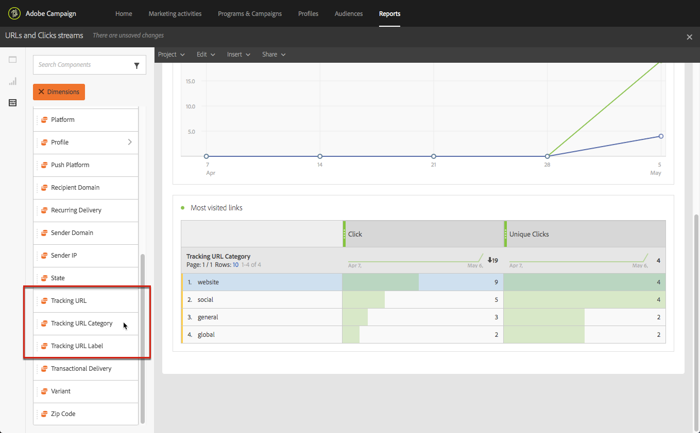

# 新增連結 {#links}

## Inserting a link {#inserting-a-link}

編輯器可讓您將連結插入HTML內容元素，以個人化電子郵件或登陸頁面。

您可以將連結插入任何頁面元素：影像、單詞、單片語、文本塊等。

>[!NOTE]
>
>下圖顯示如何使用電子郵件設計 [器插入](../../designing/using/designing-content-in-adobe-campaign.md) 連結。

1. 從內容相關工具列選 **[!UICONTROL Insert link]** 取元素並按一下。

   

1. 選擇要建立的連結類型：

   * **外部連結**:插入外部URL的連結。

      您可以為URL定義個人化。 請參 [閱個人化URL](../../designing/using/using-reusable-content.md#creating-a-content-fragment)。

   * **著陸頁面**:提供Adobe Campaign登陸頁面的存取權。
   * **訂閱連結**:插入訂閱Adobe Campaign服務的連結。
   * **取消訂閱連結**:插入要取消訂閱Adobe Campaign服務的連結。
   * **定義動作的連結**:定義著陸頁面中的元素被點按時的動作。

      >[!NOTE]
      >
      >此類型的連結僅適用於著陸頁面。

1. 您可以修改顯示給收件者的文字。
1. 您可以在使用者按一下連結時設定瀏覽器行為（例如開啟新視窗）。

   >[!NOTE]
   >
   >定義瀏覽器行為僅適用於登陸頁面。

1. 儲存您的變更。

建立連結後，您仍可從「設定」窗格修改連結。 按一下鉛筆圖示以編輯其參數。

使用電子郵件設計器編 [輯電子郵件時](../../designing/using/designing-content-in-adobe-campaign.md)，您可以輕鬆存取和修改您從列出電子郵件中所包含所有URL的表格中建立的連結。 此清單可讓您集中檢視，並找出電子郵件內容中的每個URL。 若要存取，請參閱關於 [追蹤的URL](#about-tracked-urls)。

>[!NOTE]
>
>無法從此清單修 **改個人化URL** ，例 **如「Mirror page URL** 」（鏡像頁面URL）或「Unsubscription」（取消訂閱）連結。 所有其他連結皆可編輯。

**相關主題**：

* [插入個人化欄位](../../designing/using/personalization.md#inserting-a-personalization-field)
* [新增內容區塊](../../designing/using/personalization.md#adding-a-content-block)
* [定義動態內容](../../designing/using/personalization.md#defining-dynamic-content-in-an-email)

## 關於追蹤的URL {#about-tracked-urls}

Adobe Campaign可讓您在收件者按一下電子郵件中包含的URL時追蹤其行為。 For more on tracking, see [this section](../../sending/using/tracking-messages.md#about-tracking).

動 **[!UICONTROL Links]** 作列中的圖示會自動顯示要追蹤之內容的所有URL清單。

>[!NOTE]
>
>預設會啟用追蹤。 只有在Adobe Campaign中啟用追蹤時，此功能才適用於電子郵件。 For more on the tracking parameters, refer to [this section](../../administration/using/configuring-email-channel.md#tracking-parameters).

每個連結的URL、類別、標籤和追蹤類型都可從此清單中修改。 若要編輯連結，請按一下對應的鉛筆圖示。

對於每個追蹤的URL，您可以將追蹤模式設定為下列其中一個值：

* **追蹤**:在此URL上啟動追蹤。
* **鏡像頁**:認為此URL是鏡像頁面URL。
* **永不**:切勿啟動此URL的追蹤。 此資訊已保存：如果URL在未來的訊息中再次出現，其追蹤會自動停用。
* **選擇退出**:將此URL視為選擇退出或取消訂閱URL。

您也可以停用或啟用每個URL的追蹤。

>[!NOTE]
>
>依預設，Adobe Campaign會追蹤除「鏡像頁面URL」和「取消訂閱」連 **結以外的所有內容****URL** 。

您可以編輯欄位，依訊息中 **[!UICONTROL Category]** 使用的URL而重新分組URL。 這些類別可顯示報表，例如在URL中， [然後按一下串流](../../reporting/using/urls-and-click-streams.md)。

建立報表時，從標 **[!UICONTROL Components]** 簽中選取 **[!UICONTROL Dimension]** 並向下捲動清單以存取追蹤元件。 例如，拖放至工作區 **[!UICONTROL Tracking URL Category]** 以根據每個點按URL的追蹤類別顯示結果。

如需建立自訂報表的詳細資訊，請參 [閱本節](../../reporting/using/about-dynamic-reports.md)。
