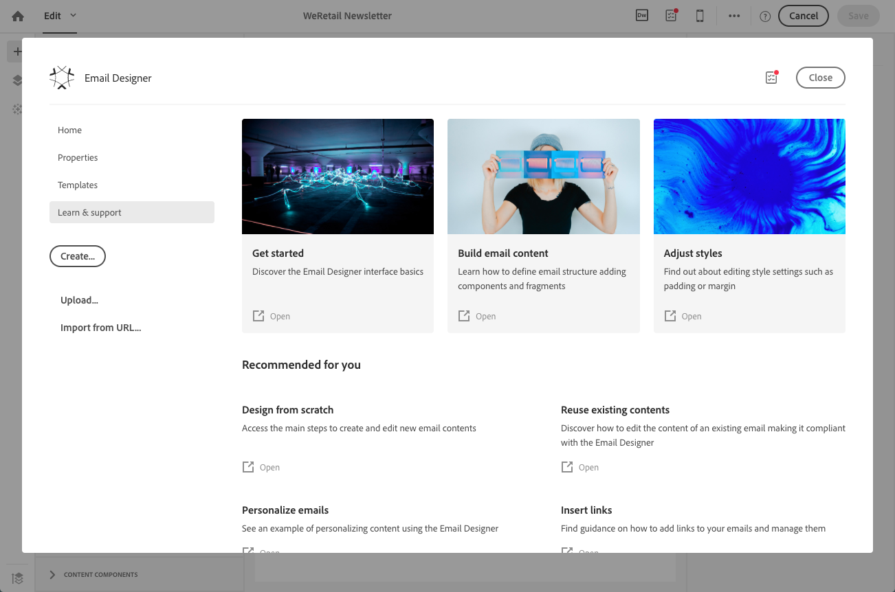

# 使用電子郵件設計工具 {#email-designer}

## 電子郵件設計人員概觀 {#about-the-email-designer}

電子郵件設計工具可讓您建立電子郵件內容和電子郵件內容範本。 它可與簡單電子郵件、交易電子郵件、A/B測試電子郵件、多語言電子郵件和循環電子郵件相容。

若要開始使用電子郵件設計工具，請觀 [看這組影片](https://helpx.adobe.com/campaign/kt/acs/using/acs-email-designer-tutorial.html#GettingStarted) ，其中說明電子郵件設計工具的一般功能，以及如何從頭開始或使用範本來設計電子郵件。

### 電子郵件設計人員首頁 {#email-designer-home-page}

建立 [電子郵件時](../../channels/using/creating-an-email.md), **[!UICONTROL Email Designer]** 首頁會在選取電子郵件內容時自動顯示。

此標 **[!UICONTROL Properties]** 簽可讓您編輯電子郵件詳細資訊，例如標籤、寄件者的地址和名稱，或電子郵件主旨。 您也可以按一下畫面上方的電子郵件標籤，以存取此標籤。

此標 **[!UICONTROL Templates]** 簽可讓您從現成可用的HTML內容或您已建立的範本中選擇，以快速開始設計電子郵件。 請參閱 [內容範本](../../designing/using/using-reusable-content.md#content-templates)。

此標 **[!UICONTROL Learn & support]** 簽可讓您輕鬆存取相關檔案和教學課程。

如果您未選擇模板，「電子郵件設計器」首頁還允許您選擇開始設計內容的方式：

* 按一下 **[!UICONTROL Create]** 按鈕，從頭開始新內容。 請參 [閱從頭設計電子郵件內容](../../designing/using/designing-from-scratch.md#designing-an-email-content-from-scratch)。
* 按一下按 **[!UICONTROL Upload]** 鈕，從您的電腦上傳檔案。 請參 [閱從檔案匯入內容](../../designing/using/using-existing-content.md#importing-content-from-a-file)。
* 按一下按 **[!UICONTROL Import from URL]** 鈕，從URL擷取現有內容。 請參 [閱從URL匯入內容](../../designing/using/using-existing-content.md#importing-content-from-a-url)。

### 電子郵件設計人員介面 {#email-designer-interface}

「電子郵件設計工具」提供許多選項，可讓您建立、編輯和自訂內容的每個方面。

該介面由幾個提供不同功能的領域組成：

從浮動視窗 **(1)中可用的元素，將結構元件和內容片段拖放至主** 工作區 **** (2)。 在工作區(2)中選取元件 **或元素** ，並從「設定」窗格(3)自訂其主樣式和 **** 顯示特性。

從主工具列(4)存取更一般的 **選項** 和設定。

>[!NOTE]
>
>「設 **定** 」窗格可依螢幕解析度向左移動並顯示。

編輯 **器介面的** 「上下文」工具欄根據所選區域提供各種功能。 它包含可讓您變更文字樣式的動作按鈕和按鈕。 所執行的修改一律適用於選取的區域。

### 術語 {#terminology}

**範本**:範本是電子郵件的結構，您可以建立並重複用於數個傳送。

**片段**:片段是可重複使用的元件，可在一或多封電子郵件中參考。

**結構元件**:定義電子郵件佈局的結構元素

**內容元件**:內容元件是原始的空白元件，放入電子郵件後，您就可以編輯這些元件。

### 內容設計最佳範例 {#content-design-best-practices}

若要正確使用電子郵件設計人員並盡可能輕鬆地建立最佳電子郵件，建議您套用下列原則：

* 在HTML的&lt;head&gt;區段中使用內嵌樣式，而不是個別的CSS和CSS。 使用內嵌樣式，您就可以最佳化內容片段的儲存和重複使用。

   請參 [閱添加內嵌樣式屬性](../../designing/using/styles.md#adding-inline-styling-attributes)。

* 如果您匯入包含HTML內容的ZIP檔案，請使用一般的CSS。 不支援SCSS樣式表。

* 建立和重複使用內容片段，讓行銷活動保持一致性，輕鬆解決您的品牌需求。

   請參 [閱建立內容片段](../../designing/using/using-reusable-content.md#creating-a-content-fragment)。

* 編輯電子郵件 **內容時**:

   在傳送訊息之前先預覽訊息。 Adobe Campaign提供了使用Litmus測試電子郵件轉譯的方法。 如需詳細資訊，請參閱「電子郵 [件轉換」](../../sending/using/email-rendering.md)。

有關訊息的更多設計與一般最佳實務，請參閱下列Adobe Campaign逐步指南：使 [用Adobe Campaign提供最佳實務](https://docs.campaign.adobe.com/doc/standard/getting_started/en/ACS_DeliveryBestPractices.html)。

### 電子郵件設計人員限制 {#email-designer-limitations}

* 您無法在片段中使用個人化欄位。 如需片段的詳細資訊，請參 [閱本節](../../designing/using/using-reusable-content.md#about-fragments)。
<!--* You cannot save directly as a fragment some content of an email that you are editing within the Email Designer. You need to copy-paste the HTML corresponding to that content into a new fragment. For more on this, see [Saving content as a fragment](../../designing/using/using-reusable-content.md#saving-content-as-a-fragment).-->
* 在編輯樣式時，只有大多數電子郵件用戶端正式支援的網頁字型才可用。
* 樣式無法儲存為主題，以供日後重複使用。 不過，CSS樣式可以儲存在內容範本或電子郵件中。 有關樣式的更多資訊，請參 [閱本節](../../designing/using/styles.md)。

### 更新片段 {#email-designer-updates}

電子郵件設計人員正在不斷改進。 如果您從頭開始、從現成可用的範本建立電子郵件內容，或者如果您建立片段，下次您開啟內容時可能會收到下列更新訊息：

Adobe建議將您的內容更新至最新版本，以避免發生CSS衝突等問題。 Click **[!UICONTROL Update now]**.

如果內容更新期間發生錯誤，請檢查HTML並修正它，然後再次執行此更新。

有關片段，請注意下列事項：

* 如果您想要將片段新增至新電子郵件或範本，而且如果您收到此訊息，則需要先更新此片段。

* 如果您有多個片段，則必須更新您想在電子郵件內容中使用的每個片段。

* 為避免對目前尚未準備的電子郵件訊息造成影響，您可以選擇不更新某些片段。

* 您仍可傳送電子郵件，其中已使用未更新的片段，但該片段不可編輯。

* 更新已準備好的電子郵件中使用的片段，不會對這些電子郵件造成影響。