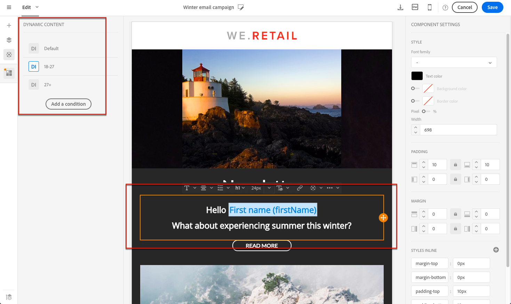
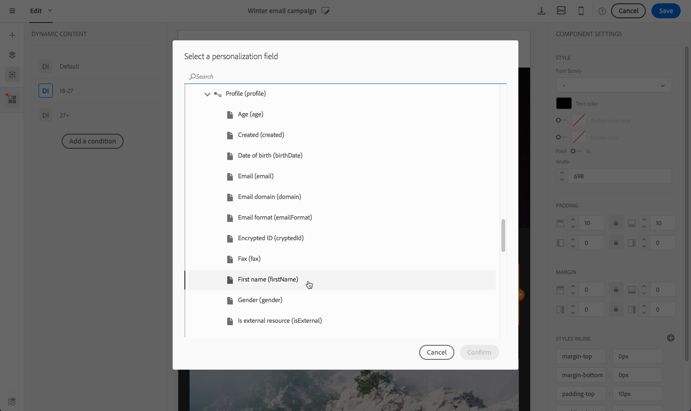

# 個人化電子郵件內容 {#personalization}

Adobe Campaign所傳遞的資訊的內容和顯示可以通過多種不同的方式進行個性化。 這些方式可根據特徵線的條件組合。 一般而言，Adobe Campaign 允許您：

* 插入動態的個人化欄位。請參閱[插入個人化欄位](#inserting-a-personalization-field)。
* 插入預定義的個人化區塊。
請參閱[新增內容區塊](#adding-a-content-block)。
* 個性化電子郵件的發件人。 請參閱 [個性化發件人](#personalizing-the-sender)。
* 個性化電子郵件主題。 請參閱 [個性化電子郵件的主題行](../../designing/using/subject-line.md#subject-line)。
* 建立有條件的內容。請參閱 [在電子郵件中定義動態內容](#defining-dynamic-content-in-an-email)。

## 個性化發件人 {#personalizing-the-sender}

要定義將出現在已發送郵件標題中的發件人名稱，請轉到 **[!UICONTROL Properties]** 的子菜單。 有關此的詳細資訊，請參閱 [定義電子郵件的發件人](../../designing/using/subject-line.md#email-sender)。

您可以通過按一下 **發件人名稱** 框。 然後，該欄位將變為可編輯欄位，您可以輸入要使用的名稱。

此欄位可以個性化。 為此，可以通過按一下發件人名稱下方的表徵圖來添加個性化欄位、內容塊和動態內容。

>[!NOTE]
>
>標頭參數不能為空。 發送者地址是允許發送電子郵件（RFC標準）的必需地址。 Adobe Campaign檢查輸入的電子郵件地址的語法。

## 個性化URL{#personalizing-urls}

Adobe Campaign允許您通過向郵件中添加個性化欄位、內容塊或動態內容來個性化郵件中的一個或多個URL。 操作步驟：

1. 插入外部URL並指定其參數。 請參閱 [插入連結](../../designing/using/links.md#inserting-a-link)。
1. 如果未顯示，請按一下「設定」窗格中選定URL旁邊的鉛筆以訪問個性化選項。
1. 添加要使用的個性化欄位、內容塊和動態內容。

   

1. 儲存您的變更。

>[!NOTE]
>
>禁用用於跟蹤連結的URL簽名機制時，個性化URL不能應用於域名或URL擴展。 如果個性化設定不正確，則在消息分析期間將顯示錯誤消息。
>
>選擇內容塊時，不允許您選擇元素，如 **連結到鏡像頁**。 此類塊在連結內被禁止。

## 插入個人化欄位{#inserting-a-personalization-field}

Adobe Campaign允許您將資料庫中的欄位插入頁面，如配置檔案的名字。

>[!NOTE]
>
>下圖顯示了如何使用 [電子郵件設計器](../../designing/using/designing-content-in-adobe-campaign.md) 郵件。

要向內容添加個性化欄位：

1. 在文本塊內按一下，按一下 **[!UICONTROL Personalize]** 表徵圖，然後選擇 **[!UICONTROL Insert personalization field]**。 有關電子郵件設計器介面的詳細資訊，請參見 [此部分](../../designing/using/designing-content-in-adobe-campaign.md#email-designer-interface)。

   

1. 選擇要插入到頁面內容中的欄位。

   

1. 按一下&#x200B;**[!UICONTROL Confirm]**。

欄位名稱將顯示在編輯器中，並會突出顯示。

生成個性化設定後（例如，在預覽和準備電子郵件時），此欄位將替換為與目標配置檔案對應的值。

>[!NOTE]
>
>如果從工作流建立電子郵件，則在工作流中計算的附加資料也可以在個性化欄位中使用。 有關從工作流添加其他資料的詳細資訊，請參閱 [豐富資料](../../automating/using/about-targeting-activities.md#enriching-data) 的子菜單。

## 添加內容塊{#adding-a-content-block}

Adobe Campaign提供預配置內容塊的清單。 這些內容塊是動態的、個性化的並具有特定的呈現。 例如，可以添加問候語或鏡像頁面的連結。

>[!NOTE]
>
>下圖顯示了如何使用 [電子郵件設計器](../../designing/using/designing-content-in-adobe-campaign.md) 郵件。

添加內容塊：

1. 在文本塊內按一下，按一下 **[!UICONTROL Personalize]** 表徵圖，然後選擇 **[!UICONTROL Insert content block]**。 有關電子郵件設計器介面的詳細資訊，請參見 [此部分](../../designing/using/designing-content-in-adobe-campaign.md#email-designer-interface)。

   

1. 選擇要插入的內容塊。 可用的塊因上下文（電子郵件或登錄頁）而異。

   

1. 按一下&#x200B;**[!UICONTROL Save]**。

內容塊的名稱顯示在編輯器中，並以黃色突出顯示。 當生成個性化時，它將自動適應配置檔案。

現成內容塊包括：

* **[!UICONTROL Database URL in emails (EmailUrlBase)]**:此內容塊只能用於 **交貨**。
* **[!UICONTROL Mirror page URL (MirrorPageUrl)]**:此內容塊只能用於 **交貨**。
* **[!UICONTROL Link to mirror page (MirrorPage)]**:此內容塊只能用於 **交貨**。
* **[!UICONTROL Greetings (Greetings)]**
* **[!UICONTROL Unsubscription link (UnsubscriptionLink)]**:此內容塊只能用於 **交貨**。
* **[!UICONTROL Social network sharing links (LandingPageViralLinks)]**:此內容塊只能用於 **登錄頁**。
* **[!UICONTROL Default sender name (DefaultSenderName)]**:此內容塊只能用於 **交貨**。
* **[!UICONTROL Name of default reply-to email address (DefaultReplyName)]**:此內容塊只能用於 **交貨**。
* **[!UICONTROL Email address of default sender (DefaultSenderAddress)]**:此內容塊只能用於 **交貨**。
* **[!UICONTROL Default error email address (DefaultErrorAddress)]**:此內容塊只能用於 **交貨**。
* **[!UICONTROL Default reply-to email address (DefaultReplyAddress)]**:此內容塊只能用於 **交貨**。
* **[!UICONTROL Brand name (BrandingUsualName)]**
* **[!UICONTROL Link to the brand website (BrandingWebSiteLink)]**
* **[!UICONTROL Brand logo (BrandingLogo)]**
* **[!UICONTROL Notification style (notificationStyle)]**

### 建立自定義內容塊 {#creating-custom-content-blocks}

您可以定義將插入到消息或登錄頁的新內容塊。

要建立內容塊，請執行以下步驟：

1. 按一下 **[!UICONTROL Resources > Content blocks]** 的子菜單。
1. 按一下 **[!UICONTROL Create]** 按鈕或複製預先存在的內容塊。

   

1. 輸入標籤。
1. 選擇塊的 **[!UICONTROL Content type]**。 有三種可用選項：

   * **[!UICONTROL Shared]**:該內容塊可用於遞送或登錄頁。
   * **[!UICONTROL Delivery]**:該內容塊只能用在遞送中。
   * **[!UICONTROL Landing page]**:內容塊只能在登錄頁中使用。

   

1. 可以選擇 **[!UICONTROL Targeting dimension]**。 有關此的詳細資訊，請參閱 [關於目標維](#about-targeting-dimension)。

   

1. 可以選擇 **[!UICONTROL Depends on format]** 選項，定義兩個不同的塊：一個用於HTML電子郵件，一個用於文本格式的電子郵件。 然後，編輯器(HTML和文本)中將顯示兩個頁籤，以定義相應的內容。

   

1. 輸入內容塊的內容，然後按一下 **[!UICONTROL Create]** 按鈕

您的內容塊現在可以在消息或登錄頁的內容編輯器中使用。

>[!CAUTION]
>
>編輯塊的內容時，請確保在塊的開頭和結尾之間沒有額外的空格 *如果* 的下界。 在HTML中，白色空格會顯示在螢幕上，因此它們會影響內容佈局。

### 關於目標維 {#about-targeting-dimension}

目標維使您能夠定義可以使用內容塊的消息類型。 這是為了防止在消息中使用不適當的塊，這可能導致錯誤。

實際上，在編輯消息時，您只能選擇具有與該消息的目標維相容的目標維的內容塊。

例如， **[!UICONTROL Unsubscription link]** 塊的目標維度為 **[!UICONTROL Profiles]** 因為它包含特定於個人化的欄位 **[!UICONTROL Profiles]** 資源。 因此，您不能使用 **[!UICONTROL Unsubscription link]** 在 [事件事務消息](../../channels/using/getting-started-with-transactional-msg.md#transactional-message-types)，因為該類型消息的目標維度為 **[!UICONTROL Real-time events]**。 但是，您可以使用 **取消訂閱連結** 在 [配置檔案事務性消息](../../channels/using/getting-started-with-transactional-msg.md#transactional-message-types)，因為該類型消息的目標維度為 **配置檔案**。 最後， **[!UICONTROL Link to mirror page]** 塊沒有目標維，因此您可以在任何消息中使用它。

如果將此欄位留空，則無論目標維是什麼，內容塊都將與所有消息相容。 如果設定了目標維，則該塊將僅與具有相同目標維的消息相容。

如需詳細資訊，請參閱[目標維度和資源](../../automating/using/query.md#targeting-dimensions-and-resources)。

**相關主題：**

* [插入個人化欄位](#inserting-a-personalization-field)
* [添加內容塊](#adding-a-content-block)
* [在電子郵件中定義動態內容](#defining-dynamic-content-in-an-email)

## 個性化影像源{#personalizing-an-image-source}

Adobe Campaign允許您根據特定標準個性化郵件中的一個或多個影像或使用跟蹤。 這是通過將個性化欄位、內容塊或動態內容插入影像源中來完成的。 操作步驟：

1. 將影像插入郵件內容，或選擇已存在的影像。
1. 在影像屬性調色板中，檢查 **[!UICONTROL Enable personalization]** 的雙曲餘切值。

   

   的 **[!UICONTROL Source]** 顯示欄位，選定的影像顯示為 **個性化** 的雙曲餘切值。

1. 按一下「Comple(C)」旁邊的鉛筆 **[!UICONTROL Source]** 的子菜單。
1. 添加影像源後，添加您喜歡的個性化欄位、內容塊和動態內容。

   

   >[!NOTE]
   >
   >域名(http://mydomain.com)無法個性化，必須手動輸入。 URL的其餘部分可以個性化。 例如：http://mydomain.com/ `[Gender]` .jpg

1. 確認您的變更。

## 條件式內容 {#conditional-content}

### 定義可見性條件{#defining-a-visibility-condition}

可以在任何元素上指定可見性條件。 只有在符合條件時才可見。

要添加可見性條件，請選擇一個塊，然後輸入要在 **[!UICONTROL Visibility condition]** 欄位。

此選項僅適用於以下元素：ADDRESS、BLOCKQUOTE、CENTER、DIR、DIV、DL、FIELDSET、FORM、H1、H2、H3、H4、H5、H6、NOSCRIPT、OL、P、PRE、UL、TR、TD。

表達式編輯器顯示在 [高級表達式編輯](../../automating/using/editing-queries.md#about-query-editor) 的子菜單。

這些條件採用XTK表達式語法(如 **context.profile.email!=&quot;** 或 **context.profile.status=&#39;0&#39;**)。 預設情況下，所有欄位都可見。

>[!NOTE]
>
>無法為已包含具有動態內容的子元素的塊或已構成動態內容的塊定義條件。 無法編輯下拉清單等不可見的動態塊。

### 在電子郵件中定義動態內容{#defining-dynamic-content-in-an-email}

>[!CONTEXTUALHELP]
>id="ac_dynamic_content"
>title="定義動態內容"
>abstract="根據您要定義的條件，定義將僅顯示給部分設定檔的不同內容。"

在電子郵件中，您可以根據通過表達式編輯器定義的條件來定義將動態顯示給收件人的不同內容。 例如，從同一封電子郵件中，您可以確保每個配置檔案根據其年齡範圍接收不同的消息。

定義動態內容與 [定義可視性條件](#defining-a-visibility-condition)。

1. 選擇片段、元件或元素。 在此示例中，選擇一個影像。
1. 按一下 **[!UICONTROL Dynamic content]** 表徵圖。

   

   的 **[!UICONTROL Dynamic content]** 的下界。

   

   預設情況下，本節包含兩個元素：預設變型和新變型。

   >[!NOTE]
   >
   >內容必須始終具有預設變型。 不能刪除它。

1. 按一下 **[!UICONTROL Edit]** 按鈕，來定義第一個可選變型的顯示條件。

   

1. 指定標籤並選擇要設定為條件的欄位。 例如，從 **[!UICONTROL General]** 節點，選擇 **[!UICONTROL Age]** 場

   

1. 設定篩選條件。 例如，您希望向18至25歲的人顯示不同的內容。

   

1. 設定所有條件後，定義應用條件的優先順序順序並保存更改。

   

   內容將按優先順序從上到下顯示在調色板中。 有關優先順序的詳細資訊，請參閱 [此部分](#defining-dynamic-content-in-an-email)。

1. 上載剛定義的變體的新影像。

   

   18至25歲的接受者將看到新的影像。

   

1. 按一下 **[!UICONTROL Add a condition]** 以添加新內容及其連結規則。

   

   例如，您可以添加一個不同的影像，以便顯示給26歲到35歲之間的人。

1. 同樣，對於要動態顯示的電子郵件中的任何其他元素，請繼續。 可以是文本、按鈕、片段等。 儲存您的變更。

>[!CAUTION]
>
>在準備好消息後，在發送消息之前，請使用證據test它。 如果不執行此操作，則可能未檢測到某些錯誤，並且可能未發送電子郵件。

**相關主題：**

* [傳送校樣](../../sending/using/sending-proofs.md)
* [進階運算式編輯](../../automating/using/editing-queries.md#about-query-editor)

### 優先順序 {#order-of-priority}

在表達式編輯器中，定義動態內容時，優先順序順序如下。

1. 可定義兩個不同的動態內容 **兩種不同的條件**，例如：

   **條件1:** 側寫的性別是男性化的，

   **條件2:** 檔案的年齡在20到30歲之間。

   

   資料庫中的某些配置檔案符合這兩種情況，但只能發送一封包含一個動態內容的電子郵件。

1. 因此，必須定義動態內容的優先順序。 優先順序順序為 **1** 即使優先順序順序為 **2** 或 **3** 也由此配置檔案滿足。

   

每個動態內容只能定義一個優先順序順序。

## 示例：電子郵件個性化{#example-email-personalization}

在此示例中，營銷服務團隊的一名成員建立了一封電子郵件，通知其中一些客戶只有他們才有特別優惠。 團隊成員決定根據客戶各自的年齡對電子郵件進行個性化設定。 年齡在18歲至27歲之間的客戶將收到一封電子郵件，其中包含不同的影像和口號，這些客戶將收到27歲以上的客戶。

電子郵件的建立方式如下：

* 將動態內容應用到影像，並且根據年齡範圍配置這些動態內容。

   

   添加和配置動態內容詳情請參見 [在電子郵件中定義動態內容](#defining-dynamic-content-in-an-email) 的子菜單。

* 個性化欄位和動態內容被應用到文本。 根據配置檔案的年齡範圍，電子郵件以配置檔案的名稱或配置檔案的標題和姓氏開頭。

   

   添加和配置個性化欄位的詳細資訊請參閱 [插入個性化欄位](#inserting-a-personalization-field) 的子菜單。

### 配置映像 {#configuring-images}

>[!CONTEXTUALHELP]
>id="ac_dynamic_image"
>title="管理動態影像"
>abstract="根據您要定義的條件，使用動態影像將您的電子郵件個人化。"

在本示例中，應用於影像的動態內容配置如下：

**針對18-27歲兒童：**

1. 選擇 **[!UICONTROL Properties]** 調色板並按一下 **[!UICONTROL Edit]** 按鈕

   

1. 編輯標籤，然後選擇 **[!UICONTROL Age]** 的 **[!UICONTROL Profile]** 的下界。

   

1. 選擇 **大於或等於** 然後輸入 **18** 建立 **18歲以上** 表達式。

   

1. 添加新 **[!UICONTROL Age]** 的子菜單。

   選擇 **小於或等於** 在「值」欄位中，運算子後跟27以建立 **27歲以下** 表達式。

   

1. 確認您的變更。

**要針對27歲及以上的配置檔案：**

1. 從調色板中選擇動態內容並對其進行編輯。
1. 編輯標籤，然後選擇 **[!UICONTROL Age]** 的 **[!UICONTROL Profile]** 的下界。
1. 添加 **大於** 在「值」欄位中，運算子後跟27以建立 **27歲以上** 表達式。

   

1. 確認您的變更。

您的動態內容已正確配置。

### 配置文本 {#configuring-text}

在本示例中，應用於文本的動態內容配置如下：

**要針對18-27之間的陳舊配置檔案：**

1. 選擇所需的結構元件並添加動態內容。
1. 編輯動態內容並配置目標表達式。 請參閱 [配置映像](#configuring-images)。
1. 在結構元件中，在所需位置按一下 **[!UICONTROL Personalize]** 表徵圖，然後選擇 **[!UICONTROL Insert personalization field]**。

   

1. 在顯示的清單中，選擇 **[!UICONTROL First name]** 確認。

   

1. 然後，您的個性化欄位將完全插入選定的動態內容中。

**要針對27歲及以上的配置檔案：**

1. 選擇所需的結構元件並添加動態內容。
1. 編輯動態內容並配置目標表達式。 請參閱 [配置映像](#configuring-images)。
1. 在結構元件中，在所需位置按一下 **[!UICONTROL Personalize]** 表徵圖，然後選擇 **[!UICONTROL Insert personalization field]**。
1. 選擇 **[!UICONTROL Title]** 從下拉清單中。
1. 同樣繼續添加 **[!UICONTROL Last name]** 的子菜單。

   

您的個性化欄位現在應完美地插入到所選的動態內容中。

### 預覽電子郵件 {#previewing-emails}

預覽允許您在發送個性化欄位和動態內容之前檢查是否正確配置了 **[!UICONTROL Proofs]**。 在預覽過程中，可以選擇與電子郵件目標對應的不同test配置檔案。

如果沒有test配置檔案，預設顯示的電子郵件為：

該電子郵件在口號中沒有個性化欄位，並且使用預設影像。

第一test簡檔對應於年齡在18到27歲之間的客戶。 通過選擇此配置檔案，將顯示以下電子郵件：

與18-27年前的表達式（具體是配置檔案的名稱）對應的個性化欄位被正確配置，並且影像也根據配置檔案而改變。

第二個配置檔案對應於年齡超過27歲的客戶端，並生成以下電子郵件：

影像因為動態內容而發生了改變，而出現的口號正是為這個目標公眾定義的更正式的口號。

**相關主題：**

* [建立對象](../../audiences/using/creating-audiences.md)
* [準備傳送](../../sending/using/preparing-the-send.md)
