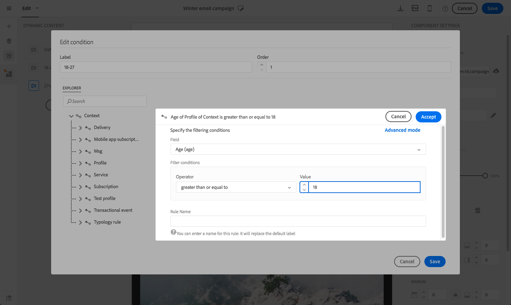

# 個人化電子郵件內容 {#personalization}

Adobe Campaign傳送的訊息內容和顯示可透過數種不同方式個人化。 根據設定檔，可根據條件結合這些方式。 一般而言，Adobe Campaign 允許您：

* 插入動態的個人化欄位。請參閱[插入個人化欄位](#inserting-a-personalization-field)。
* 插入預定義的個人化區塊。
請參閱[新增內容區塊](#adding-a-content-block)。
* 個人化電子郵件的寄件者。 請參閱 [個人化寄件者](#personalizing-the-sender).
* 個人化電子郵件的主旨。 請參閱 [個人化電子郵件的主旨行](../../designing/using/subject-line.md#subject-line).
* 建立有條件的內容。請參閱 [定義電子郵件中的動態內容](#defining-dynamic-content-in-an-email).

## 個人化寄件者 {#personalizing-the-sender}

要定義將顯示在發送郵件標題中的發件人名稱，請轉至 **[!UICONTROL Properties]** 電子郵件設計工具首頁的索引標籤（可透過首頁圖示存取）。 有關詳細資訊，請參閱 [定義電子郵件的寄件者](../../designing/using/subject-line.md#email-sender).

您可以按一下 **寄件者名稱** 封鎖。 欄位隨後變成可編輯，您可以輸入要使用的名稱。

此欄位可個人化。 若要這麼做，您可以按一下寄件者名稱下方的圖示，以新增個人化欄位、內容區塊和動態內容。

>[!NOTE]
>
>標題參數不得為空。 發送者的地址是強制性的，以允許發送電子郵件（RFC標準）。 Adobe Campaign會檢查輸入之電子郵件地址的語法。

## 個人化URL{#personalizing-urls}

Adobe Campaign可讓您透過新增個人化欄位、內容區塊或動態內容，個人化訊息中的一或多個URL。 操作步驟：

1. 插入外部URL並指定其參數。 請參閱 [插入連結](../../designing/using/links.md#inserting-a-link).
1. 如果未顯示，請按一下「設定」窗格中所選URL旁的鉛筆，以存取個人化選項。
1. 新增您要使用的個人化欄位、內容區塊和動態內容。

   

1. 儲存您的變更。

>[!NOTE]
>
>停用追蹤連結的URL簽章機制時，個人化URL無法套用至網域名稱，也無法套用至URL擴充功能。 如果個人化不正確，則在訊息分析期間會顯示錯誤訊息。
>
>選取內容區塊時，不允許選取元素，例如 **鏡像頁面的連結**. 此類型的區塊在連結內是禁止的。

## 插入個人化欄位{#inserting-a-personalization-field}

Adobe Campaign可讓您將資料庫的欄位插入頁面，例如設定檔的名字。

>[!NOTE]
>
>下圖顯示如何使用 [電子郵件設計工具](../../designing/using/designing-content-in-adobe-campaign.md) 以取得電子郵件。

若要將個人化欄位新增至內容：

1. 按一下文字區塊內部，按一下 **[!UICONTROL Personalize]** 圖示並選取 **[!UICONTROL Insert personalization field]**. 如需電子郵件設計工具介面的詳細資訊，請參閱 [本節](../../designing/using/designing-content-in-adobe-campaign.md#email-designer-interface).

   

1. 選取您要插入至頁面內容的欄位。

   

1. 按一下&#x200B;**[!UICONTROL Confirm]**。

欄位名稱會顯示在編輯器中，並反白顯示。

產生個人化後（例如，預覽和準備電子郵件時），此欄位將會取代為目標設定檔對應的值。

>[!NOTE]
>
>如果電子郵件是從工作流程建立，工作流程中計算的其他資料也可在個人化欄位中使用。 如需從工作流程新增其他資料的詳細資訊，請參閱 [擴充資料](../../automating/using/about-targeting-activities.md#enriching-data) 區段。

## 新增內容區塊{#adding-a-content-block}

Adobe Campaign提供預先設定的內容區塊清單。 這些內容區塊是動態、個人化的，且會有特定的轉譯。 例如，您可以新增問候語或鏡像頁面的連結。

>[!NOTE]
>
>下圖顯示如何使用 [電子郵件設計工具](../../designing/using/designing-content-in-adobe-campaign.md) 以取得電子郵件。

若要新增內容區塊：

1. 按一下文字區塊內部，按一下 **[!UICONTROL Personalize]** 圖示並選取 **[!UICONTROL Insert content block]**. 如需電子郵件設計工具介面的詳細資訊，請參閱 [本節](../../designing/using/designing-content-in-adobe-campaign.md#email-designer-interface).

   

1. 選取您要插入的內容區塊。 可用的區塊會依內容（電子郵件或登錄頁面）而異。

   

1. 按一下&#x200B;**[!UICONTROL Save]**。

內容區塊的名稱會顯示在編輯器中，並以黃色強調顯示。 它會在產生個人化時自動調整至設定檔。

現成的內容區塊包括：

* **[!UICONTROL Database URL in emails (EmailUrlBase)]**:此內容區塊僅可用於 **傳遞**.
* **[!UICONTROL Mirror page URL (MirrorPageUrl)]**:此內容區塊僅可用於 **傳遞**.
* **[!UICONTROL Link to mirror page (MirrorPage)]**:此內容區塊僅可用於 **傳遞**.
* **[!UICONTROL Greetings (Greetings)]**
* **[!UICONTROL Unsubscription link (UnsubscriptionLink)]**:此內容區塊僅可用於 **傳遞**.
* **[!UICONTROL Social network sharing links (LandingPageViralLinks)]**:此內容區塊僅可用於 **登陸頁面**.
* **[!UICONTROL Default sender name (DefaultSenderName)]**:此內容區塊僅可用於 **傳遞**.
* **[!UICONTROL Name of default reply-to email address (DefaultReplyName)]**:此內容區塊僅可用於 **傳遞**.
* **[!UICONTROL Email address of default sender (DefaultSenderAddress)]**:此內容區塊僅可用於 **傳遞**.
* **[!UICONTROL Default error email address (DefaultErrorAddress)]**:此內容區塊僅可用於 **傳遞**.
* **[!UICONTROL Default reply-to email address (DefaultReplyAddress)]**:此內容區塊僅可用於 **傳遞**.
* **[!UICONTROL Brand name (BrandingUsualName)]**
* **[!UICONTROL Link to the brand website (BrandingWebSiteLink)]**
* **[!UICONTROL Brand logo (BrandingLogo)]**
* **[!UICONTROL Notification style (notificationStyle)]**

### 建立自訂內容區塊 {#creating-custom-content-blocks}

您可以定義要插入訊息或登錄頁面的新內容區塊。

若要建立內容區塊，請依照下列步驟操作：

1. 按一下 **[!UICONTROL Resources > Content blocks]** 從進階功能表存取內容區塊清單。
1. 按一下 **[!UICONTROL Create]** 按鈕或複製預先存在的內容區塊。

   

1. 輸入標籤。
1. 選取區塊的 **[!UICONTROL Content type]**. 有三種可用選項：

   * **[!UICONTROL Shared]**:內容區塊可用於傳遞或登錄頁面。
   * **[!UICONTROL Delivery]**:內容區塊只能用於傳送。
   * **[!UICONTROL Landing page]**:內容區塊只能用於登錄頁面。

   

1. 您可以選取 **[!UICONTROL Targeting dimension]**. 有關詳細資訊，請參閱 [關於目標維度](#about-targeting-dimension).

   

1. 您可以選取 **[!UICONTROL Depends on format]** 定義兩個不同區塊的選項：一個用於HTML電子郵件，一個用於文字格式的電子郵件。 然後編輯器中會顯示兩個索引標籤(HTML和文字)，以定義對應的內容。

   

1. 輸入內容區塊的內容，然後按一下 **[!UICONTROL Create]** 按鈕。

您的內容區塊現在可用於訊息或登錄頁面的內容編輯器中。

>[!CAUTION]
>
>編輯區塊的內容時，請確定開頭和結尾之間沒有額外的空格 *if* 報表。 在HTML中，螢幕上會顯示空白字元，因此會影響您的內容配置。

### 關於目標維度 {#about-targeting-dimension}

目標維度可讓您定義可以使用內容區塊的訊息類型。 這是為了防止在訊息中使用不適當的區塊，而可能導致錯誤。

事實上，在編輯訊息時，您只能選取具有與訊息的目標維度相容的目標維度的內容區塊。

例如， **[!UICONTROL Unsubscription link]** 區塊的目標維度為 **[!UICONTROL Profiles]** 因為它包含特定於的個人化欄位 **[!UICONTROL Profiles]** 資源。 因此，您無法使用 **[!UICONTROL Unsubscription link]** 在 [事件交易式訊息](../../channels/using/getting-started-with-transactional-msg.md#transactional-message-types)，因為該類型訊息的目標維度為 **[!UICONTROL Real-time events]**. 不過，您可以使用 **取消訂閱連結** 在 [設定檔交易式訊息](../../channels/using/getting-started-with-transactional-msg.md#transactional-message-types)，因為該類型訊息的目標維度為 **設定檔**. 最後， **[!UICONTROL Link to mirror page]** 區塊沒有目標維度，因此您可以在任何訊息中使用它。

如果將此欄位保留為空白，則無論目標維度是什麼，內容區塊都將與所有訊息相容。 如果您設定目標維度，該區塊將僅與具有相同目標維度的訊息相容。

如需詳細資訊，請參閱[目標維度和資源](../../automating/using/query.md#targeting-dimensions-and-resources)。

**相關主題：**

* [插入個人化欄位](#inserting-a-personalization-field)
* [新增內容區塊](#adding-a-content-block)
* [定義電子郵件中的動態內容](#defining-dynamic-content-in-an-email)

## 個人化影像來源{#personalizing-an-image-source}

Adobe Campaign可讓您根據特定准則或使用追蹤來個人化訊息中的一或多個影像。 若要這麼做，請將個人化欄位、內容區塊或動態內容插入影像來源。 操作步驟：

1. 將影像插入訊息的內容，或選取已存在的影像。
1. 在影像屬性浮動視窗中，檢查 **[!UICONTROL Enable personalization]** 選項。

   

   此 **[!UICONTROL Source]** 欄位，而選取的影像則顯示為 **個人化** 編輯里。

1. 按一下 **[!UICONTROL Source]** 欄位按鈕來存取個人化選項。
1. 新增影像來源後，新增您喜歡的個人化欄位、內容區塊和動態內容。

   

   >[!NOTE]
   >
   >網域名稱(http://mydomain.com)無法個人化，必須手動輸入。 其餘的URL可個人化。 例如：http://mydomain.com/ `[Gender]` .jpg

1. 確認您的變更。

## 條件式內容 {#conditional-content}

### 定義可見性條件{#defining-a-visibility-condition}

您可以在任何元素上指定可見性條件。 只有在符合條件時，才會顯示。

若要新增可見性條件，請選取區塊並輸入要在 **[!UICONTROL Visibility condition]** 欄位。

此選項僅適用於下列元素：地址，塊引號，中心，目錄， DIV, DL，欄位集， FORM, H1, H2, H3, H4, H5, H6, NOSCRIPT, OL, P, PRE, UL, TR, TD。

運算式編輯器顯示在 [進階運算式編輯](../../automating/using/editing-queries.md#about-query-editor) 區段。

這些條件採用XTK運算式語法(例如 **context.profile.email !=&quot;** 或 **context.profile.status=&#39;0&#39;**)。 依預設，所有欄位皆會顯示。

>[!NOTE]
>
>無法為已包含具有動態內容的子元素或已構成動態內容的區塊定義條件。 無法編輯下拉式清單等不可見的動態區塊。

### 定義電子郵件中的動態內容{#defining-dynamic-content-in-an-email}

>[!CONTEXTUALHELP]
>id="ac_dynamic_content"
>title="定義動態內容"
>abstract="根據您要定義的條件，定義將僅顯示給部分設定檔的不同內容。"

在電子郵件中，您可以定義不同的內容，這些內容將根據透過運算式編輯器定義的條件動態顯示給收件者。 例如，從相同的電子郵件，您可以確保每個設定檔都根據其年齡範圍收到不同的訊息。

定義動態內容與 [定義可見性條件](#defining-a-visibility-condition).

1. 選取片段、元件或元素。 在此範例中，選取影像。
1. 按一下 **[!UICONTROL Dynamic content]** 圖示。

   

   此 **[!UICONTROL Dynamic content]** 區段會顯示在左側的浮動視窗中。

   

   依預設，此區段包含兩個元素：預設變體和新變體。

   >[!NOTE]
   >
   >內容必須一律有預設變體。 您無法刪除它。

1. 按一下 **[!UICONTROL Edit]** 按鈕來定義第一個替代變體的顯示條件。

   

1. 指定標籤，並選取您要設定為條件的欄位。 例如，從 **[!UICONTROL General]** 節點，選擇 **[!UICONTROL Age]** 欄位

   

1. 設定篩選條件。 例如，您想要向18至25歲之間的人顯示不同的內容。

   

1. 設定好所有條件後，定義要套用條件的優先順序順序，並儲存您的變更。

   

   內容會依優先順序從上到下顯示在浮動視窗中。 有關優先順序的詳細資訊，請參閱 [本節](#defining-dynamic-content-in-an-email).

1. 為您剛定義的變體上傳新影像。

   

   18至25歲的收件者將看到新影像。

   

1. 按一下 **[!UICONTROL Add a condition]** 新增內容及其連結規則的方式。

   

   例如，您可以新增不同影像以顯示給26至35歲之間的人。

1. 以類似方式繼續處理您要動態顯示之電子郵件的任何其他元素。 可以是文字、按鈕、片段等。 儲存您的變更。

>[!CAUTION]
>
>在您準備好訊息後，在傳送訊息之前，請使用證明加以測試。 若您未這麼做，系統可能會偵測不到某些錯誤，且可能不會傳送電子郵件。

**相關主題：**

* [傳送校樣](../../sending/using/sending-proofs.md)
* [進階運算式編輯](../../automating/using/editing-queries.md#about-query-editor)

### 優先順序 {#order-of-priority}

在運算式編輯器中，定義動態內容時，優先順序的順序如下。

1. 您可以使用 **兩種不同的條件**，例如：

   **條件1:** 側寫的性別是男性的，

   **條件2:** 設定檔介於20到30歲之間。

   

   資料庫中的某些設定檔會對應至兩個條件，但只能傳送一封包含一個動態內容的電子郵件。

1. 因此，您必須定義動態內容的優先順序。 優先順序順序為 **1** (因此，即使優先順序為的其他條件，也會將（及對應的動態內容）傳送至設定檔 **2** 或 **3** 也符合此設定檔的條件。

   

您只能為每個動態內容定義一個優先順序順序。

## 範例：電子郵件個人化{#example-email-personalization}

在此範例中，行銷服務團隊的成員已建立電子郵件，通知其部分客戶只有特別優惠方案。 該團隊成員決定根據客戶各自的年齡來個人化該電子郵件。 18至27歲的客戶會收到一封電子郵件，內含不同的影像和口號，供27歲以上的客戶收到。

電子郵件的建立方式如下：

* 動態內容被應用到影像，並且這些動態內容根據年齡範圍被配置。

   

   新增和設定動態內容在 [定義電子郵件中的動態內容](#defining-dynamic-content-in-an-email) 區段。

* 個人化欄位和動態內容會套用至文字。 視設定檔的年齡範圍而定，電子郵件的開頭會是設定檔的名字，或是設定檔的標題和姓氏。

   

   新增和設定個人化欄位在 [插入個人化欄位](#inserting-a-personalization-field) 區段。

### 設定影像 {#configuring-images}

>[!CONTEXTUALHELP]
>id="ac_dynamic_image"
>title="管理動態影像"
>abstract="根據您要定義的條件，使用動態影像將您的電子郵件個人化。"

在此範例中，套用至影像的動態內容會依下列方式設定：

**目標18-27-year-old:**

1. 在 **[!UICONTROL Properties]** 浮動視窗，然後按一下 **[!UICONTROL Edit]** 按鈕。

   

1. 編輯標籤，然後選取 **[!UICONTROL Age]** 欄位 **[!UICONTROL Profile]** 節點。

   

1. 選取 **大於或等於** 運算子，然後輸入 **18** 建立 **大於18歲** 運算式。

   

1. 新增 **[!UICONTROL Age]** 條件。

   選取 **小於或等於** 運算子，在值欄位中後面加上27以建立 **27歲以下** 運算式。

   

1. 確認您的變更。

**若要定位27歲及以上的設定檔：**

1. 從浮動視窗中選取動態內容並加以編輯。
1. 編輯標籤，然後選取 **[!UICONTROL Age]** 欄位 **[!UICONTROL Profile]** 節點。
1. 新增 **大於** 運算子，在值欄位中後面加上27以建立 **大於27** 運算式。

   

1. 確認您的變更。

您的動態內容已正確設定。

### 設定文字 {#configuring-text}

在此範例中，套用至文字的動態內容設定如下：

**若要定位年齡介於18到27歲之間的設定檔：**

1. 選取您要的結構元件並新增動態內容。
1. 編輯動態內容並設定目標運算式。 請參閱 [設定影像](#configuring-images).
1. 在結構元件中，在所需位置按一下 **[!UICONTROL Personalize]** 圖示並選取 **[!UICONTROL Insert personalization field]**.

   

1. 在顯示的清單中，選取 **[!UICONTROL First name]** 欄位並確認。

   

1. 然後您的個人化欄位會完美插入選取的動態內容中。

**若要定位27歲及以上的設定檔：**

1. 選取您要的結構元件並新增動態內容。
1. 編輯動態內容並設定目標運算式。 請參閱 [設定影像](#configuring-images).
1. 在結構元件中，在所需位置按一下 **[!UICONTROL Personalize]** 圖示並選取 **[!UICONTROL Insert personalization field]**.
1. 選擇 **[!UICONTROL Title]** 從下拉式清單中。
1. 以類似方式繼續以新增 **[!UICONTROL Last name]** 欄位。

   

您的個人化欄位現在應已完全插入選取的動態內容中。

### 預覽電子郵件 {#previewing-emails}

預覽可讓您在傳送 **[!UICONTROL Proofs]**. 在預覽期間，您可以選取與電子郵件目標對應的不同測試設定檔。

若沒有測試設定檔，預設顯示的電子郵件為：

電子郵件的口號中沒有個人化欄位，且會使用預設影像。

第一個測試設定檔對應於年齡介於18到27歲之間的用戶端。 選取此設定檔後，會顯示下列電子郵件：

與18-27-year-old運算式對應的個人化欄位（尤其是設定檔的名字）已正確設定，且影像也已根據設定檔而變更。

第二個設定檔對應至年齡超過27歲的用戶端，並產生下列電子郵件：

影像因動態內容而改變，所出現的口號是為這個目標公眾定義的更正式的口號。

**相關主題：**

* [建立對象](../../audiences/using/creating-audiences.md)
* [準備傳送](../../sending/using/preparing-the-send.md)
