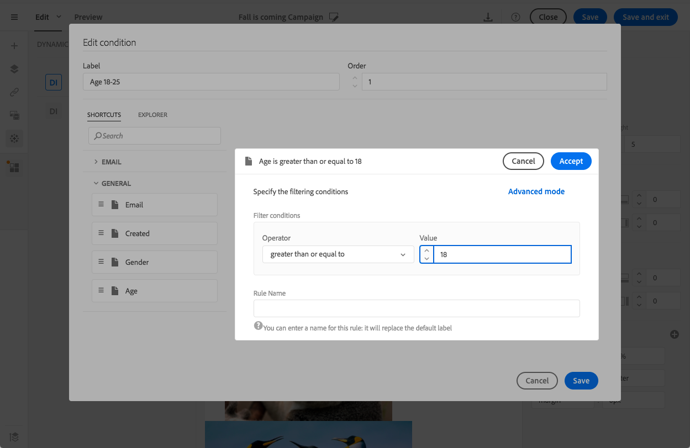
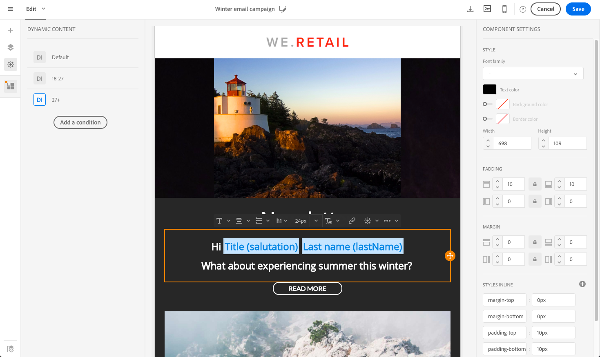

# 個人化電子郵件內容 {#personalization}

Adobe Campaign傳遞的訊息內容和顯示方式可透過多種不同方式個人化。 這些方式可根據條件結合，視描述檔而定。 一般而言，Adobe Campaign 允許您：

* 插入動態的個人化欄位。請參 [閱插入個人化欄位](#inserting-a-personalization-field)。
* 插入預先定義的個人化區塊。 請參 [閱新增內容區塊](#adding-a-content-block)。
* 個人化電子郵件的寄件者。 請參 [閱個人化傳送者](#personalizing-the-sender)。
* 個人化電子郵件的主題。 See [Personalizing the subject line of an email](../../designing/using/subject-line.md#subject-line).
* 建立有條件的內容。請參 [閱定義電子郵件中的動態內容](#defining-dynamic-content-in-an-email)。

## 個人化傳送者 {#personalizing-the-sender}

要定義將出現在所發送郵件標題中的發件人名稱，請轉至「電子郵件設計器」首頁的頁籤（可通過首頁表徵圖訪問）。 **[!UICONTROL Properties]** 如需詳細資訊，請參 [閱定義電子郵件的寄件者](../../designing/using/subject-line.md#email-sender)。

您可以按一下「傳送者名稱」區塊，以變更 **傳送者名稱** 。 然後，欄位會變成可編輯，您可以輸入要使用的名稱。

此欄位可以個人化。 若要這麼做，您可以按一下傳送者名稱下方的圖示，新增個人化欄位、內容區塊和動態內容。

>[!NOTE]
>
>標題參數不得為空。 發件人地址是允許發送電子郵件的強制性地址（RFC標準）。 Adobe Campaign會檢查輸入的電子郵件地址語法。

## 個人化URL{#personalizing-urls}

Adobe Campaign可讓您新增個人化欄位、內容區塊或動態內容，以個人化訊息中的一或多個URL。 操作步驟：

1. 插入外部URL並指定其參數。 請參 [閱插入連結](../../designing/using/links.md#inserting-a-link)。
1. 如果未顯示，請按一下「設定」窗格中選取之URL旁的鉛筆，以存取個人化選項。
1. 新增您要使用的個人化欄位、內容區塊和動態內容。

   

1. 儲存您的變更。

>[!NOTE]
>
>個人化URL無法套用至網域名稱，也無法套用至URL副檔名。 如果個人化不正確，則會在訊息分析期間顯示錯誤訊息。 選取內容區塊時，不允許您選取元素，例如「連結 **至鏡像頁面」**。 此類塊在連結內部被禁止。

## 插入個人化欄位{#inserting-a-personalization-field}

Adobe Campaign可讓您將資料庫中的欄位插入頁面，例如描述檔的名字。

>[!NOTE]
>
>下圖顯示如何使用電子郵件設計工具插入個 [人化欄位](../../designing/using/designing-content-in-adobe-campaign.md) 。

若要新增個人化欄位至內容：

1. 在文字區塊內按一下，按一下內容 **[!UICONTROL Personalize]** 相關工具列中的圖示並選取 **[!UICONTROL Insert personalization field]**。 如需「電子郵件設計器」介面的詳細資訊，請參 [閱本節](../../designing/using/designing-content-in-adobe-campaign.md#email-designer-interface)。

   

1. 選取您要插入頁面內容的欄位。

   

1. 按一下 **[!UICONTROL Confirm]**.

欄位名稱會出現在編輯器中，並反白顯示。

產生個人化後（例如預覽和準備電子郵件時），此欄位將由與目標描述檔對應的值取代。

>[!NOTE]
>
>如果電子郵件是從工作流程建立，在工作流程中計算的其他資料也會顯示在個人化欄位中。 有關從工作流中添加其他資料的詳細資訊，請參閱「豐 [富資料](../../automating/using/about-targeting-activities.md#enriching-data) 」部分。

## 新增內容區塊{#adding-a-content-block}

Adobe Campaign提供預先設定的內容區塊清單。 這些內容區塊是動態、個人化的，並具有特定的演算。 例如，您可以添加問候語或鏡像頁面的連結。

>[!NOTE]
>
>下圖顯示如何使用電子郵件設計工具插入 [內容區塊](../../designing/using/designing-content-in-adobe-campaign.md) 。

若要新增內容區塊：

1. 在文字區塊內按一下，按一下內容 **[!UICONTROL Personalize]** 相關工具列中的圖示並選取 **[!UICONTROL Insert content block]**。 如需「電子郵件設計器」介面的詳細資訊，請參 [閱本節](../../designing/using/designing-content-in-adobe-campaign.md#email-designer-interface)。

   

1. 選取您要插入的內容區塊。 可用的區塊會視上下文（電子郵件或著陸頁面）而異。

   

1. 按一下 **[!UICONTROL Save]**.

內容區塊的名稱會顯示在編輯器中，並以黃色反白顯示。 當個人化產生時，它會自動調整至個人檔案。

現成可用的內容區塊包括：

* **[!UICONTROL Database URL in emails (EmailUrlBase)]**: 此內容區塊只能用於傳 **送**。
* **[!UICONTROL Mirror page URL (MirrorPageUrl)]**: 此內容區塊只能用於傳 **送**。
* **[!UICONTROL Link to mirror page (MirrorPage)]**: 此內容區塊只能用於傳 **送**。
* **[!UICONTROL Greetings (Greetings)]**
* **[!UICONTROL Unsubscription link (UnsubscriptionLink)]**: 此內容區塊只能用於傳 **送**。
* **[!UICONTROL Social network sharing links (LandingPageViralLinks)]**: 此內容區塊僅能用於著 **陸頁面**。
* **[!UICONTROL Default sender name (DefaultSenderName)]**: 此內容區塊只能用於傳 **送**。
* **[!UICONTROL Name of default reply-to email address (DefaultReplyName)]**: 此內容區塊只能用於傳 **送**。
* **[!UICONTROL Email address of default sender (DefaultSenderAddress)]**: 此內容區塊只能用於傳 **送**。
* **[!UICONTROL Default error email address (DefaultErrorAddress)]**: 此內容區塊只能用於傳 **送**。
* **[!UICONTROL Default reply-to email address (DefaultReplyAddress)]**: 此內容區塊只能用於傳 **送**。
* **[!UICONTROL Brand name (BrandingUsualName)]**
* **[!UICONTROL Link to the brand website (BrandingWebSiteLink)]**
* **[!UICONTROL Brand logo (BrandingLogo)]**
* **[!UICONTROL Notification style (notificationStyle)]**

### 建立自訂內容區塊 {#creating-custom-content-blocks}

您可以定義將插入訊息或登陸頁面的新內容區塊。

若要建立內容區塊，請依照下列步驟進行：

1. 從進 **[!UICONTROL Resources > Content blocks]** 階功能表按一下，存取內容區塊清單。
1. 按一下 **[!UICONTROL Create]** 按鈕或複製預先存在的內容區塊。

   

1. 輸入標籤。
1. 選擇塊的 **[!UICONTROL Content type]**。 有三種可用選項：

   * **[!UICONTROL Shared]**: 內容區塊可用於傳送或著陸頁面。
   * **[!UICONTROL Delivery]**: 內容區塊只能用於傳送。
   * **[!UICONTROL Landing page]**: 內容區塊只能用於著陸頁面。
   

1. 您可以選取 **[!UICONTROL Targeting dimension]**。 如需詳細資訊，請參閱關於 [定位維度](#about-targeting-dimension)。

   

1. 您可以選取選 **[!UICONTROL Depends on format]** 項來定義兩個不同的區塊： 一個用於HTML電子郵件，一個用於文本格式的電子郵件。 然後，編輯器（HTML和Text）中會顯示兩個標籤，以定義對應的內容。

   

1. 輸入內容區塊的內容，然後按一下按 **[!UICONTROL Create]** 鈕。

您的內容區塊現在可用於訊息或登陸頁面的內容編輯器中。

>[!CAUTION]
>
>編輯塊的內容時，請確定if語句的開頭和結尾之間沒有額外的空 *格* 。 在HTML中，空白字元會顯示在螢幕上，因此會影響您的內容版面配置。

### 關於定位維度 {#about-targeting-dimension}

定位維度可讓您定義可以使用內容區塊的訊息類型。 這是為了防止在消息中使用不適當的塊，這可能會導致錯誤。

事實上，在編輯訊息時，您只能選擇具有與訊息定位維度相容之定位維度的內容區塊。

例如，區塊的 **[!UICONTROL Unsubscription link]** 定位維度是因為它 **[!UICONTROL Profiles]** 包含特定於資源的個人化 **[!UICONTROL Profiles]** 欄位。 因此，您不能在事 **[!UICONTROL Unsubscription link]** 件事務性 [訊息中使用區塊](../../channels/using/event-transactional-messages.md)，因為該類型訊息的定位維度是 **[!UICONTROL Real-time events]**。 不過，您可以在描述檔 **交易訊息中使用** 「取消訂閱」連結區塊 [，因為該類型訊息的定位維度是「描述檔」](../../channels/using/profile-transactional-messages.md)****。 最後， **[!UICONTROL Link to mirror page]** 區塊沒有定位維度，因此您可以在任何訊息中使用。

如果您將此欄位保留為空白，則無論定位維度為何，內容區塊都會與所有訊息相容。 如果您設定定位維度，該區塊將僅與具有相同定位維度的訊息相容。

如需詳細資訊，請參閱「定 [位維度和資源」](../../automating/using/query.md#targeting-dimensions-and-resources)。

**相關主題：**

* [插入個人化欄位](#inserting-a-personalization-field)
* [新增內容區塊](#adding-a-content-block)
* [定義電子郵件中的動態內容](#defining-dynamic-content-in-an-email)

## 個人化影像來源{#personalizing-an-image-source}

Adobe Campaign可讓您根據特定標準或使用追蹤，個人化訊息中的一或多張影像。 這是透過將個人化欄位、內容區塊或動態內容插入影像來源來完成的。 操作步驟：

1. 將影像插入訊息內容，或選取已存在的影像。
1. 在影像屬性浮動視窗中，勾選 **[!UICONTROL Enable personalization]** 選項。

   

   此時 **[!UICONTROL Source]** 會顯示欄位，而選取的影像在編輯器中 **顯示為** 「個人化」。

1. 按一下欄位按鈕旁 **[!UICONTROL Source]** 的鉛筆，存取個人化選項。
1. 新增影像來源後，請新增您喜歡的個人化欄位、內容區塊和動態內容。

   

   >[!NOTE]
   >
   >網域名稱(http://mydomain.com)無法個人化，必須手動輸入。 其餘的URL可以個人化。 例如： http://mydomain.com/`[Gender]`.jpg

1. 確認您的變更。

## 條件式內容 {#conditional-content}

### 定義可見性條件{#defining-a-visibility-condition}

您可以在任何元素上指定可見性條件。 只有在遵守條件時，才會顯示它。

要添加可見性條件，請選擇一個塊，然後在其設定欄位中輸入要 **[!UICONTROL Visibility condition]** 考慮的條件。

此選項僅適用於下列元素： 地址、塊引號、中心、目錄、DIV、DL、FIELDSET、FORM、H1、H2、H3、H4、H5、H6、NOSCRIPT、OL、P、PRE、UL、TR、TD。

運算式編輯器會顯示在「進階運算式 [編輯」區段中](../../automating/using/editing-queries.md#about-query-editor) 。

這些條件採用XTK運算式語法(例如 **context.profile.email !=&quot;** 或 **context.profile.status=&#39;0&#39;**)。 依預設，所有欄位皆可顯示。

>[!NOTE]
>
>無法為已包含具有動態內容的子元素的區塊或已構成動態內容的區塊定義條件。 無法編輯非可見的動態區塊（如下拉式清單）。

### 定義電子郵件中的動態內容{#defining-dynamic-content-in-an-email}

在電子郵件中，您可以定義不同的內容，這些內容會根據透過運算式編輯器定義的條件動態顯示給收件者。 例如，您可以從相同的電子郵件，確保每個描述檔會根據其年齡範圍收到不同的訊息。

定義動態內容與定義可見 [性條件不同](#defining-a-visibility-condition)。

1. 選取片段、元件或元素。 在此範例中，選取影像。
1. 按一下內 **[!UICONTROL Dynamic content]** 容相關工具列中的圖示。

   

   區 **[!UICONTROL Dynamic content]** 段會出現在左側的浮動視窗中。

   

   依預設，本節包含兩個元素： 預設變體和新變體。

   >[!NOTE]
   >
   >內容必須始終具有預設變型。 您無法刪除。

1. 按一下按 **[!UICONTROL Edit]** 鈕可定義第一個替代變數的顯示條件。

   

1. 指定標籤，並選取您要設定為條件的欄位。 例如，從節 **[!UICONTROL General]** 點選擇字 **[!UICONTROL Age]** 段

   

1. 設定篩選條件。 例如，您想要向18到25歲的人顯示不同的內容。

   

1. 設定好所有條件後，請定義要套用條件的優先順序，並儲存您所做的變更。

   

   內容會依優先順序從上到下顯示在浮動視窗中。 For more on priorities, refer to [this section](#defining-dynamic-content-in-an-email).

1. 上傳您剛定義的變型的新影像。

   

   18至25歲的受贈者將看到新的形象。

   

1. 按一 **[!UICONTROL Add a condition]** 下可新增內容及其連結規則。

   

   例如，您可以新增不同的影像，以便顯示給26歲到35歲的人。

1. 對於您電子郵件中想要動態顯示的任何其他元素，請以類似方式繼續。 可以是文字、按鈕、片段等。 儲存您的變更。

>[!CAUTION]
>
>在您準備好訊息後，在傳送訊息之前，請使用證明加以測試。 如果您不這麼做，則可能無法偵測到某些錯誤，且可能無法傳送電子郵件。

**相關主題：**

* [傳送校樣](../../sending/using/sending-proofs.md)
* [進階運算式編輯](../../automating/using/editing-queries.md#about-query-editor)

### 優先順序 {#order-of-priority}

在運算式編輯器中，定義動態內容時，優先順序如下。

1. 您可以使用兩種不同的條件 **定義兩種不同的動態內容**，例如：

   **條件1:** 側寫的性別是男性化的，

   **條件2:** 側寫是20到30歲。

   

   您資料庫中的某些描述檔會對應這兩種情況，但只能傳送一封包含一動態內容的電子郵件。

1. 因此，您必須定義動態內容的優先順序。 即使優先順序順序為 **1** （以及相應的動態內容）的條件也由此配置檔案滿足其優先順序順序為 **2****或** 3的其它條件，該條件也將被發送到配置檔案。

   

每個動態內容只能定義一個優先順序。

## 範例： 電子郵件個人化{#example-email-personalization}

在此範例中，行銷服務團隊的一名成員已建立電子郵件，通知他的部分客戶，只有他們有特別優惠。 該團隊成員決定根據客戶各自的年齡將電子郵件個人化。 18至27歲的客戶將收到一封電子郵件，其中包含不同的圖片和口號，給27歲以上的客戶。

電子郵件的建立方式如下：

* 動態內容被應用到影像，並且這些動態內容根據年齡範圍被配置。

   

   新增和設定動態內容的詳細資訊，請參閱「 [在電子郵件中定義動態內容](#defining-dynamic-content-in-an-email) 」一節。

* 個人化欄位和動態內容會套用至文字。 根據描述檔的年齡範圍，電子郵件會從描述檔的名字或描述檔的標題和姓氏開始。

   

   新增和設定個人化欄位的詳細資訊，請參閱「 [插入個人化欄位](#inserting-a-personalization-field) 」一節。

### 設定影像 {#configuring-images}

在此範例中，套用至影像的動態內容設定如下：

**目標18-27歲：**

1. 在浮動視窗中選取動態內 **[!UICONTROL Properties]** 容，然後按一下 **[!UICONTROL Edit]** 按鈕。

   

1. 編輯標籤，然後從節 **[!UICONTROL Age]** 點中選擇字 **[!UICONTROL Profile]** 段。

   

1. 選擇「 **大於或等於」運算子** ，然後輸入 **18** ，以建立 **早於18的運算式** 。

   

1. 新增條 **[!UICONTROL Age]** 件。

   在值欄 **位中選取「小於或等於** 」運算子後接27，以建立小 **於27的運算式** 。

   

1. 確認您的變更。

**要定位27歲及以上的配置檔案，請執行以下操作：**

1. 從浮動視窗中選取動態內容並加以編輯。
1. 編輯標籤，然後從節 **[!UICONTROL Age]** 點中選擇字 **[!UICONTROL Profile]** 段。
1. 在值欄 **位中新增** 「大於」運算子後接27，以建立 **早於27的運算式** 。

   

1. 確認您的變更。

您的動態內容已正確設定。

### 設定文字 {#configuring-text}

在此範例中，套用至文字的動態內容設定如下：

**要定位18-27之間的過時配置檔案：**

1. 選擇所需的結構元件並添加動態內容。
1. 編輯動態內容並設定定位運算式。 請參閱「 [設定影像](#configuring-images)」。
1. 在結構元件中，在所需位置，按一下內容工具 **[!UICONTROL Personalize]** 列中的圖示並選取 **[!UICONTROL Insert personalization field]**。

   

1. 在出現的清單中，選取欄位並 **[!UICONTROL First name]** 進行確認。

   

1. 然後，您的個人化欄位會完美地插入所選動態內容。

**要定位27歲及以上的配置檔案，請執行以下操作：**

1. 選擇所需的結構元件並添加動態內容。
1. 編輯動態內容並設定定位運算式。 請參閱「 [設定影像](#configuring-images)」。
1. 在結構元件中，在所需位置，按一下內容工具 **[!UICONTROL Personalize]** 列中的圖示並選取 **[!UICONTROL Insert personalization field]**。
1. 從下 **[!UICONTROL Title]** 拉式清單中選取。
1. 以類似方式繼續新增欄 **[!UICONTROL Last name]** 位。

   

您的個人化欄位現在應完美地插入所選動態內容。

### 預覽電子郵件 {#previewing-emails}

預覽可讓您在傳送個人化欄位和動態內容之前，先檢查是否已正確設定個人化欄位和動態內容 **[!UICONTROL Proofs]**。 在預覽期間，您可以選取與電子郵件目標對應的不同測試設定檔。

若沒有測試設定檔，預設會顯示的電子郵件為：

電子郵件的口號中沒有個人化欄位，而且會使用預設影像。

第一測試簡檔對應於年齡在18到27歲之間的客戶。 選取此描述檔後，會顯示下列電子郵件：

對應於18-27歲運算式的個人化欄位，尤其是描述檔的名字，已正確設定，而且影像也已根據描述檔而變更。

第二個描述檔對應於年齡超過27歲的客戶，並產生下列電子郵件：

由於動態內容，影像已經變更，而出現的口號正是針對此目標公眾所定義的更正式口號。

**相關主題：**

* [建立閱聽眾](../../audiences/using/creating-audiences.md)
* [準備傳送](../../sending/using/preparing-the-send.md)

