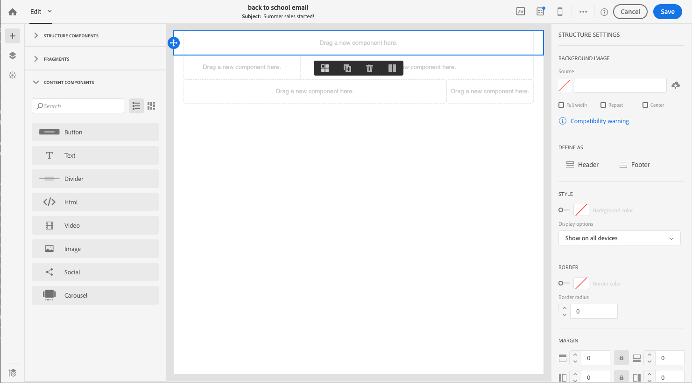

# 電子郵件設計工具快速入門 {#quick-start}

電子郵件設計人員提供四種建立電子郵件的方式。

您可以在電子郵件設 [計器中建立新的電子郵件](#without-existing-content):

1. 您可以 **透過輕鬆新增結構和內容元件** ，並個人化其內容，以便快速傳送，從空白畫布建立電子郵件。 您也可以完全管理樣式元素。 如需詳細資訊，請 [快速上手](#from-scratch-email) ，或查看完 [整的檔案](../../designing/using/designing-from-scratch.md#designing-an-email-content-from-scratch)。

1. 您可 **以從現成可用的範本建立電子郵件** ，方法是選取範本並從此處建立新的電子郵件內容。 [進一步瞭解](#building-content-from-an-out-of-the-box-template)

您也可以建立包含現有內 [容的電子郵件](#with-existing-content):

1. 您可以 **轉換現有的HTML內容** （在外部或舊版編輯器中建立）。 [進一步瞭解](#converting-an-html-content)
1. 您可以 **在相容性模式下** ，直接匯入現有的HTML內容。 [進一步瞭解](#compatibility-mode)

| 無內容 | 使用內容 |
|---|---|
| [從頭開始建立電子郵件](#from-scratch-email) | [轉換現有HTML內容](#converting-an-html-content) |
| [從現成可用的範本建立內容](#building-content-from-an-out-of-the-box-template) | [匯入現有的HTML](#compatibility-mode) |

## 使用編輯器設計電子郵件 {#without-existing-content}

>[!NOTE]
>
>在這兩種建立策略中，在傳送電子郵件之前先填妥主題行是十分重要的。 瞭解如何 [新增主旨行](#add-a-subject-line)。

### 從頭開始建立電子郵件 {#from-scratch-email}

您可以輕鬆建立電子郵件、新增元件並個人化其內容，以便快速傳送。 您可以視需要調整樣式選項以配合您的內容。 如需有關管理樣式設定和內嵌屬性的詳細資訊，請參閱「編 [輯電子郵件樣式」](../../designing/using/styles.md)。

1. 建立電子郵件.
1. 關閉首頁。

### 新增主旨行 {#add-a-subject-line}

傳送電子郵件時，主旨行是必填的。 如需詳細資訊，請 [參閱定義電子郵件的主旨行](../../designing/using/subject-line.md)。

1. 轉至「電 **[!UICONTROL Properties]** 子郵件設計器」首頁的標籤（可透過首頁圖示存取）並填寫 **[!UICONTROL Subject]** 章節。

### 添加結構元件 {#add-structure-components}

結構元件將定義電子郵件的版面配置。 如需詳細資訊，請 [參閱定義電子郵件結構](../../designing/using/designing-from-scratch.md#defining-the-email-structure)。

在「結構」元件中，拖放您要使用的版面的元件。

>[!NOTE]
>
>您可以選取不同的內容版面，這些版面會加入您的電子郵件中。

### 新增內容元件 {#add-content-components}

您可以在電子郵件中新增數種內容元件，例如影像、文字和按鈕。 如需詳細資訊，請參閱「 [內容元件」](../../designing/using/designing-from-scratch.md#about-content-components)。

* **影像**

   1. 在「 **內容元件**」中，將影像拖放至其中一個結構元件中。
   1. 按一 **下瀏覽**。
   1. 從您的電腦選取影像檔案。

   

* **文字與個人化**

   1. 在「 **內容元件**」中，將文字拖放至其中一個結構元件中。
   1. 按一下元件並輸入文字。
   1. 若要新增個人化欄位，請按一下工 **具列中的「插入個人化** 」欄位。
   1. 選擇您需要的欄位，例如名字。

   

* **HTML**

   1. 在「 **內容元件**」中，將HTML拖放至其中一個結構元件中。
   1. 按一 **下顯示原始碼**。
   1. 輸入您的HTML內容。
   1. 按一下 **儲存**。

   

   如果您熟悉HTML，則可使用內容元件，從原始頁尾複製並貼上HTML **[!UICONTROL Html]** 程式碼。 如需詳細資訊，請參閱關於 [內容元件](../../designing/using/designing-from-scratch.md#about-content-components)。

   

### 設定電子郵件元件的樣式

您可以調整電子郵件樣式，例如變更元件的間距。 如需有關管理樣式設定和內嵌屬性的詳細資訊，請參閱「編 [輯電子郵件樣式」](../../designing/using/styles.md)。

1. 按一下您的 **文字元件**。
1. 在調色板的右側，轉到「填充 **」**。
1. 按一下鎖定圖示，可中斷上下或左右參數之間的同步。
1. 視需 **要調整** 「填補」。
1. 按一下 **儲存**。

您現在可以儲存並傳送電子郵件。

### 從現成可用的範本建立內容 {#building-content-from-an-out-of-the-box-template}

您可以利用現成可用的範本（例如客戶歡迎訊息、電子報和重新參與電子郵件）建立電子郵件，並個人化這些範本。

1. 建立電子郵件並開啟其內容。 如需詳細資訊，請參 [閱建立電子郵件](../../channels/using/creating-an-email.md)。
1. 按一下首頁圖示以存取 **[!UICONTROL Email Designer]** 首頁。
1. 按一下標 **[!UICONTROL Templates]** 簽。
1. 選擇現成可用的HTML範本。
不同的範本呈現多種元素的組合。 例如，「羽化」範本有邊界，而「Astro」範本沒有邊界。 如需詳細資訊，請參閱「內 [容範本」](../../designing/using/using-reusable-content.md#content-templates)。
1. 轉至「電 **[!UICONTROL Properties]** 子郵件設計器」首頁的標籤（可透過首頁圖示存取）並填寫 **[!UICONTROL Subject]** 章節。
1. 您可以結合這些元素來建立許多電子郵件變體。 例如，您可以選擇結構元件並從內容相關工具列按一下，以複製 **[!UICONTROL Duplicate]** 電子郵件區段。
1. 可以使用左側的藍色箭頭將元素移動，以將結構元件拖曳到另一個元件下方或上方。 如需詳細資訊，請參閱「[編輯電子郵件結構](../../designing/using/designing-from-scratch.md#defining-the-email-structure)」。
1. 您也可以移動元件以變更每個結構元素的組織。 如需詳細資訊，請參閱「[新增片段及元件](../../designing/using/designing-from-scratch.md#defining-the-email-structure)」。
1. 根據您的需求修改每個元素的內容：影像、文字、連結。
1. 視需要調整樣式選項以配合您的內容。 如需詳細資訊，請參閱[編輯電子郵件樣式](../../designing/using/styles.md)。

## 使用現有的電子郵件內容 {#with-existing-content}

如果您想要建立模組範本和片段的架構，以便結合在多封電子郵件中重複使用，您應考慮將電子郵件的HTML轉換為電子郵件設計人員範本。

### 轉換HTML內容 {#converting-an-html-content}

此使用案例提供將HTML電子郵件轉換為電子郵件設計器元件的快速方式。 如需此主題的詳細資訊，請參閱 [轉換HTML內容](../../designing/using/using-existing-content.md#converting-an-html-content)。

>[!CAUTION]
>
>本節適用於熟悉HTML程式碼的使用者。

>[!NOTE]
>
>和相容性模式一樣，HTML元件也可編輯，但選項有限：您只能執行就地版本。

### 匯入和編輯HTML電子郵件 {#compatibility-mode}

上傳內容時，它必須包含特定標籤，才能與「電子郵件設計器」的WYSIWYG編輯器完全相容並可編輯。

有關將現有電子郵件轉換為與電子郵件設計人員相容的電子郵件的詳細資訊，請參 [閱本節](../../designing/using/using-existing-content.md#compatibility-mode)。
