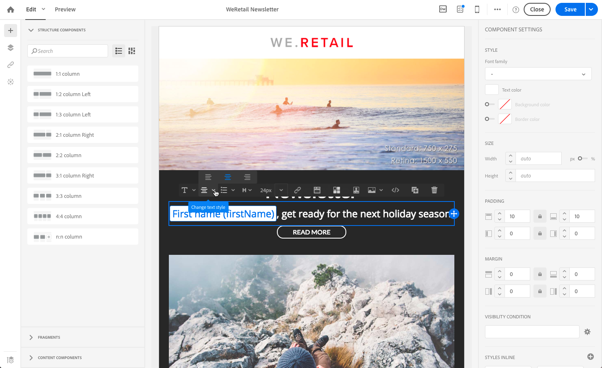
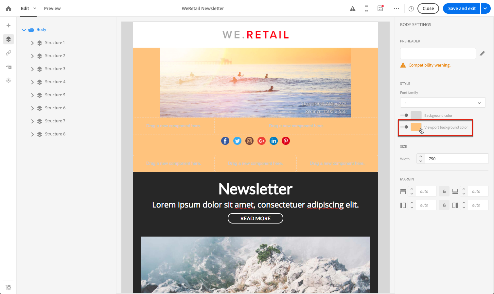
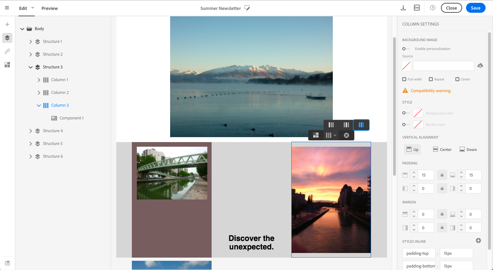

# 管理電子郵件樣式 {#managing-styles}

在「電子郵件設計器」中，選取元素時，窗格中會顯示特定於所選內容類型的幾個選 **[!UICONTROL Settings]** 項。 您可以使用這些選項輕鬆變更電子郵件的樣式。

## 選取元素 {#selecting-an-element}

要在「電子郵件設計器」介面中選擇元素，您可以：

* 直接在電子郵件中按一下，
* 或瀏覽左側「浮動視窗」( **Palette)選項中可用的結構樹**。

瀏覽結構樹可讓您進行更精確的選擇。 您可以選擇下列任一項：

* 整個結構，
* 組成結構元件的列之一，
* 或僅包含位於欄內的元件。

要選擇列，您還可以執行以下操作：

1. 選取結構元件(直接在電子郵件中或使用左側浮動視窗中提供的結構 **樹狀**)。
1. 從內容相 **關工具列**，按一 **[!UICONTROL Select a column]** 下以選擇所要的欄。

請參閱本節的 [範例](#example--adjusting-vertical-alignment-and-padding)。

## 調整樣式設定 {#adjusting-style-settings}

1. 在電子郵件中選取元素。 有關詳細資訊，請參 [閱選擇元素](#selecting-an-element)。
1. 根據您的需求調整設定。 每個選取的元素都提供不同的設定集。

   您可以插入背景、變更大小、修改水準或垂直對齊、管理顏色、 [新增填補](#selecting-an-element)或邊界等。

   若要這麼做，請使用窗格中顯示的選項或 **[!UICONTROL Settings]** 新增內 [嵌樣式屬性](#adding-inline-styling-attributes)。

   

1. 儲存您的內容。

## 調整間距和邊界 {#about-padding-and-margin}

電子郵件設計器介面可讓您快速調整填補空間和邊界設定。

**[!UICONTROL Padding]**:此設定可讓您管理位於元素邊框內的空間。

例如：

* 使用填補功能來設定影像左側和右側的邊界。
* 使用上下填充為或元件添加更 **[!UICONTROL Text]** 多間 **[!UICONTROL Divider]** 距。
* 要設定結構元素內各列之間的邊界，請定義每列的間距。

**[!UICONTROL Margin]**:此設定可讓您管理元素邊框與下一個元素之間的間距。

>[!NOTE]
>
>根據您的選擇（結構元件、欄或內容元件），結果將不相同。 Adobe建議在欄 **[!UICONTROL Padding]** 層級 **[!UICONTROL Margin]** 設定和參數。

對於和 **[!UICONTROL Padding]** ，單 **[!UICONTROL Margin]**&#x200B;擊鎖定表徵圖可中斷頂部和底部或右和左參數之間的同步。 這可讓您個別調整每個參數。

## 樣式對齊 {#about-alignment}

* **文字對齊**:將滑鼠游標置於某些文字上，然後使用內容相關工具列來對齊。

   

* **水準對齊** (Horizontal alignment)可套用至文字、影像和按鈕——目前不套用至 **[!UICONTROL Divider]** 和元 **[!UICONTROL Social]** 件。

   

* 要設定垂 **直對齊**，請在結構元件中選擇一個列，然後從「設定」窗格中選擇一個選項。

   

## 設定背景 {#about-backgrounds}

>[!CONTEXTUALHELP]
>id="ac_edition_backgroundimage"
>title="背景設定"
>abstract="電子郵件設計工具可讓您個人化內容的背景色彩或背景影像。"

在使用電子郵件設計工具設定背景時，Adobe建議您：

1. 如果您的設計需要，請將背景顏色套用至電子郵件的正文。
1. 在大多數情況下，請在欄層級設定背景顏色。
1. 請盡量不要在影像或文字元件上使用背景色彩，因為這些色彩很難管理。

以下是您可使用的可用背景設定。

* 為整個 **[!UICONTROL Background color]** 電子郵件設定。 請務必在導覽樹狀結構中選取可從左側浮動視窗存取的內文設定。

   

* 通過選擇，為所有結構元件設定相同的背景顏色 **[!UICONTROL Viewport background color]**。 此選項可讓您從背景顏色中選取不同的設定。

   

* 為每個結構元件設定不同的背景顏色。 在導覽樹狀結構中，從左側的浮動視窗中選取可存取的結構，以僅將特定背景顏色套用至該結構。

   

   請確定您未設定檢視區背景顏色，因為它可能會隱藏結構背景顏色。

* 設定 **[!UICONTROL Background image]** 結構元件的內容。

   

   >[!NOTE]
   >
   >有些電子郵件程式不支援背景影像。 不支援時，會改用列背景顏色。 請務必選取適當的備援背景顏色，以防影像無法顯示。

* 在欄層級設定背景顏色。

   

   >[!NOTE]
   >
   >這是最常見的使用案例。 Adobe建議在欄層級設定背景顏色，因為這樣在編輯整個電子郵件內容時，可提供更大的彈性。

   您也可以在欄層級設定背景影像，但很少使用。

### 範例：調整垂直對齊和間距 {#example--adjusting-vertical-alignment-and-padding}

要在由三列組成的結構元件中調整填充和垂直對齊。 要執行此操作，請遵循下列步驟：

1. 直接在電子郵件中或使用左側元件面板中的結構樹選擇結構 **元件**。
1. 從內容 **相關工具**，按一 **[!UICONTROL Select a column]** 下並選擇要編輯的工具列。 也可以從結構樹中選取它。

   

   該列的可編輯參數顯示在右 **[!UICONTROL Settings]** 側窗格中。

1. 在下 **[!UICONTROL Vertical alignment]**&#x200B;面，選擇 **[!UICONTROL Up]**。

   

   內容元件會顯示在欄的頂端。

1. 在下 **[!UICONTROL Padding]**&#x200B;面，定義列內的頂部填充。 按一下鎖定表徵圖以中斷與底部填充的同步。

   定義該列的左邊距和右邊距。

   

1. 同樣地，繼續調整其他列的對齊和間距。

   

1. 儲存您的變更。

## 樣式連結 {#about-styling-links}

您可以在電子郵件設計器中為連結加下划線，並選擇其顏色和目標。

1. 在插入連結的元件中，選擇連結的標籤文本。

1. 在元件設定中，勾選以 **[!UICONTROL Underline link]** 在連結的標籤文字上加底線。

   

1. 若要選取將開啟連結的瀏覽內容，請選取 **[!UICONTROL Target]**。

   

1. 若要變更連結的顏色，請按一下 **[!UICONTROL Link color]**。

   

1. 選擇您需要的顏色。

   

1. 儲存您的變更。

## 添加內嵌樣式屬性 {#adding-inline-styling-attributes}

在「電子郵件設計器」介面中，當您選取元素並在側面板顯示其設定時，可以自訂該特定元素的內嵌屬性及其值。

1. 選取內容中的元素。
1. 在側面板上，查找設 **[!UICONTROL Styles Inline]** 置。

   

1. 修改現有屬性的值，或使用+按鈕添加 **新屬** 性。 您可以新增任何與CSS相容的屬性和值。

樣式隨即會套用至選取的元素。 如果子元素沒有定義特定的樣式屬性，則會繼承父元素的樣式。
