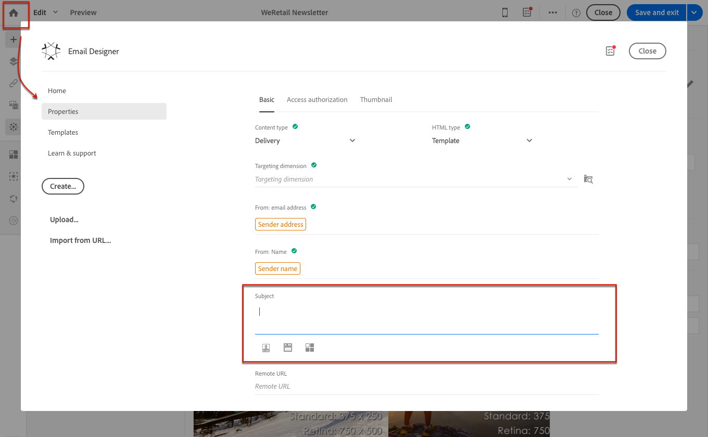

# 定義電子郵件的主旨行和寄件者{#defining-the-subject-line-of-an-email}

## 定義電子郵件的主旨行 {#subject-line}

訊息主旨是準備和傳送訊息的必要專案。

>[!NOTE]
>
>如果主旨列為空，訊息控制面板和電子郵件Designer中會顯示警告。

1. 建立電子郵件。
1. 前往電子郵件Designer首頁的&#x200B;**[!UICONTROL Properties]**&#x200B;標籤（可透過首頁圖示存取）。
1. 填寫&#x200B;**[!UICONTROL Subject]**&#x200B;區段。

   

1. 您也可以按一下對應的圖示，將個人化欄位、內容區塊及動態內容新增至主旨列。 如需詳細資訊，請參閱[Personalization](../../designing/using/personalization.md)。

## 定義電子郵件的電子郵件寄件者 {#email-sender}

若要定義將顯示在已傳送訊息標題中的寄件者名稱，請移至電子郵件Designer首頁的&#x200B;**[!UICONTROL Properties]**&#x200B;標籤（可透過首頁圖示存取）。

* **[!UICONTROL From: name]**&#x200B;欄位可讓您輸入寄件者名稱。 依預設，預設的&#x200B;**寄件者名稱**&#x200B;區塊會自動輸入欄位中。 預設寄件者電子郵件地址和寄件者名稱定義於&#x200B;**[!UICONTROL Brands]**&#x200B;中，可透過進階功能表&#x200B;**[!UICONTROL Administration > Instance settings > Brand configuration]**&#x200B;下的Adobe Campaign標誌存取。

  您可以按一下&#x200B;**寄件者名稱**&#x200B;區塊來變更寄件者名稱。 欄位隨後會變成可編輯，您可以輸入要使用的名稱。

  此欄位可個人化。 若要這麼做，您可以按一下寄件者名稱下方的圖示，新增個人化欄位、內容區塊和動態內容。 如需詳細資訊，請參閱[Personalization](../../designing/using/personalization.md)。

* 無法從此節編輯&#x200B;**[!UICONTROL From: email address]**&#x200B;欄位。 您可以從電子郵件的控制面板編輯電子郵件的屬性，以變更它。 如需詳細資訊，請參閱[電子郵件進階引數清單](../../administration/using/configuring-email-channel.md#advanced-parameters)。

>[!NOTE]
>
>標頭引數不得為空白。 必須提供寄件者的地址，才能傳送電子郵件（RFC標準）。 Adobe Campaign會檢查所輸入電子郵件地址的語法。

**相關主題：**

* [插入個人化欄位](../../designing/using/personalization.md#inserting-a-personalization-field)
* [新增內容區塊](../../designing/using/personalization.md#adding-a-content-block)
* [定義電子郵件中的動態內容](../../designing/using/personalization.md#defining-dynamic-content-in-an-email)
