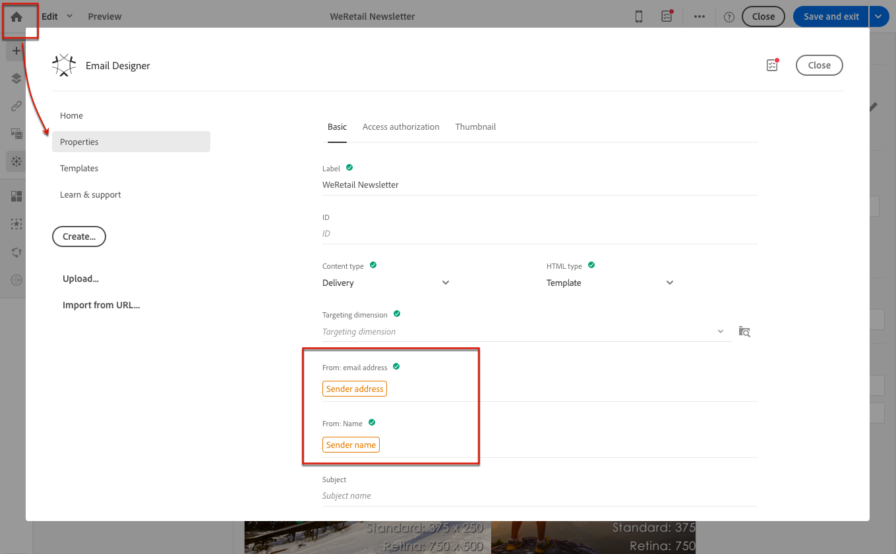

# 定義電子郵件的主旨行和發件人{#defining-the-subject-line-of-an-email}

留言主體是準備和發送留言的必備主題。

>[!NOTE]
>
>如果主旨行為空白，則訊息控制面板和電子郵件設計工具中會顯示警告。

若要設定電子郵件主旨，請 **[!UICONTROL Properties]** 前往「電子郵件設計人員」首頁的標籤（可透過首頁圖示存取），並填寫 **[!UICONTROL Subject]** 章節。

**要定義電子郵件的主題行，請執行以下操作**:

1. 建立電子郵件。
1. 關閉首頁。
1. 轉至「電 **[!UICONTROL Properties]** 子郵件設計器」首頁的標籤（可透過首頁圖示存取）並填寫 **[!UICONTROL Subject]** 章節。

您也可以按一下對應的圖示，將個人化欄位、內容區塊和動態內容新增至主題行。

**相關主題：**

* [插入個人化欄位](../../designing/using/personalization.md#inserting-a-personalization-field)
* [新增內容區塊](../../designing/using/personalization.md#adding-a-content-block)
* [定義電子郵件中的動態內容](../../designing/using/personalization.md#defining-dynamic-content-in-an-email)

## 預測性主體行 {#predictive-subject-line}

在編輯電子郵件時，您可以嘗試不同的主旨行，並在傳送電子郵件前先估計其開放率。

此功能預設為停用。 當匯入第一個模型時，就會啟用它。 模型是特定產業的訓練資料集的結果。 模型可讓系統在提交新主旨行時預測電子郵件的開放率。

>[!NOTE]
>
>此功能適用於電子郵件訊息和僅包含英文內容的資料庫。 如果您的例項包含其他語言的電子郵件，則訓練好的模型會不一致，並導致錯誤的結果。 只有在實例上已有模型可用時，才會顯示允許測試主題的選項。

**相關主題**

* [測試電子郵件的主旨行](../../sending/using/testing-subject-line-email.md)

## 電子郵件傳送者 {#email-sender}

要定義將出現在所發送郵件標題中的發件人名稱，請轉至「電子郵件設計器」首頁的頁籤（可通過首頁表徵圖訪問）。 **[!UICONTROL Properties]**

* 該 **[!UICONTROL From: name]** 欄位允許您輸入發件人名稱。 預設情況下，預設的 **「發件人名稱** 」塊會自動輸入到欄位中。 Adobe Campaign是指電子郵件通道設定(從進階功能表， **[!UICONTROL Administration > Channels > Email > Email accounts]** 透過Adobe Campaign標誌)來指定此傳送者。

   您可以按一下「傳送者名稱」區塊，以變更 **傳送者名稱** 。 然後，欄位會變成可編輯，您可以輸入要使用的名稱。

   此欄位可以個人化。 若要這麼做，您可以按一下傳送者名稱下方的圖示，新增個人化欄位、內容區塊和動態內容。

* 無 **[!UICONTROL From: email address]** 法從此部分編輯欄位。 您可以透過從其控制面板編輯電子郵件的屬性來變更。 如需詳細資訊，請參 [閱電子郵件進階參數清單](../../administration/using/configuring-email-channel.md#advanced-parameters)。

>[!NOTE]
>
>標題參數不得為空。 發件人地址是允許發送電子郵件的強制性地址（RFC標準）。 Adobe Campaign會檢查輸入的電子郵件地址語法。

**相關主題：**

* [插入個人化欄位](../../designing/using/personalization.md#inserting-a-personalization-field)
* [新增內容區塊](../../designing/using/personalization.md#adding-a-content-block)
* [定義電子郵件中的動態內容](../../designing/using/personalization.md#defining-dynamic-content-in-an-email)
