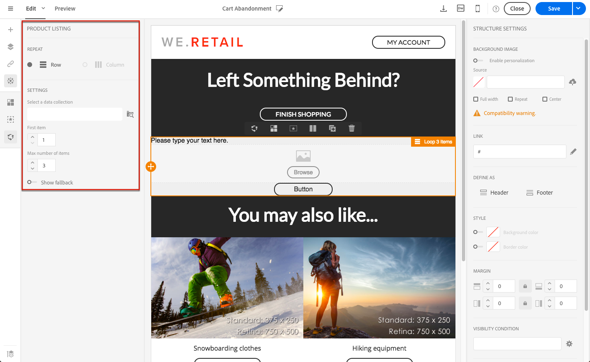
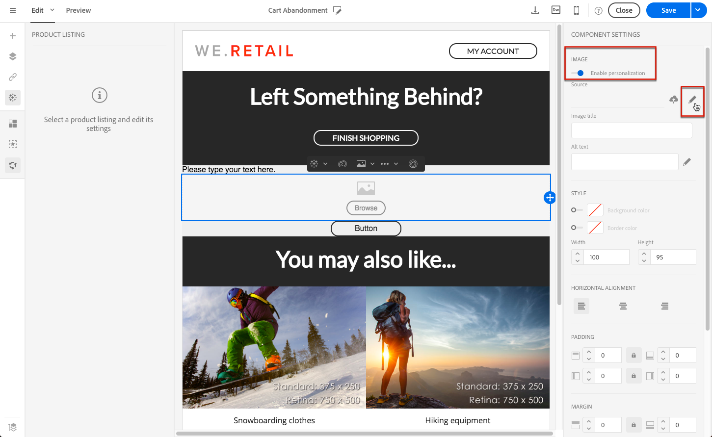

# 在交易式訊息中使用產品清單 {#using-product-listings}

>[!IMPORTANT]
>
>只有透過[電子郵件Designer](../../designing/using/designing-content-in-adobe-campaign.md#email-designer-interface)介面的&#x200B;**交易式電子郵件訊息**&#x200B;才有產品清單。

編輯交易式電子郵件的內容時，您可以建立參考一或多個資料集合的產品清單。 例如，在購物車放棄率電子郵件中，您可以加入使用者離開網站時購物車中的所有產品清單，其中會包含每個產品的影像、價格和連結。

若要在交易式訊息中新增放棄的產品清單，請遵循以下步驟。

您也可以觀看[這組影片](https://experienceleague.adobe.com/docs/campaign-standard-learn/tutorials/designing-content/product-listings-in-transactional-email.html#configure-product-listings-in-transactional-emails)，說明在交易式電子郵件中設定產品清單所需的步驟。

>[!NOTE]
>
>Adobe Campaign 不支援巢狀產品清單，這表示您無法將產品清單加入另一個產品清單中。

## 定義產品清單 {#defining-a-product-listing}

您必須先在事件層級中定義產品清單以及您想要顯示清單中各產品的欄位，才能在交易式訊息中使用產品清單。 如需詳細資訊，請參閱「[定義資料集合](../../channels/using/configuring-transactional-event.md#defining-data-collections)」。

1. 在交易式訊息中，按一下 **[!UICONTROL Content]** 區塊以修改電子郵件內容。
1. 將結構元件拖放至工作區。 如需詳細資訊，請參閱[定義電子郵件結構](../../designing/using/designing-from-scratch.md#defining-the-email-structure)。

   例如，選取單欄結構元件並新增文字元件、影像元件及按鈕元件。 如需詳細資訊，請參閱[使用內容元件](../../designing/using/designing-from-scratch.md#about-content-components)。

1. 選取您剛剛建立的結構元件，然後按一下內容工具列中的 **[!UICONTROL Enable product listing]** 圖示。

   

   結構元件會以橘色外框突出顯示，而 **[!UICONTROL Product listing]** 設定會顯示在左側色盤中。

   

1. 選取集合元素的顯示方式：

   * **[!UICONTROL Row]**：水平顯示，表示每列上的每個元素會位在彼此下方。
   * **[!UICONTROL Column]**：垂直顯示，表示每個元素會位在相同列上彼此旁邊。

   >[!NOTE]
   >
   >**[!UICONTROL Column]**&#x200B;選項僅適用於使用多欄結構元件（ **[!UICONTROL 2:2欄]**、**[!UICONTROL 3:3欄]**&#x200B;和&#x200B;**[!UICONTROL 4:4欄]** ）時。 編輯產品清單時，僅填入第一欄：不會將其他欄納入考量。 如需選取結構元件的詳細資訊，請參閱[定義電子郵件結構](../../designing/using/designing-from-scratch.md#defining-the-email-structure)。

1. 選取您在設定與交易式訊息相關之事件時建立的資料集合。 您可以在 **[!UICONTROL Context]** > **[!UICONTROL Real-time event]** > **[!UICONTROL Event context]** 節點下方找到該集合。

   

   如需設定事件的詳細資訊，請參閱「[定義資料集合](../../channels/using/configuring-transactional-event.md#defining-data-collections)」。

1. 使用 **[!UICONTROL First item]** 下拉式清單，以選取會啟動電子郵件中所顯示清單的元素。

   例如，如果您選取 2，集合的第一個項目將不會顯示在電子郵件中。 產品清單將從第二個項目開始。

1. 選取清單中要顯示的項目數量上限。

   >[!NOTE]
   >
   >如果您希望清單的元素垂直顯示　(**[!UICONTROL Column]**)，則會根據已選取的結構元件（2、3 或 4 欄）來限制項目數目上限。 如需選取結構元件的詳細資訊，請參閱「[編輯電子郵件結構](../../designing/using/designing-from-scratch.md#defining-the-email-structure)」。

## 填入產品清單 {#populating-the-product-listing}

若要顯示從連結至交易式電子郵件之事件的產品清單，請遵循下列步驟。

如需在設定事件時建立集合及相關欄位的詳細資訊，請參閱「[定義資料集合](../../channels/using/configuring-transactional-event.md#defining-data-collections)」。

1. 選取您已插入的影像元件、選取 **[!UICONTROL Enable personalization]** 並按一下「設定」窗格中的鉛筆。

   

1. 在開啟的 **[!UICONTROL Image source URL]** 視窗中選取　**[!UICONTROL Add personalization field]**。

   從　**[!UICONTROL Context]** > **[!UICONTROL Real-time event]** > **[!UICONTROL Event context]**　節點中，開啟與您建立之集合（此處 **[!UICONTROL Product list]**）相對應的節點，然後選取您定義的影像欄位（此處 **[!UICONTROL Product image]**）。 按一下 **[!UICONTROL Save]**。

   

   您選取的個人化欄位現在會顯示在「設定」窗格中。

1. 在需要的位置中，從內容工具列選取 **[!UICONTROL Insert personalization field]**。

   

1. 從　**[!UICONTROL Context]** > **[!UICONTROL Real-time event]** > **[!UICONTROL Event context]**　節點中，開啟與您建立之集合（此處 **[!UICONTROL Product list]**）相對應的節點，然後選取您建立的欄位（此處 **[!UICONTROL Product name]**）。 按一下 **[!UICONTROL Confirm]**。

   

   您選取的個人化欄位現在會顯示在電子郵件內容的需要位置。

1. 以類似方式繼續插入價格。
1. 選取一些文字，然後從內容工具列選取 **[!UICONTROL Insert link]**。

   

1. 在開啟的 **[!UICONTROL Insert link]** 視窗中選取　**[!UICONTROL Add personalization field]**。

   從　**[!UICONTROL Context]** > **[!UICONTROL Real-time event]** > **[!UICONTROL Event context]**　節點中，開啟與您建立之集合（此處 **[!UICONTROL Product list]**）相對應的節點，然後選取您建立的　URL　欄位（此處 **[!UICONTROL Product URL]**）。 按一下 **[!UICONTROL Save]**。

   >[!IMPORTANT]
   >
   >基於安全考量，請確定您將個人化欄位插入在連結（以適當靜態網域名稱開頭）內部。

   

   您選取的個人化欄位現在會顯示在「設定」窗格中。

1. 選取要對產品清單套用的結構元件，並選取 **[!UICONTROL Show fallback]** 以定義預設內容。

   

1. 拖曳一或多個內容元件，並視需要加以編輯。

   

   如果集合在觸發事件（例如客戶購物車中沒有任何專案）時為空白，則會顯示後援內容。

1. 在「設定」窗格中，編輯產品清單的樣式。 如需詳細資訊，請參閱[管理電子郵件樣式](../../designing/using/styles.md)。
1. 使用連結至相關交易式事件且您為其定義集合資料的測試輪廓，以預覽電子郵件。 例如，在您要使用之測試輪廓的 **[!UICONTROL Event data]** 區段中新增下列資訊：

   

   如需在交易式訊息中定義測試輪廓的詳細資訊，請參閱[本區段](../../channels/using/testing-transactional-message.md#defining-specific-test-profile)。
