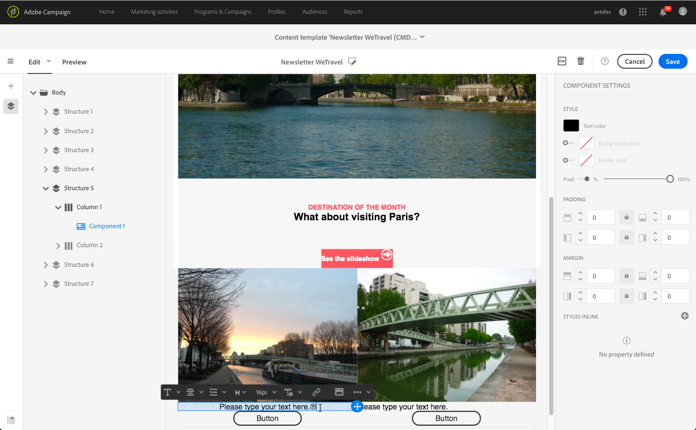
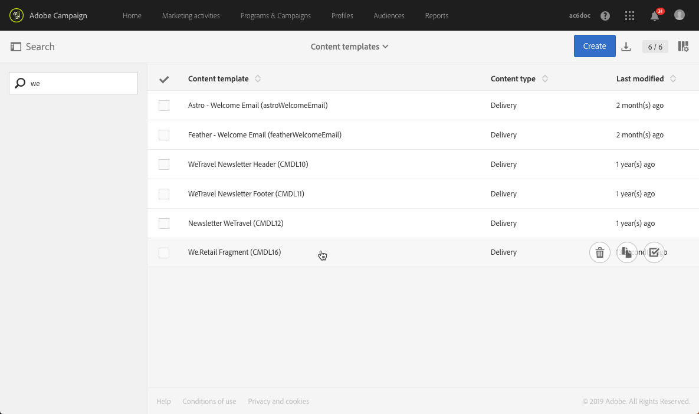

# 建立和使用可重複使用的內容 {#using-reusable-content}

瞭解如何掌握電子郵件內容版本。 使用電子郵件設計工具，您可以使用自己預先定義的內容來建立範本和片段，並重複使用這些範本和片段，以便進行後續傳送。

## 使用範本進行設計 {#designing-templates}

>[!NOTE]
>
> 在Adobe Campaign Standard中，您可以建立可從「資源&gt;範本」功能表存取的不 **同範本****類型** 。 「電子郵件設計器」中使用的模板是「內容」模板。 如需詳細資訊，請參 [閱關於範本](../../start/using/about-templates.md)。

### 內容範本 {#content-templates}

您可以管理「電子郵件設計器」首頁標籤 **[!UICONTROL Templates]** 中提供的 [HTML內容](../../designing/using/overview.md) 。 不同的範本呈現多種元素的組合。 例如，「羽化」範本有邊界，而「Astro」範本沒有邊界。 如需詳細資訊，請參閱「內 [容範本」](#content-templates)。

如要瞭解如何從現成可用的範本建立電子郵件，請參閱電子郵 [件設計器](../../designing/using/quick-start.md#building-content-from-an-out-of-the-box-template)。

### Creating a content template {#creating-a-content-template}

您可以建立自己的內容範本，視需要多次使用這些範本。

以下範例說明如何建立電子郵件內容範本。

1. 前往 **[!UICONTROL Resources]** &gt;並 **[!UICONTROL Content templates & fragments]** 按一下 **[!UICONTROL Create]**。
1. 按一下電子郵件標籤以存取「電子郵 **[!UICONTROL Properties]** 件設計器」的標籤。
1. 指定可辨識的標籤，並選取下列參數，以便在電子郵件中使用此範本：

   * 從下 **[!UICONTROL Shared]** 拉 **[!UICONTROL Delivery]** 式清 **[!UICONTROL Content type]** 單中選擇或。
   * 從下 **[!UICONTROL Template]** 拉式清 **[!UICONTROL HTML type]** 單中選擇。
   

1. 如有需要，您可以設定將用作範本縮圖的影像。 從模板屬性的 **[!UICONTROL Thumbnail]** 頁籤中選擇它。

   

   此縮圖將顯示在「電子郵 **[!UICONTROL Templates]** 件設計器」主 [頁的頁籤中](../../designing/using/overview.md#about-the-email-designer) 。

1. 關閉標 **[!UICONTROL Properties]** 簽以返回主工作區。
1. 新增可視需要自訂的結構元件和內容元件。
   >[!NOTE]
   >
   > 您無法在內容範本中插入個人化欄位或條件式內容。
1. 編輯完成後，儲存範本。

此範本現在可用於使用電子郵件設計工具建立的任何電子郵件。 從「電子郵件設計 **[!UICONTROL Templates]** 器」首頁的選 [項卡中選擇](../../designing/using/overview.md#about-the-email-designer) 。

### 將內容儲存為範本 {#saving-content-as-template}

使用電子郵件設計工具編輯電子郵件時，您可以直接將該電子郵件的內容儲存為範本。

<!--[!CAUTION]
>
>You cannot save as template a structure containing personalization fields or dynamic content.-->

1. 從「電 **[!UICONTROL Save as template]** 子郵件設計器」主工具欄中選擇。

   

1. 視需要新增標籤和說明，然後按一下 **[!UICONTROL Save]**。

   

1. 若要尋找您剛建立的範本，請前往 **[!UICONTROL Resources]** &gt; **[!UICONTROL Content templates & fragments]**。

1. 若要使用新範本，請從「電子郵件設計 **[!UICONTROL Templates]** 器」首頁的標 [簽中選取它](../../designing/using/overview.md#about-the-email-designer) 。

   

### 使用片段和元件建立範本 {#template-fragments-components}

您現在可以使用電子郵件設計工具建立電子郵件範本。 使用內容元件來反映您電子郵件的不同章節，並調整設定，使其盡可能接近原始電子報。 最後，插入您剛建立的片段。

1. 使用電子郵件設計工具建立範本。 如需詳細資訊，請參閱「內 [容範本」](#content-templates)。
1. 將數個結構元件插入範本中——與電子郵件的頁首、頁尾和內文對應。 有關添加結構元件的詳細資訊，請參 [閱使用電子郵件設計器編輯電子郵件結構](../../designing/using/designing-from-scratch.md#defining-the-email-structure)。
1. 視需要插入多個內容元件，以建立電子報內文。 這將是您每個月都會更新之電子郵件的可編輯內容。

   

   如果您熟悉HTML程式碼，Adobe建議您運用元 **[!UICONTROL Html]** 件來複製並貼上原始電子郵件中較複雜的元素。 使用其他元件 **[!UICONTROL Button]**, **[!UICONTROL Image]** 例如 **[!UICONTROL Text]** ，或用於其餘內容。 如需詳細資訊，請參閱關於 [內容元件](../../designing/using/designing-from-scratch.md#about-content-components)。

   >[!NOTE]
   >
   >使用元 **[!UICONTROL Html]** 件可建立可使用有限選項編輯的元件。 在選取此元件之前，請確定您知道如何處理HTML程式碼。

1. 調整內容元件，盡可能符合原始電子郵件。

   

   如需有關管理樣式設定和內嵌屬性的詳細資訊，請參閱「編 [輯電子郵件樣式」](../../designing/using/styles.md)。

1. 將先前建立的兩個片段（頁首和頁尾）插入所需的結構元件。

   

1. 儲存範本。

您現在可以在電子郵件設計工具中完全管理此範本，以建立並更新每個月傳送給收件者的電子報。

若要使用，請建立電子郵件並選取您剛建立的內容範本。

**相關主題**:

* [建立電子郵件](../../channels/using/creating-an-email.md)
* [電子郵件設計人員簡介影片](https://video.tv.adobe.com/v/22771/?autoplay=true&hidetitle=true&captions=chi_hant)
* [從頭設計電子郵件內容](../../designing/using/designing-from-scratch.md#designing-an-email-content-from-scratch)

## 關於片段 {#about-fragments}

片段是可重複使用的元件，可在一或多封電子郵件中參考。
您可在介面中的「資源 **&gt;內** 容片段和範本」下找到 ****。

要充分利用電子郵件設計器中的片段：

* 建立您自己的片段。 請參 [閱建立內容片段](#creating-a-content-fragment) , [以及將內容儲存為片段](#saving-content-as-a-fragment)。
* 視需要在電子郵件中多次使用。 請參 [閱將元素插入電子郵件](#inserting-elements-into-an-email)。
* 當您編輯片段時，會同步變更：它們會自動傳播至包含該片段的所有電子郵件（前提是尚未準備或傳送）。

新增至電子郵件時，預設會鎖定片段。 如果要修改特定電子郵件的片段，可以在使用該片段的電子郵件中解鎖該片段，以中斷與原始片段的同步。 更改將不再同步。

若要解除鎖定電子郵件中的片段，請選取該片段，然後從內容相關工具列按一下鎖定圖示。

該片段會變成獨立元件，不再連結至原始片段。 然後可以編輯它作為任何其他內容元件。 請參 [閱關於內容元件](../../designing/using/designing-from-scratch.md#about-content-components)。

### 將片段插入電子郵件 {#inserting-elements-into-an-email}

若要定義電子郵件的內容，您可以在預先放置的結構元件中新增內容元素。 請參閱 [編輯電子郵件結構](../../designing/using/designing-from-scratch.md#defining-the-email-structure)。

1. 選取左側的+圖示， **以存取** 內容元素。 選取 [片段](#about-fragments)[或內容元件](../../designing/using/designing-from-scratch.md#about-content-components)。
1. 如果您已經知道要添加的片段的標籤或部分標籤，則可以搜索它。

   

1. 從浮動視窗拖放片段或內容元件至電子郵件的結構元件。

   

   元素新增至電子郵件後，就可在結構元件內或電子郵件中的其他結構元件內移動。

   

1. 編輯元素以符合此電子郵件的確切需求。 您可以新增文字、連結、影像等。

   >[!NOTE]
   >
   >新增至電子郵件時，預設會鎖定片段。 如果要修改特定電子郵件的片段，或直接在片段中進行更改，可以中斷與原始片段的同步。 請參閱 [關於片段](#about-fragments)。

1. 請針對您需要新增至電子郵件的所有元素重複此程式。
1. 儲存您的電子郵件。

現在，您的電子郵件結構已填入，您可以編輯每個內容元素的樣式。 請參 [閱編輯元素](../../designing/using/styles.md#editing-an-element)。

>[!NOTE]
>
>如果修改片段，變更會自動傳播至使用片段的電子郵件中。 如需詳細資訊，請參閱關於 [片段](#about-fragments)。

### 建立內容片段 {#creating-a-content-fragment}

您可以建立自己的內容片段，以視需要在一或多封電子郵件中使用這些片段。

1. 前往 **[!UICONTROL Resources]** &gt;並 **[!UICONTROL Content templates & fragments]** 按一下 **[!UICONTROL Create]**。
1. 按一下電子郵件標籤以存取「電子郵 **[!UICONTROL Properties]** 件設計器」的標籤。
1. 指定可識別的標籤，並選取下列參數，以在編輯電子郵件內容時尋找片段：

   * 由於片段僅與電子郵件相容，所以請 **[!UICONTROL Delivery]** 從下拉式清 **[!UICONTROL Content type]** 單中選取。
   * 從下 **[!UICONTROL Fragment]** 拉式清 **[!UICONTROL HTML type]** 單中選取，即可將此內容當做片段使用。
   

1. 如有需要，您可以設定影像作為片段的縮圖。 從模板屬性的 **[!UICONTROL Thumbnail]** 頁籤中選擇它。

   

   編輯電子郵件時，此縮圖會顯示在片段標籤旁。

1. 關閉標 **[!UICONTROL Properties]** 簽以返回主工作區。
1. 新增可視需要自訂的結構元件和內容元件。

   >[!CAUTION]
   >
   >片段不能包含個人化欄位、動態內容或其他片段。
   >
   >請避免將內容儲存為空白結構元件的片段內容。 插入&gt;fragment後，就無法編輯它們。
   >
   >行動 [裝置檢視](../../designing/using/styles.md#switching-to-mobile-view) ，無法在片段中使用。

1. 編輯完成後，儲存您的片段。

此片段現在可用於使用電子郵件設計工具建立的任何電子郵件。 它會出現在「浮動 **[!UICONTROL Fragments]** 視窗」的區段下。

>[!NOTE]
>
>您無法將個人化欄位插入片段中，除非該欄位用於電子郵件且已解除鎖定。 請參閱 [關於片段](#about-fragments)。

### 將內容儲存為片段 {#saving-content-as-a-fragment}

使用電子郵件設計工具編輯電子郵件時，您可以直接將該電子郵件的一部分儲存為片段。

* 您無法將包含個人化欄位、動態內容或其他片段的結構儲存為片段。
* 只能選取彼此相鄰的結構。
<!-- - You cannot select an empty structure.-->

1. 在「電子郵件設計器」中編輯電子郵件時，請從主 **[!UICONTROL Save as fragment]** 工具列中選擇。

   

1. 從工作區中，選擇將構成片段的結構。

   

   >[!NOTE]
   >
   >請確定您選取的結構彼此相鄰，且不包含個人化欄位、動態內容或其他片段。
   <!--You cannot select an empty structure.-->

1. Click **[!UICONTROL Create]**.

1. 視需要新增標籤和說明，然後按一下 **[!UICONTROL Save]**。

   

1. 若要尋找您剛建立的片段，請前往 **[!UICONTROL Resources]** &gt; **[!UICONTROL Content templates & fragments]**。

   

1. 若要使用新片段，請開啟任何電子郵件內容並從片段清單中選取它。

>[!NOTE]
>行動 [裝置檢視](../../designing/using/styles.md#switching-to-mobile-view) ，無法在片段中使用。 如果您想要編輯電子郵件行動裝置檢視，請先先進行，再將內容儲存為片段。

<!--You need to copy-paste the HTML corresponding to the section that you want to save into a new fragment.

>[!NOTE]
>
>To do this, you need to be familiar with HTML code.

To save as a fragment some email content that you created, follow the steps below.

1. When editing an email in the Email Designer, select **[!UICONTROL Edit]** > **[!UICONTROL HTML]** to open the HTML version of that email.
1. Select and copy the HTML corresponding to the part that you want to save.
1. Go to **[!UICONTROL Resources]** > **[!UICONTROL Content templates & fragments]** and click **[!UICONTROL Create]**.
1. Click the email label to access the **[!UICONTROL Properties]** tab of the Email Designer and select **[!UICONTROL Fragment]** from the **[!UICONTROL HTML type]** drop-down list.
1. Select **[!UICONTROL Edit]** > **[!UICONTROL HTML]** to open the HTML version of the fragment.
1. Paste the HTML that you copied where appropriate.
1. Switch back to the **[!UICONTROL Edit]** view to check the result and save the new fragment.-->

## 使用片段建立可重複使用的頁首和頁尾 {#header-footer-fragments}

使用電子郵件設計工具，為每個可重複使用的區段建立片段。 在此範例中，您將建立兩個片段：一個用於頁首，一個用於頁尾。 然後，您可以將現有內容的相關部分複製到這些片段中。

要執行此操作，請遵循下列步驟：

1. 在Adobe Campaign中，前往 **[!UICONTROL Resources]** &gt; **[!UICONTROL Content templates & fragments]** 並建立頁首的片段。 如需詳細資訊，請參 [閱建立內容片段](#creating-a-content-fragment)。
1. 在片段中添加所需數量的結構元件。

1. 將影像和文字元件插入結構中。

1. 上傳對應的影像，輸入文字並調整設定。

1. 儲存您的片段。
1. 以類似方式繼續建立頁尾並儲存頁尾。

您的片段現在已可供範本使用。
