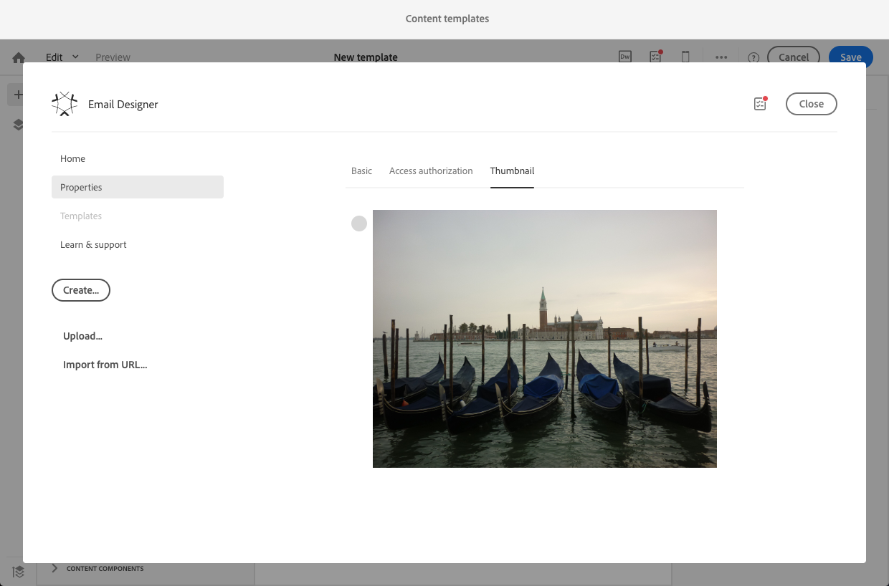

# 建立和使用可重複使用的內容 {#using-reusable-content}

了解如何掌握電子郵件內容版本。 使用電子郵件設計工具，您可以使用自己的預先定義內容建立範本和片段，並重複使用這些範本和片段以供後續傳遞。

## 使用範本設計電子郵件 {#designing-templates}

>[!NOTE]
>
> 在Adobe Campaign Standard中，您可以建立可透過 **資源** > **範本** 功能表。 「電子郵件設計工具」中使用的範本是「內容」範本。 如需詳細資訊，請參閱 [關於範本](../../start/using/marketing-activity-templates.md).

 [了解如何在影片中建立範本](#video)

### 關於內容範本 {#content-templates}

您可以管理中提供的HTML內容 **[!UICONTROL Templates]** 的 [電子郵件設計工具](../../designing/using/designing-content-in-adobe-campaign.md) 首頁。

現成可用的電子郵件內容範本包含18種行動裝置最佳化版面，以及4種由Behance藝術家設計的同級最佳回應式範本。 它們對應至最新的使用方式，例如客戶歡迎訊息、電子報和重新參與電子郵件等。 您可以輕鬆自訂品牌內容，輕鬆從頭設計電子郵件。

HTML內容範本可從 **[!UICONTROL Resources]** > **[!UICONTROL Content templates & fragments]** 螢幕 [進階功能表](../../start/using/interface-description.md#advanced-menu). 從那裡，您可以管理登錄頁面內容範本、電子郵件內容範本以及片段。

現成的內容範本為唯讀。 若要編輯其中一個範本，您必須先複製所需的範本。

您可以建立新的範本或片段，並定義您自己的內容。 有關詳細資訊，請參閱 [建立內容範本](#creating-a-content-template) 和 [建立內容片段](#creating-a-content-fragment).

使用電子郵件設計工具編輯內容時，您也可以將內容儲存為片段或範本，以建立內容範本。 有關詳細資訊，請參閱 [將內容另存為範本](#saving-content-as-template) 和 [將內容儲存為片段](../../designing/using/using-reusable-content.md#saving-content-as-a-fragment).

**相關主題：**

* 如需編輯內容的詳細資訊，請參閱 [關於電子郵件內容設計](../../designing/using/designing-content-in-adobe-campaign.md).

### 建立內容範本 {#creating-a-content-template}

您可以建立自己的內容範本，視需要多次使用。

下列範例說明如何建立電子郵件內容範本。

1. 前往 **[!UICONTROL Resources]** > **[!UICONTROL Content templates & fragments]** 按一下 **[!UICONTROL Create]**.
1. 按一下電子郵件標籤以存取 **[!UICONTROL Properties]** 頁簽。
1. 指定可識別的標籤，並選取下列參數以便在電子郵件中使用此範本：

   * 選擇 **[!UICONTROL Shared]** 或 **[!UICONTROL Delivery]** 從 **[!UICONTROL Content type]** 下拉式清單。
   * 選擇 **[!UICONTROL Template]** 從 **[!UICONTROL HTML type]** 下拉式清單。

   

1. 如有需要，您可以設定要作為範本縮圖的影像。 從 **[!UICONTROL Thumbnail]** 頁簽。

   

   此縮圖會顯示在 **[!UICONTROL Templates]** 的 [電子郵件設計工具](../../designing/using/designing-content-in-adobe-campaign.md) 首頁。

1. 關閉 **[!UICONTROL Properties]** 頁簽返回主工作區。
1. 新增結構元件和內容元件，您可視需要加以自訂。
   >[!NOTE]
   >
   > 您無法在內容範本內插入個人化欄位或條件式內容。
1. 編輯後，儲存範本。

此範本現在可用於使用電子郵件設計工具建立的任何電子郵件。 從 **[!UICONTROL Templates]** 的 [電子郵件設計工具](../../designing/using/designing-content-in-adobe-campaign.md) 首頁。

### 將內容另存為範本 {#saving-content-as-template}

使用電子郵件設計工具編輯電子郵件時，您可以直接將該電子郵件的內容儲存為範本。

<!--[!CAUTION]
>
>You cannot save as template a structure containing personalization fields or dynamic content.-->

1. 選擇 **[!UICONTROL Save as template]** 從「電子郵件設計工具」主工具欄。

   

1. 視需要新增標籤和說明，然後按一下 **[!UICONTROL Save]**.

   

1. 若要尋找您剛建立的範本，請前往 **[!UICONTROL Resources]** > **[!UICONTROL Content templates & fragments]**.

1. 若要使用新範本，請從 **[!UICONTROL Templates]** 的 [電子郵件設計工具](../../designing/using/designing-content-in-adobe-campaign.md) 首頁。

   

### 使用片段和元件建立範本 {#template-fragments-components}

您現在可以使用電子郵件設計工具建立電子郵件範本。 使用內容元件來反映您電子郵件的不同區段，並調整設定，使其盡可能接近原始電子報。 最後，插入您剛建立的片段。

1. 使用電子郵件設計工具建立範本。 有關詳細資訊，請參閱 [內容範本](#content-templates).
1. 將數個結構元件插入範本中 — 與電子郵件的頁首、頁尾和內文相對應。 有關添加結構元件的詳細資訊，請參閱 [使用電子郵件設計工具編輯電子郵件結構](../../designing/using/designing-from-scratch.md#defining-the-email-structure).
1. 視需要插入任意數量的內容元件，以建立電子報內文。 這將是您每月要更新之電子郵件的可編輯內容。

   

   如果您熟悉HTML程式碼，Adobe建議使用 **[!UICONTROL Html]** 您可以在其中複製貼上原始電子郵件中較複雜的元素的元件。 使用其他元件，例如 **[!UICONTROL Button]**, **[!UICONTROL Image]** 或 **[!UICONTROL Text]** 內容的其餘部分。 有關詳細資訊，請參閱 [關於內容元件](../../designing/using/designing-from-scratch.md#about-content-components).

   >[!NOTE]
   >
   >使用 **[!UICONTROL Html]** 元件導致建立可以使用有限選項編輯的元件。 選取此元件之前，請確定您知道如何處理HTML程式碼。

1. 盡可能調整內容元件以符合原始電子郵件。

   

   有關管理樣式設定和內嵌屬性的詳細資訊，請參閱 [編輯電子郵件樣式](../../designing/using/styles.md).

1. 將您先前建立的兩個片段（頁首和頁尾）插入到所需的結構元件中。

   

1. 儲存範本。

您現在可以在電子郵件設計工具中完全管理此範本，以建立和更新您每月要傳送給收件者的電子報。

若要使用，請建立電子郵件，並選取您剛建立的內容範本。

**相關主題**：

* [建立電子郵件](../../channels/using/creating-an-email.md)
* [電子郵件設計工具簡介影片](../../designing/using/designing-content-in-adobe-campaign.md#video)
* [從草稿開始設計電子郵件內容](../../designing/using/designing-from-scratch.md#designing-an-email-content-from-scratch)

### 教學課程影片 {#video}

此影片說明如何建立您自己的範本。

>[!VIDEO](https://video.tv.adobe.com/v/23106?quality=12)

提供其他Campaign Standard作法影片 [此處](https://experienceleague.adobe.com/docs/campaign-standard-learn/tutorials/overview.html?lang=zh-Hant).

## 關於片段 {#about-fragments}

>[!CONTEXTUALHELP]
>id="ac_fragments"
>title="關於片段"
>abstract="片段指可重複使用的內容區塊，可在一封或多封電子郵件中參照。"

片段是可重複使用的元件，可在一封或多封電子郵件中參考。
您可以在下方的介面中找到 **資源** > **內容片段和範本**.

若要在電子郵件設計工具中最有效地使用片段：

* 建立您自己的片段。 請參閱 [建立內容片段](#creating-a-content-fragment) 和 [將內容儲存為片段](#saving-content-as-a-fragment).
* 視需要在電子郵件中使用。 請參閱 [在電子郵件中插入元素](#inserting-elements-into-an-email).
* 編輯片段時，會同步變更：它們會自動傳播至包含該片段的所有電子郵件（前提是它們尚未準備或傳送）。

新增至電子郵件時，預設會鎖定片段。 如果您想要修改特定電子郵件的片段，可以在使用該片段的電子郵件中解除鎖定，以中斷與原始片段的同步。 更改將不再同步。

若要解除鎖定電子郵件內的片段，請選取該片段，然後按一下內容工具列中的鎖定圖示。

該片段會變成不再連結至原始片段的獨立元件。 然後，您就可以編輯它作為任何其他內容元件。 請參閱 [關於內容元件](../../designing/using/designing-from-scratch.md#about-content-components).

### 在電子郵件中插入片段 {#inserting-elements-into-an-email}

若要定義電子郵件的內容，您可以在預先放置的結構元件中新增內容元素。 請參閱 [編輯電子郵件結構](../../designing/using/designing-from-scratch.md#defining-the-email-structure).

1. 選取 **+** 表徵圖。 選擇 [片段](#about-fragments) 或 [內容元件](../../designing/using/designing-from-scratch.md#about-content-components).
1. 如果您已經知道要新增之片段的標籤或標籤的一部分，則可加以搜尋。

   

1. 從浮動視窗拖放片段或內容元件至電子郵件的結構元件。

   

   將元素新增至電子郵件後，元素就可以在結構元件內或電子郵件中的其他結構元件內移動。

   

1. 編輯元素以符合此電子郵件的確切需求。 您可以新增文字、連結、影像等。

   >[!NOTE]
   >
   >片段新增至電子郵件時，預設會鎖定。 如果您想要修改特定電子郵件的片段，或直接在片段中進行變更，可以中斷與原始片段的同步。 請參閱 [關於片段](#about-fragments).

1. 對您需要新增至電子郵件的所有元素重複此程式。
1. 儲存您的電子郵件。

現在您的電子郵件結構已填入，您可以編輯每個內容元素的樣式。 請參閱 [編輯元素](../../designing/using/styles.md).

>[!NOTE]
>
>如果修改片段，變更會自動傳播至使用片段的電子郵件中。 有關詳細資訊，請參閱 [關於片段](#about-fragments).

### 建立內容片段 {#creating-a-content-fragment}

您可以建立自己的內容片段，以視需要在一或多封電子郵件中使用。

1. 前往 **[!UICONTROL Resources]** > **[!UICONTROL Content templates & fragments]** 按一下 **[!UICONTROL Create]**.
1. 按一下電子郵件標籤以存取 **[!UICONTROL Properties]** 頁簽。
1. 指定可識別的標籤，並選取下列參數以在編輯電子郵件內容時尋找片段：

   * 因為片段僅與電子郵件相容，請選取 **[!UICONTROL Delivery]** 從 **[!UICONTROL Content type]** 下拉式清單。
   * 選擇 **[!UICONTROL Fragment]** 從 **[!UICONTROL HTML type]** 下拉式清單，以便將此內容當成片段使用。

   

1. 如有需要，您可以設定要作為片段縮圖的影像。 從 **[!UICONTROL Thumbnail]** 頁簽。

   

   編輯電子郵件時，此縮圖會顯示在片段的標籤旁。

1. 關閉 **[!UICONTROL Properties]** 頁簽返回主工作區。
1. 新增結構元件和內容元件，您可視需要加以自訂。

   >[!CAUTION]
   >
   >片段不得包含個人化欄位、動態內容或其他片段.
   >
   >請避免以空白結構元件儲存為片段內容。 插入片段後，就無法編輯。
   >
   >此 [行動檢視](../../designing/using/plain-text-html-modes.md#switching-to-mobile-view) 無法在片段中使用。

1. 編輯後，儲存您的片段。

此片段現在可用於使用電子郵件設計工具建立的任何電子郵件。 它顯示在 **[!UICONTROL Fragments]** 區段。

>[!NOTE]
>
>您無法在片段內插入個人化欄位，除非該欄位用於電子郵件且解除鎖定。 請參閱 [關於片段](#about-fragments).

### 將內容儲存為片段 {#saving-content-as-a-fragment}

使用電子郵件設計工具編輯電子郵件時，您可以直接將該電子郵件的一部分儲存為片段。

* 您無法將包含個人化欄位、動態內容或其他片段的結構儲存為片段。
* 只能選取彼此相鄰的結構。
   <!-- - You cannot select an empty structure.-->

1. 在電子郵件設計工具中編輯電子郵件時，請選取 **[!UICONTROL Save as fragment]** 中。

   

1. 從工作區中，選取將組成片段的結構。

   

   >[!NOTE]
   >
   >請務必選取彼此相鄰且不包含個人化欄位、動態內容或其他片段的結構。
   <!--You cannot select an empty structure.-->

1. 按一下&#x200B;**[!UICONTROL Create]**。

1. 視需要新增標籤和說明，然後按一下 **[!UICONTROL Save]**.

   

1. 若要尋找您剛建立的片段，請前往 **[!UICONTROL Resources]** > **[!UICONTROL Content templates & fragments]**.

   

1. 若要使用新片段，請開啟任何電子郵件內容，然後從片段清單中選取內容。

>[!NOTE]
>此 [行動檢視](../../designing/using/plain-text-html-modes.md#switching-to-mobile-view) 無法在片段中使用。 如果您想要編輯電子郵件行動檢視，請先完成此動作，再將內容儲存為片段。

<!--You need to copy-paste the HTML corresponding to the section that you want to save into a new fragment.

>[!NOTE]
>
>To do this, you need to be familiar with HTML code.

To save as a fragment some email content that you created, follow the steps below.

1. When editing an email in the Email Designer, select **[!UICONTROL Edit]** > **[!UICONTROL HTML]** to open the HTML version of that email.
1. Select and copy the HTML corresponding to the part that you want to save.
1. Go to **[!UICONTROL Resources]** > **[!UICONTROL Content templates & fragments]** and click **[!UICONTROL Create]**.
1. Click the email label to access the **[!UICONTROL Properties]** tab of the Email Designer and select **[!UICONTROL Fragment]** from the **[!UICONTROL HTML type]** drop-down list.
1. Select **[!UICONTROL Edit]** > **[!UICONTROL HTML]** to open the HTML version of the fragment.
1. Paste the HTML that you copied where appropriate.
1. Switch back to the **[!UICONTROL Edit]** view to check the result and save the new fragment.-->

## 使用片段建立可重複使用的頁首和頁尾 {#header-footer-fragments}

使用電子郵件設計工具，為每個可重複使用的區段建立片段。 在此範例中，您將建立兩個片段：一個用於頁首，一個用於頁尾。 然後，您可以將現有內容中的相關部分複製到這些片段中。

要執行此操作，請遵循下列步驟：

1. 在Adobe Campaign中，前往 **[!UICONTROL Resources]** > **[!UICONTROL Content templates & fragments]** 並為標題建立片段。 有關詳細資訊，請參閱 [建立內容片段](#creating-a-content-fragment).
1. 新增您所需數量的結構元件至片段。

   

1. 將影像和文字元件插入結構中。

   

1. 上傳對應的影像，輸入您的文字並調整設定。

   

1. 儲存您的片段。
1. 以類似方式繼續建立頁尾並儲存。

   

您的片段現在已可用於範本中。
