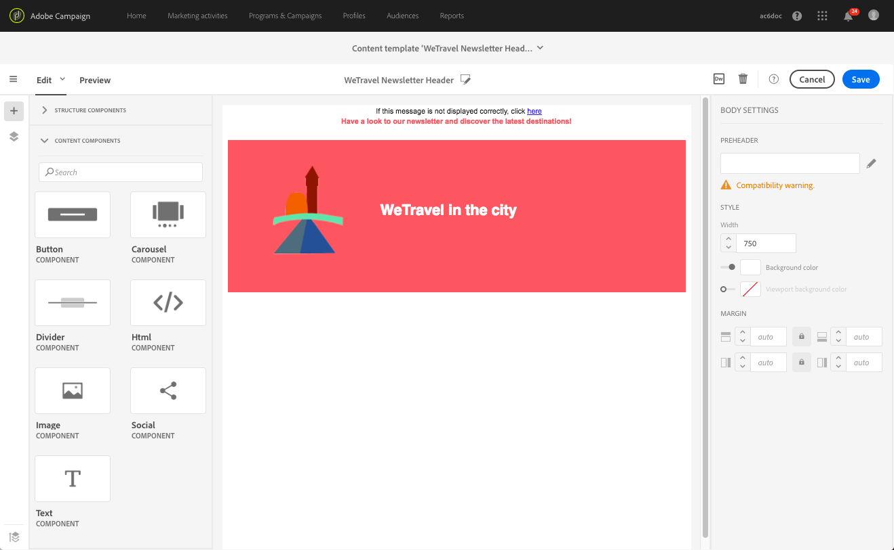

# 建立和使用可重用內容 {#using-reusable-content}

瞭解如何掌握電子郵件內容版本。 使用電子郵件設計器，您可以使用自己的預定義內容建立模板和片段，並將它們重新用於後續交貨。

## 使用模板設計電子郵件 {#designing-templates}

>[!NOTE]
>
> 在Adobe Campaign Standard，您可以建立可從 **資源** > **模板** 的子菜單。 電子郵件設計器中使用的模板是內容模板。 有關詳細資訊，請參見 [關於模板](../../start/using/marketing-activity-templates.md)。

 [瞭解如何在視頻中建立模板](#video)

### 關於內容模板 {#content-templates}

您可以管理中提供的HTML內容 **[!UICONTROL Templates]** 頁籤 [電子郵件設計器](../../designing/using/designing-content-in-adobe-campaign.md) 的子菜單。

現成電子郵件內容模板包括18個移動優化佈局和4個由Behance藝術家設計的一流響應模板。 它們對應於最新的使用方式，如客戶歡迎郵件、新聞稿和重新聯繫電子郵件等。 您可以輕鬆地根據您品牌的內容定制電子郵件，以便從頭開始設計電子郵件。

HTML內容模板可從 **[!UICONTROL Resources]** > **[!UICONTROL Content templates & fragments]** 螢幕 [高級菜單](../../start/using/interface-description.md#advanced-menu)。 從中，您可以管理登錄頁內容模板、電子郵件內容模板以及碎片。

現成內容模板是只讀的。 要編輯其中一個模板，必須首先複製所需模板。

您可以建立新模板或片段，並定義自己的內容。 有關此的詳細資訊，請參閱 [建立內容模板](#creating-a-content-template) 和 [建立內容片段](#creating-a-content-fragment)。

使用電子郵件設計器編輯內容時，還可以通過將內容另存為片段或模板來建立內容模板。 有關此的詳細資訊，請參閱 [將內容另存為模板](#saving-content-as-template) 和 [將內容另存為片段](../../designing/using/using-reusable-content.md#saving-content-as-a-fragment)。

**相關主題：**

* 有關編輯內容的詳細資訊，請參見 [關於電子郵件內容設計](../../designing/using/designing-content-in-adobe-campaign.md)。

### 建立內容模板 {#creating-a-content-template}

您可以建立自己的內容模板，以根據需要多次使用它們。

以下示例說明如何建立電子郵件內容模板。

1. 轉到 **[!UICONTROL Resources]** > **[!UICONTROL Content templates & fragments]** 按一下 **[!UICONTROL Create]**。
1. 按一下電子郵件標籤以訪問 **[!UICONTROL Properties]** 頁籤。
1. 指定可識別的標籤，並選擇以下參數以便能夠在電子郵件中使用此模板：

   * 選擇 **[!UICONTROL Shared]** 或 **[!UICONTROL Delivery]** 從 **[!UICONTROL Content type]** 的子菜單。
   * 選擇 **[!UICONTROL Template]** 從 **[!UICONTROL HTML type]** 的子菜單。

   

1. 如果需要，可以設定將用作模板縮略圖的影像。 從 **[!UICONTROL Thumbnail]** 頁籤。

   

   此縮略圖將顯示在 **[!UICONTROL Templates]** 頁籤 [電子郵件設計器](../../designing/using/designing-content-in-adobe-campaign.md) 的子菜單。

1. 關閉 **[!UICONTROL Properties]** 頁籤。
1. 添加結構元件和內容元件，您可以根據需要進行自定義。
   >[!NOTE]
   >
   > 不能在內容模板中插入個性化欄位或條件內容。
1. 編輯後，保存模板。

此模板現在可用於使用電子郵件設計器生成的任何電子郵件。 從 **[!UICONTROL Templates]** 頁籤 [電子郵件設計器](../../designing/using/designing-content-in-adobe-campaign.md) 的子菜單。

### 將內容另存為模板 {#saving-content-as-template}

使用電子郵件設計器編輯電子郵件時，可以直接將該電子郵件的內容另存為模板。

<!--[!CAUTION]
>
>You cannot save as template a structure containing personalization fields or dynamic content.-->

1. 選擇 **[!UICONTROL Save as template]** 的子菜單。

   

1. 如果需要，添加標籤和說明，然後按一下 **[!UICONTROL Save]**。

   

1. 要查找剛建立的模板，請轉到 **[!UICONTROL Resources]** > **[!UICONTROL Content templates & fragments]**。

1. 要使用新模板，請從 **[!UICONTROL Templates]** 頁籤 [電子郵件設計器](../../designing/using/designing-content-in-adobe-campaign.md) 的子菜單。

   

### 建立包含片段和元件的模板 {#template-fragments-components}

現在，您可以使用電子郵件設計器建立電子郵件模板。 使用內容元件來反映您電子郵件的不同部分，並調整設定，使其盡可能接近原始新聞稿。 最後，插入您剛建立的片段。

1. 使用電子郵件設計器建立模板。 有關此的詳細資訊，請參閱 [內容模板](#content-templates)。
1. 將多個結構元件插入模板中 — 與電子郵件的頁眉、頁腳和正文相對應。 有關添加結構元件的詳細資訊，請參見 [使用電子郵件設計器編輯電子郵件結構](../../designing/using/designing-from-scratch.md#defining-the-email-structure)。
1. 根據需要插入多個內容元件，以建立新聞簡報正文。 這將是您每月更新的電子郵件的可編輯內容。

   

   如果您熟悉HTML代碼，Adobe建議利用 **[!UICONTROL Html]** 可複製和貼上原始電子郵件中較複雜元素的元件。 使用其他元件，如 **[!UICONTROL Button]**。 **[!UICONTROL Image]** 或 **[!UICONTROL Text]** 其他內容。 有關此的詳細資訊，請參閱 [關於內容元件](../../designing/using/designing-from-scratch.md#about-content-components)。

   >[!NOTE]
   >
   >使用 **[!UICONTROL Html]** 元件導致建立具有有限選項的可編輯元件。 在選擇此元件之前，請確保知道如何處理HTML代碼。

1. 調整內容元件以盡可能匹配原始電子郵件。

   

   有關管理樣式設定和內聯屬性的詳細資訊，請參見 [編輯電子郵件樣式](../../designing/using/styles.md)。

1. 將先前建立的兩個片段（頁眉和頁腳）插入到所需的結構元件中。

   

1. 儲存範本。

現在，您可以在電子郵件設計器中完全管理此模板，以建立和更新您每月發送給收件人的新聞稿。

要使用它，請建立電子郵件並選擇您剛建立的內容模板。

**相關主題**：

* [建立電子郵件](../../channels/using/creating-an-email.md)
* [電子郵件設計器簡介視頻](../../designing/using/designing-content-in-adobe-campaign.md#video)
* [從頭設計電子郵件內容](../../designing/using/designing-from-scratch.md#designing-an-email-content-from-scratch)

### 教程視頻 {#video}

此視頻顯示如何建立您自己的模板。

>[!VIDEO](https://video.tv.adobe.com/v/23106?quality=12)

可提供其他Campaign Standard操作視頻 [這裡](https://experienceleague.adobe.com/docs/campaign-standard-learn/tutorials/overview.html?lang=zh-Hant)。

## 關於片段 {#about-fragments}

>[!CONTEXTUALHELP]
>id="ac_fragments"
>title="關於片段"
>abstract="片段指可重複使用的內容區塊，可在一封或多封電子郵件中參照。"

片段是可在一個或多個電子郵件中引用的可重用元件。
可以在下面的介面中找到 **資源** > **內容片段和模板**。

要在電子郵件設計器中充分利用片段：

* 建立您自己的碎片。 請參閱 [建立內容片段](#creating-a-content-fragment) 和 [將內容另存為片段](#saving-content-as-a-fragment)。
* 在電子郵件中根據需要多次使用它們。 請參閱 [在電子郵件中插入元素](#inserting-elements-into-an-email)。
* 編輯片段時，將同步更改：它們會自動傳播到包含該片段的所有電子郵件（如果它們尚未準備或發送）。

添加到電子郵件時，預設情況下會鎖定片段。 如果要修改特定電子郵件的片段，可以在使用該片段的電子郵件中解鎖該片段，從而中斷與原始片段的同步。 更改將不再同步。

要解鎖電子郵件中的片段，請選擇該片段並按一下上下文工具欄中的鎖定表徵圖。

該片段將成為不再連結到原始片段的獨立元件。 然後，可以將其作為任何其他內容元件進行編輯。 請參閱 [關於內容元件](../../designing/using/designing-from-scratch.md#about-content-components)。

### 將片段插入電子郵件 {#inserting-elements-into-an-email}

要定義電子郵件的內容，您可以在預先放置的結構元件中添加內容元素。 請參閱 [編輯電子郵件結構](../../designing/using/designing-from-scratch.md#defining-the-email-structure)。

1. 通過選擇 **+** 表徵圖。 選擇 [片段](#about-fragments) 或 [內容元件](../../designing/using/designing-from-scratch.md#about-content-components)。
1. 如果您已經知道要添加的片段的標籤或部分標籤，可以搜索它。

   

1. 將片段或內容元件從元件面板拖放到電子郵件的結構元件。

   

   在將元素添加到電子郵件中後，可以將其移動到結構元件或電子郵件中的其他結構元件中。

   

1. 編輯元素以滿足此電子郵件的確切需要。 可以添加文本、連結、影像等。

   >[!NOTE]
   >
   >預設情況下，在將片段添加到電子郵件時會鎖定。 如果要修改特定電子郵件的片段，或直接在片段中進行更改，則可以中斷與原始片段的同步。 請參閱 [關於片段](#about-fragments)。

1. 對需要添加到電子郵件中的所有元素重複此過程。
1. 保存電子郵件。

現在已填充電子郵件結構，您可以編輯每個內容元素的樣式。 請參閱 [編輯元素](../../designing/using/styles.md)。

>[!NOTE]
>
>如果修改了片段，則更改將自動傳播到使用片段的電子郵件中。 有關此的詳細資訊，請參閱 [關於片段](#about-fragments)。

### 建立內容片段 {#creating-a-content-fragment}

您可以建立您自己的內容片段，以便根據需要在一個或多個電子郵件中使用它們。

1. 轉到 **[!UICONTROL Resources]** > **[!UICONTROL Content templates & fragments]** 按一下 **[!UICONTROL Create]**。
1. 按一下電子郵件標籤以訪問 **[!UICONTROL Properties]** 頁籤。
1. 指定可識別的標籤，並選擇以下參數以在編輯電子郵件內容時查找片段：

   * 由於片段僅與電子郵件相容，請選擇 **[!UICONTROL Delivery]** 從 **[!UICONTROL Content type]** 的子菜單。
   * 選擇 **[!UICONTROL Fragment]** 從 **[!UICONTROL HTML type]** 下拉清單，可將此內容用作片段。

   

1. 如果需要，可以設定將用作片段縮略圖的影像。 從 **[!UICONTROL Thumbnail]** 頁籤。

   

   編輯電子郵件時，此縮略圖將顯示在片段標籤旁邊。

1. 關閉 **[!UICONTROL Properties]** 頁籤。
1. 添加結構元件和內容元件，您可以根據需要進行自定義。

   >[!CAUTION]
   >
   >片段不得包含個人化欄位、動態內容或其他片段.
   >
   >避免另存為具有空結構元件的片段內容。 插入>片段後，它們將不可編輯。
   >
   >的 [移動視圖](../../designing/using/plain-text-html-modes.md#switching-to-mobile-view) 在片段中不可用。

1. 編輯完後，保存您的片段。

現在，此片段可用於使用電子郵件設計器生成的任何電子郵件。 它出現在 **[!UICONTROL Fragments]** 的子菜單。

>[!NOTE]
>
>除非在電子郵件中使用並解除鎖定，否則不能在片段內插入個性化欄位。 請參閱 [關於片段](#about-fragments)。

### 將內容另存為片段 {#saving-content-as-a-fragment}

使用電子郵件設計器編輯電子郵件時，您可以直接將該電子郵件的一部分另存為片段。

* 不能將包含個性化欄位、動態內容或其他片段的結構另存為片段。
* 只能選取彼此相鄰的結構。
   <!-- - You cannot select an empty structure.-->

1. 在電子郵件設計器中編輯電子郵件時，選擇 **[!UICONTROL Save as fragment]** 的上界。

   

1. 在工作區中，選擇將構成片段的結構。

   

   >[!NOTE]
   >
   >確保選擇彼此相鄰且不包含個性化欄位、動態內容或其他片段的結構。
   <!--You cannot select an empty structure.-->

1. 按一下&#x200B;**[!UICONTROL Create]**。

1. 如果需要，添加標籤和說明，然後按一下 **[!UICONTROL Save]**。

   

1. 要查找您剛建立的片段，請轉到 **[!UICONTROL Resources]** > **[!UICONTROL Content templates & fragments]**。

   

1. 要使用新片段，請開啟所有電子郵件內容並從片段清單中選擇它。

>[!NOTE]
>的 [移動視圖](../../designing/using/plain-text-html-modes.md#switching-to-mobile-view) 在片段中不可用。 如果要編輯電子郵件移動視圖，請在將內容保存為片段之前進行編輯。

<!--You need to copy-paste the HTML corresponding to the section that you want to save into a new fragment.

>[!NOTE]
>
>To do this, you need to be familiar with HTML code.

To save as a fragment some email content that you created, follow the steps below.

1. When editing an email in the Email Designer, select **[!UICONTROL Edit]** > **[!UICONTROL HTML]** to open the HTML version of that email.
1. Select and copy the HTML corresponding to the part that you want to save.
1. Go to **[!UICONTROL Resources]** > **[!UICONTROL Content templates & fragments]** and click **[!UICONTROL Create]**.
1. Click the email label to access the **[!UICONTROL Properties]** tab of the Email Designer and select **[!UICONTROL Fragment]** from the **[!UICONTROL HTML type]** drop-down list.
1. Select **[!UICONTROL Edit]** > **[!UICONTROL HTML]** to open the HTML version of the fragment.
1. Paste the HTML that you copied where appropriate.
1. Switch back to the **[!UICONTROL Edit]** view to check the result and save the new fragment.-->

## 使用片段建立可重用頁眉和頁腳 {#header-footer-fragments}

使用電子郵件設計器，為每個可重用的節建立一個片段。 在此示例中，將建立兩個片段：一個用於頁眉，一個用於頁腳。 然後，可以將現有內容中的相關部件複製到這些片段中。

要執行此操作，請遵循下列步驟：

1. 在Adobe Campaign，轉到 **[!UICONTROL Resources]** > **[!UICONTROL Content templates & fragments]** 並為頭建立片段。 有關此的詳細資訊，請參閱 [建立內容片段](#creating-a-content-fragment)。
1. 根據您的片段需要添加盡可能多的結構元件。

   

1. 將影像和文本元件插入結構中。

   

1. 上載相應影像，輸入文本並調整設定。

   

1. 保存您的碎片。
1. 同樣，繼續建立頁腳並保存。

   

您的片段現已準備好用於模板。
