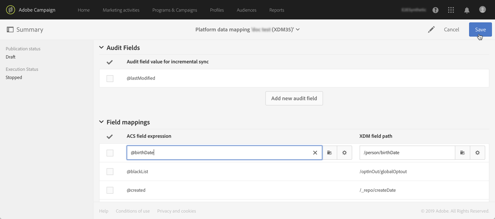

# 映射定義 {#mapping-definition}

>[!IMPORTANT]
>
>Adobe Experience Platform Data Connector目前正在測試中，可能會在不另行通知的情況下頻繁更新。 客戶必須在Azure上代管（目前僅限北美地區測試版）才能存取這些功能。 如果您想要存取，請聯絡Adobe客戶服務。

在本節中，您將瞭解如何使用「體驗資料模型」(XDM)欄位對應「促銷活動標準」欄位。

要執行此任務，必要條件是：

* XDM架構定義（通過介面或使用與XDM關聯的REST API）
* 基於XDM模式定義的資料集建立

1. 前往&#x200B;**[!UICONTROL Administration]** > **[!UICONTROL Development]** > **[!UICONTROL Platform]**&#x200B;並選擇&#x200B;**[!UICONTROL Data mappings]**&#x200B;項目。

1. 按一下&#x200B;**[!UICONTROL Create]**&#x200B;以啟動新的XDM映射。

   

1. 填寫必填欄位並選取：

   * a **定位維度**&#x200B;此為要映射的促銷活動標準結構
   * a **dataset**&#x200B;這是與Adobe Experience Platform中的XDM架構相關聯的資料套件。

>[!NOTE]
>
>若要將批次收錄至即時客戶個人檔案或身分服務，資料集必須啟用「即時客戶個人檔案」[。](https://docs.adobe.com/content/help/en/experience-platform/rtcdp/intro/get-started.html)
>
>如果您選取的資料集已用於現有的資料對應，會出現警告，通知您Adobe Experience Platform可能會覆寫您的資料。 當使用相同資料集的資料綁架中有一些常見的收件者時，可能會發生這種情況。

下列畫面顯示&#x200B;**[!UICONTROL Field mappings]**&#x200B;區段，您可在其中為Campaign Standard架構中的每個欄位建立新的對應。

**[!UICONTROL Create new field mapping]**&#x200B;按鈕可讓您選擇「促銷活動標準」欄位，以及XDM架構中的對應欄位路徑運算式。

如果您找不到Adobe Campaign Standard欄位，您可以使用搜尋欄位來搜尋欄位。 目前，搜尋只適用於階層中開啟的欄位。

在「促銷活動標準」中定義的擴充資源會對應所有原生欄位。 它們定義在XDM的_customer/default擴展中。

您可以透過API自訂XDM擴充功能，並定義您自己的擴充功能，讓您更能控制對應。

有關XDM API的詳細資訊，請參閱[方案註冊表API教程](https://docs.adobe.com/content/help/zh-Hant/experience-platform/xdm/api/getting-started.html)。

要映射枚舉欄位，需要使用表達式編輯器來定義與XDM值對應的每個枚舉值。 例如，postalAdressfield需要定義為：

如果XDM值在XDM模式中定義為枚舉，則可以使用自動替換&#x200B;**lif**&#x200B;語法的本地EXDM函式。

若要編輯XDM映射，請將其開啟，修改所需資訊，然後保存它。

>[!IMPORTANT]
>
>目前，如果您在&#x200B;**[!UICONTROL Field mappings]**&#x200B;區段中編輯值，然後在欄位外按一下，則在按一下&#x200B;**[!UICONTROL Save]**&#x200B;按鈕後，您的變更才會顯示在介面中。 當&#x200B;**[!UICONTROL Field Mappings]**&#x200B;上的編輯是頁面上的第一次編輯時，此行為僅發生一次。
