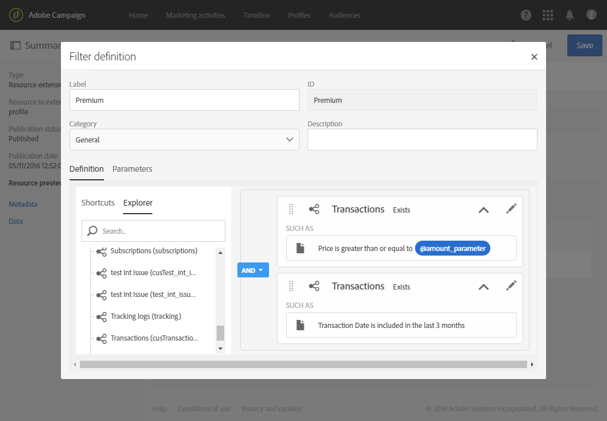

# 設定篩選定義{#configuring-filter-definition}

在標籤 **[!UICONTROL Filter definition]** 中，您可以建立進階篩選器，讓使用者在建立複雜查詢時（例如定義對象時）直接存取這些篩選器。

此步驟並非必要步驟，因為您仍可以填入資源，並透過工作流程、對象和 REST API 存取其資料。

這些篩選器在查詢編輯器中以預先設定的規則形式使用。它們可讓您限制取得所需組態所需的步驟數，這對重複細分特別有利。

例如，您可以建立篩選器，以便選取過去三個月內超過特定金額的所有交易。

為此，您需要擴展 **[!UICONTROL Profiles]** 資源並定義一個連結至交易表格（您以前已建立）的篩選器，該篩選器具有一個規則，該規則指明交易價格必須大於或等於給定參數，並且交易日期必須落在與最近三個月相對應的範圍內。

1. 請確定您建立和發佈交易表。請參閱[建立或擴充資源](../../developing/using/creating-or-extending-the-resource.md)。

   >[!NOTE]
   >
   >此過程使用自定義交易表的範例。針對您的個案，根據您的企業需求進行調整。

1. 在定義資源 **[!UICONTROL Profiles]** 中與交易表相關的篩選器之前，請務必定義此資料表的連結並發佈更改。請參閱[定義與其他資源的連結](../../developing/using/configuring-the-resource-s-data-structure.md#defining-links-with-other-resources)和[更新資料庫結構](../../developing/using/updating-the-database-structure.md)。
1. 在 **[!UICONTROL Definition]** 新篩選器定義螢幕的標籤中，選取交易表。

   

1. 在 **[!UICONTROL Add a rule - Profiles/Transactions]** 視窗中，將交易表拖放到工作區中。在顯示的下一個視窗中，選取您要使用的欄位。

   

1. 在 **[!UICONTROL Add a rule - Transactions]** 視窗的 **[!UICONTROL Optional parameter settings]** 中，選取 **[!UICONTROL Switch to parameters]** 方塊。

   在 **[!UICONTROL Filter conditions]** 中選取 **[!UICONTROL Greater than or equal to]** 運算子。在欄位 **[!UICONTROL Parameters]** 中輸入名稱，然後按一下加號以建立新參數。

   

1. 確認您的變更。此定義對應於用戶以後必須填寫的可配置欄位，以執行查詢。

   

1. 將此規則與另一個規則結合，指定交易日期必須落在與最近三個月相對應的範圍內。

   

1. 選取顯示篩選的類別。

   

1. 在 **[!UICONTROL Parameters]** 篩選器定義畫面的標籤中，修改說明和標籤，向使用者清楚指出您的篩選器主題。此資訊會出現在查詢編輯器中。

   

   如果定義多個可配置欄位，則可以修改它們在介面中的顯示順序。

1. 儲存變更並發佈資源。有關詳細資訊，請參閱[更新資料庫結構](../../developing/using/updating-the-database-structure.md)區段。

發佈 **[!UICONTROL Profiles]** 資源擴展後，使用者將在[查詢編輯器](../../automating/using/editing-queries.md)介面的捷徑標籤下看到此篩選器。

這可讓使用者在建立電子郵件以傳送給所有客戶時，輕鬆定義其對象，這些客戶在過去三個月中花費了超過特定金額。

他們只需在出現的對話方塊中輸入所需金額，而不需自行設定。

設定篩選器後，您就可以使用下列語法，從Campaign Standard API使用篩選器：

`GET https://mc.adobe.io/<ORGANIZATION>/campaign/profileAndServicesExt/<resourceName>/by<customFilterName>?<customFilterparam>=<customFilterValue>`

如需詳細資訊，請參閱 [Campaign Standard API檔案](../../api/using/filtering.md#custom-filters)。
