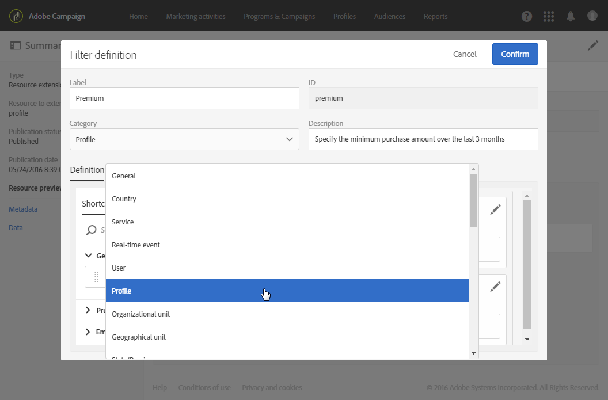

# 設定篩選定義{#configuring-filter-definition}

在標籤 **[!UICONTROL Filter definition]** 中，您可以建立進階篩選，讓使用者在建立複雜查詢時（例如定義對象時）直接存取這些篩選器。

此步驟並非必要步驟，因為您仍可以填入資源，並透過工作流程、對象和REST API存取其資料。

這些篩選器在查詢編輯器中以預先設定的規則形式使用。 它們可讓您限制取得所需組態所需的步驟數，這對重複分段特別有利。

例如，您可以建立篩選，以便選取過去三個月內超過特定金額的所有交易。

為此，您需要擴展資源並定義一個連結至事務處理表（您以前已建立）的篩選器，該篩選器具有一個規則，該規則指明事務處理價格必須大於或等於給定參數，並且事務處理日期必須落在與最近三個月相對應的範圍內。 **[!UICONTROL Profiles]**

1. 請確定您建立和發佈交易表。 See [Creating or extending the resource](../../developing/using/creating-or-extending-the-resource.md).

   >[!NOTE]
   >
   >此過程使用自定義事務表的示例。 針對您的個案，根據您的業務需求進行調整。

1. 在定義資源中與事務表相關的篩選器之 **[!UICONTROL Profiles]** 前，請務必定義此表的連結並發佈更改。 請參 [閱定義與其他資源的連結](../../developing/using/configuring-the-resource-s-data-structure.md#defining-links-with-other-resources)[和更新資料庫結構](../../developing/using/updating-the-database-structure.md)。
1. 在新篩 **[!UICONTROL Definition]** 選器定義螢幕的頁籤中，選擇事務表。

   

1. 在窗口 **[!UICONTROL Add a rule - Profiles/Transactions]** 中，將事務表拖放到工作區中。 在顯示的下一個視窗中，選取您要使用的欄位。

   

1. 在窗口 **[!UICONTROL Optional parameter settings]** 中，選 **[!UICONTROL Add a rule - Transactions]** 中該框 **[!UICONTROL Switch to parameters]** 。

   在中， **[!UICONTROL Filter conditions]**&#x200B;選擇運算 **[!UICONTROL Greater than or equal to]** 符。 在欄位 **[!UICONTROL Parameters]** 中輸入名稱，然後按一下加號以建立新參數。

   

1. 確認您的變更。 此定義對應於用戶以後必須填寫的可配置欄位，以執行查詢。

   

1. 將此規則與另一個規則結合，指定交易日期必須落在與最近三個月相對應的範圍內。

   

1. 選擇顯示篩選的類別。

   

1. 在篩選 **[!UICONTROL Parameters]** 器定義畫面的標籤中，修改說明和標籤，向使用者清楚指出您的篩選器主題。 此資訊會出現在查詢編輯器中。

   

   如果定義多個可配置欄位，則可以修改它們在介面中的顯示順序。

1. 儲存變更並發佈資源。 有關詳細資訊，請參閱「更 [新資料庫結構](../../developing/using/updating-the-database-structure.md) 」部分。

發佈資 **[!UICONTROL Profiles]** 源擴展後，用戶將在查詢編輯器介面的快捷方式頁籤下看到 [此篩選器](../../automating/using/editing-queries.md) 。

這可讓使用者在建立電子郵件以傳送給所有客戶時，輕鬆定義其受眾，這些客戶在過去三個月中花費了超過特定金額。

他們只需在出現的對話方塊中輸入所需金額，而不需自行設定。

