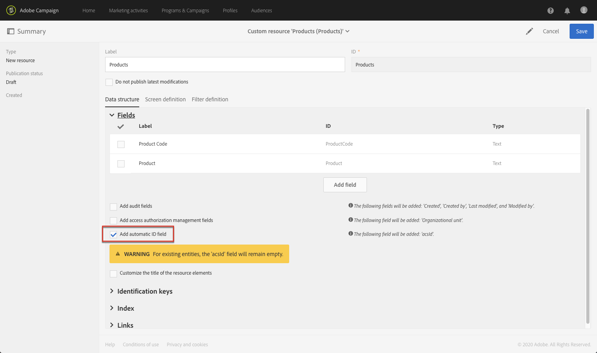

# 設定資源的資料結構{#configuring-the-resource-s-data-structure}

建立新的自訂資源後，您必須設定資料結構。

在編輯資源時，可在 **[!UICONTROL Data structure]** 索引標籤中新增：

* [欄位](#adding-fields-to-a-resource)
* [識別鍵](#defining-identification-keys)
* [索引](#defining-indexes)
* [連結](#defining-links-with-other-resources)
* [傳送記錄檔](#defining-sending-logs-extension)

## 向資源新增欄位 {#adding-fields-to-a-resource}

您可以將新欄位新增至資源，以儲存非現成可用資料模型一部分的資料。

1. 使用 **[!UICONTROL Create element]** 按鈕建立欄位。
1. 指定標籤、ID、欄位類型，並定義此欄位所授權的最大長度。

   **[!UICONTROL ID]** 欄位是必填欄位，且每個新增欄位必須是唯一的。

   >[!NOTE]
   >
   >最多使用 30 個字元。

   

1. 要修改其中一個欄位，請核取 **[!UICONTROL Edit Properties]** 按鈕。

   

1. 在 **[!UICONTROL Field definition]** 畫面中，您可以定義將用於對象和定位的類別，或甚至新增說明。

   

1. 如果您需要定義將提供給使用者的值（分項清單），請核取 **[!UICONTROL Specify a list of authorized values]** 選項。

   然後，按一下 **[!UICONTROL Create element]** 並指定 **[!UICONTROL Label]** 和 **[!UICONTROL Value]**。視需要新增多個值。

1. 在新增欄位後，核取 **[!UICONTROL Add audit fields]** 方塊以包含詳細說明建立日期、建立資源的用戶、日期和上次修改的作者的欄位。
1. 核取 **[!UICONTROL Add access authorization management fields]** 方塊以包含欄位，指出誰擁有該特定資源的存取權。

   這些欄位會顯示在資料和中繼資料中，當進行資料庫更新後，這些欄位就會顯示出來。有關詳細資訊，請參閱[更新資料庫結構](../../developing/using/updating-the-database-structure.md)區段。

1. 核取 **[!UICONTROL Add automatic ID]** 欄位以自動產生 ID。請注意，現有實體將維持空白。如需詳細資訊，請參閱[產生設定檔和自訂資源的唯一 ID](../../developing/using/configuring-the-resource-s-data-structure.md#generating-a-unique-id-for-profiles-and-custom-resources)。
1. 要修改資源元素名稱在清單和建立步驟中的顯示方式，請核取 **[!UICONTROL Customize the title of the resource elements]** 方塊。從為此資源建立的欄位中選取一個欄位。

   

   >[!NOTE]
   >
   >如果不核取此選項，則在列出此表中的所有實體時，將使用自動主鍵（每次將實體新增到表格中時都會自動建立主要鍵）。

現在已定義資源的欄位。

## 定義標識鍵 {#defining-identification-keys}

每個資源至少必須有一個唯一密鑰。例如，您可以指定索引鍵，讓兩個產品在購買表格中不能有相同的 ID。

1. 如果要自動逐步產生技術密鑰，請在 **[!UICONTROL Automatic primary key]** 區段中指定儲存的大小。

   

1. 使用 **[!UICONTROL Create element]** 按鈕建立金鑰。

   預設會完成 **[!UICONTROL Label]** 及 **[!UICONTROL ID]** 欄位，但您可以編輯它們。

   >[!NOTE]
   >
   >最多使用 30 個字元。

1. 要定義構成此鍵的元素，請按一下 **[!UICONTROL Create element]** 並選取為此資源建立的欄位。

   

   建立的鍵將顯示在 **[!UICONTROL Custom keys]** 區段中。

現在會建立資源的識別碼。

>[!NOTE]
>
>若要瞭解建立識別索引鍵時的最佳實務，請參閱本[區段](../../developing/using/data-model-best-practices.md#keys)。

## 定義索引 {#defining-indexes}

索引可以參考一個或多個資源欄位。索引允許資料庫對記錄進行排序，以便更輕鬆地復原記錄。它們最佳化 SQL 查詢的效能。

建議定義索引，但不是強制性的。

1. 使用 **[!UICONTROL Create element]** 按鈕可建立索引。

   

1. 預設會完成 **[!UICONTROL Label]** 及 **[!UICONTROL ID]** 欄位，但您可以加以編輯。

   >[!NOTE]
   >
   >最多使用 30 個字元。

1. 要定義構成此索引的元素，請從為此資源建立的欄位中選取欄位。

   

1. 按一下 **[!UICONTROL Confirm]**。

已建立的索引將顯示在 **[!UICONTROL Index]** 區段中的清單中。

>[!NOTE]
>
>若要瞭解建立索引時的最佳實務，請參閱[本區段](../../developing/using/data-model-best-practices.md#indexes)。

## 定義與其他資源的連結 {#defining-links-with-other-resources}

連結詳細說明了一個表與其他表的關聯。

1. 使用 **[!UICONTROL Create element]** 按鈕可建立指向目標資源的連結。
1. 按一下 **[!UICONTROL Select a target resource]**。

   

1. 資源按字母順序顯示，並可按名稱篩選。其技術名稱會以方括弧顯示。

   從清單中選取元素並按一下 **[!UICONTROL Confirm]**。

   

1. 根據基數選取 **[!UICONTROL Link type]**。根據所選的基數類型，刪除或複製記錄時的行為可能會有所不同。

   各種連結類型如下：

   * **[!UICONTROL 1 cardinality simple link]**：來源表格的一個執行個體最多可以具有目標表格的相對應執行個體。
   * **[!UICONTROL N cardinality collection link]**：來源表格的一個出現次數可以具有多個目標表的相應出現次數，但目標表的一個出現次數最多可以具有來源表格的一個對應出現次數。
   * **[!UICONTROL 0 or 1 cardinality simple link]**：來源表格的一個執行個體最多可以具有目標表的一個相應執行個體或無。請注意，這類 **[!UICONTROL Link type]** 可能會導致效能問題。

   

1. 在 **[!UICONTROL New link]** 畫面中，預設會完成 **[!UICONTROL Label]** 及 **[!UICONTROL ID]** 欄位，但您可以加以編輯。

   >[!NOTE]
   >
   >最多使用 30 個字元。
   >
   >建立後無法重新命名連結。若要重新命名連結，您必須刪除連結並重新建立連結。

1. **[!UICONTROL Category for the audience and targeting]** 清單可讓您將此連結指派給類別，使其在查詢編輯器工具中更加可見。
1. 如果需要，**[!UICONTROL Reverse link definition]** 區段可讓您在目標資源中顯示資源的標籤和 ID。
1. 定義 **[!UICONTROL Behavior if deleted/duplicated]** 區段中連結參考的記錄行為。

   依預設，當連結不再參照目標籤錄時，就會將其刪除。

   

1. 在 **[!UICONTROL Join definition]** 區段中，選取預設 **[!UICONTROL Use the primary keys to make the join]** 選項，但您可以選取兩個選項：

   * **[!UICONTROL Use the primary key to make the join]**：此連接定義可讓您使用設定主鍵來調解購買的主鍵。
   * **[!UICONTROL Define specific join conditions]**：此連接定義可讓您手動選取將連接兩個資源的欄位。請注意，如果資料未正確設定，**Purchase** 記錄將不會顯示。

   

所建立的連結將顯示在 **[!UICONTROL Links]** 區段中的清單中。

>[!NOTE]
>
>若要瞭解建立索引時的最佳實務，請參閱[本區段](../../developing/using/data-model-best-practices.md#links)。

**範例：將建立的資源與 &#39;Profiles&#39; 資源連結**

在此範例中，我們想將新的資源 **Purchase** 與 **Profiles** 自訂資源連結：

1. 建立您的新 **Purchase** 資源。
1. 若要將其與 **Profiles** 自訂資源連結，請展開 **[!UICONTROL Data structure]** 索引標籤中的 **[!UICONTROL Links]** 區段，然後按一下 **[!UICONTROL Create element]**。
1. 在此處選取目標資源 **[!UICONTROL Profiles (profile)]**。
1. 在此範例中，請保留預設的 **[!UICONTROL 1 cardinality simple link]** 連結類型。

   

1. 選取聯接定義，此處保留預設值 **[!UICONTROL Use the primary key to make the join]**。

   

1. 如有需要，您可以定義詳細資訊畫面，以便編輯 **Purchase**，並將它連結至設定檔。

   展開該 **[!UICONTROL Detail screen configuration]** 區段並核取 **[!UICONTROL Define a detail screen]** 以設定與資源的每個元素對應的畫面。如果不核取此方塊，則無法存取此資源元素的詳細檢視。

1. 按一下 **[!UICONTROL Create element]**。
1. 選取連結的資源，然後按一下 **[!UICONTROL Add]**。

   然後，您的新資源將可在進階功能表取得，方法是選取 **[!UICONTROL Client data]** > **[!UICONTROL Purchase]**。

   

1. 完成設定後，按一下 **[!UICONTROL Confirm]**。

   您現在可以發佈新資源。

透過新增此連結，**Purchase** 索引標籤標籤會從 **[!UICONTROL Profiles & audiences]** > **[!UICONTROL Profiles]** 功能表新增至設定檔詳細資訊畫面。請注意，這會特定於 **[!UICONTROL Profile]** 資源。

## 定義發送日誌擴展 {#defining-sending-logs-extension}

發送日誌擴展可讓您：

* 若要透過新增設定檔自訂欄位來擴充 **動態報表功能**
* 使用區段代碼和設定檔資料來擴充 **傳送記錄檔資料**

**使用區段代碼擴充**

使用者可使用來自工作流程引擎的區段代碼來擴充記錄檔。

區段代碼必須定義至工作流程中。

若要啟用此擴充功能，請核取選項 **[!UICONTROL Add segment code]**。

如需區段代碼的詳細資訊，請參閱[分段](../../automating/using/segmentation.md)區段。

**使用設定檔欄位擴充**

>[!NOTE]
>
>管理員應該已使用自訂欄位擴展設定檔資源。

按一下 **[!UICONTROL Add field]** 並從設定檔資源中選取任何自訂欄位。

要產生連結到「設定檔」維的新子維，請核取該 **[!UICONTROL Add this field in Dynamic reporting as a new dimension]** 選項。

從動態報表，您可以將自訂欄位維度拖放至自由表格。

有關動態報告的詳細資訊，請參閱[元件清單](../../reporting/using/list-of-components-.md)。

>[!IMPORTANT]
>
>傳送至動態報表的欄位數限制為20。

## 編輯資源屬性 {#editing-resource-properties}

在自訂資源螢幕中，**[!UICONTROL Summary]** 窗格指示新建立的資源的狀態。您可以管理其存取權及其一般屬性。

1. 按一下 **[!UICONTROL Edit properties]** 按鈕以新增說明。

   

1. 如果需要，請修改資源的標籤和 ID。

   >[!NOTE]
   >
   >最多使用 30 個字元。

1. 如果您需要限制特定組織單位對此資源的存取權限，請在此處指定這些單位。只有授權單位的使用者才能在應用程式中使用此資源。
1. 儲存修改。

您的修改會儲存。您需要再次發佈資源以套用資源。

## 為設定檔和自訂資源產生唯一 ID {#generating-a-unique-id-for-profiles-and-custom-resources}

依預設，設定檔和自訂資源在建立時沒有業務 ID。您可以啟用在建立元素時自動產生唯一ID的選項。此 ID 可用於：

* 在外部工具中輕鬆識別匯出的記錄。
* 匯入在其他應用程式中處理的更新資料時，調解記錄。

僅可針對設定檔和自訂資源啟用。

1. 為設定檔資源建立擴展或建立新資源。
1. 在資料結構定義中，核取 **[!UICONTROL Add automatic ID field]** 區段下的 **[!UICONTROL Fields]** 選項。

   

   >[!NOTE]
   >
   >只有新記錄有ACS ID。在啟用此選項之前，對於已建立的設定檔或元素，**[!UICONTROL ACS ID]** 欄位將保持空白。

1. 儲存並發佈對資源所進行的修改。如果您想要此機制套用至透過 API 建立的元素，請核取擴充 API 的選項。

現在 **[!UICONTROL ACS ID]** 欄位可供使用，並在手動、從 API 或從匯入工作流程插入新元素時自動填入。ACS ID 欄位是 UUID 欄位，並且已編製索引。

現在，在匯出設定檔或自訂資源時，如果 **[!UICONTROL ACS ID]** 欄已為該資源啟用，則可以新增該列。您可以在外部工具中重複使用此 ID 來識別記錄。

當重新匯入已在其他應用程式（例如 CRM）中處理/更新的資料時，您可以輕鬆將其與此唯一 ID 調解。

>[!NOTE]
>
>在啟用選項之前，不會針對已建立的設定檔或元素更新 **[!UICONTROL ACS ID]** 欄位。只有新記錄有ACS ID。
>
>此欄位處於唯讀模式。您無法修改它。
