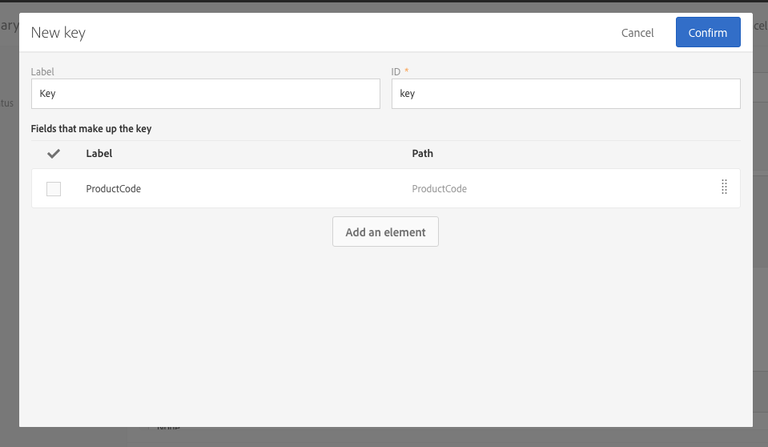

# Configuring the resource's data structure{#configuring-the-resource-s-data-structure}

建立新的自訂資源後，您必須設定資料結構。

When editing the resource, in the **[!UICONTROL Data structure]** tab, you can add:

* [欄位](../../developing/using/configuring-the-resource-s-data-structure.md#adding-fields-to-a-resource)
* [識別碼](../../developing/using/configuring-the-resource-s-data-structure.md#defining-identification-keys)
* [索引索引](../../developing/using/configuring-the-resource-s-data-structure.md#defining-indexes)
* [連結](../../developing/using/configuring-the-resource-s-data-structure.md#defining-links-with-other-resources)
* [傳送記錄檔](../../developing/using/configuring-the-resource-s-data-structure.md#defining-sending-logs-extension)

## Adding fields to a resource {#adding-fields-to-a-resource}

您可以新增欄位至資源，以儲存不屬於方塊資料模型之一部分的資料。

1. Use the **[!UICONTROL Create element]** button to create a field.
1. 指定標籤、ID、欄位類型，並定義此欄位授權的最大長度。

   **[!UICONTROL ID]** 欄位為強制欄位，且每個欄位都必須是唯一欄位。

   >[!NOTE]
   >
   >If you leave the **[!UICONTROL Label]** field empty, it will automatically be completed from the ID.
   >建議您最多使用30個字元。

   

1. To modify one of the fields, check the **[!UICONTROL Edit Properties]** button.

   

1. **[!UICONTROL Field definition]** 在畫面中，您可以定義將用於對象和定位的類別，甚至新增說明。

   

1. Check the **[!UICONTROL Specify a list of authorized values]** option if you need to define values that will be offered to the user (enumeration values).

   Then, click **[!UICONTROL Create element]** and specify a **[!UICONTROL Label]** and **[!UICONTROL Value]**. 視需要新增多個值。

1. Once you have added your fields, check the **[!UICONTROL Add audit fields]** box to include fields detailing the creation date, the user that created the resource, the date, and the author of the last modification.
1. Check the **[!UICONTROL Add access authorization management fields]** box to include the fields stating who has access rights to that particular resource.

   這些欄位會顯示在資料和中繼資料中，並在資料庫更新完成後顯示。For more on this, refer to the [Updating the database structure](../../developing/using/updating-the-database-structure.md) section.

1. Check the **[!UICONTROL Add automatic ID]** field to automatically generate an ID. 請注意，現有實體將維持空白。
1. To modify the way in which the name of the resource elements will appear in the lists and creation steps, check the **[!UICONTROL Personalize the resource title]** box. 從您為此資源建立的欄位中選取欄位。

   

現在已定義您的資源欄位。

## Defining identification keys {#defining-identification-keys}

每個資源至少必須有一個唯一金鑰。例如，您可以指定索引鍵，讓兩個產品在購買表格中都無法使用相同的ID。

1. Specify it in the **[!UICONTROL Automatic primary key]** section the size for the storage if you would like to have a technical key automatically and incrementally generated.

   

1. Use the **[!UICONTROL Create element]** button to create a key.

   The **[!UICONTROL Label]** and **[!UICONTROL ID]** fields are completed by default but you can edit them.

   >[!NOTE]
   >
   >建議您最多使用30個字元。

1. To define the elements making up this key, click **[!UICONTROL Create element]** and select the fields that you created for this resource.

   

   Created keys are displayed in the **[!UICONTROL Custom keys]** section.

現在會建立資源的識別金鑰。

## Defining indexes {#defining-indexes}

索引可以參考一或多個資源欄位。索引可讓資料庫排序記錄，以便更輕鬆地復原記錄。它們可最佳化SQL查詢的效能。

建議您定義索引，但不是強制的。

1. Use the **[!UICONTROL Create element]** button to create an index.

   

1. The **[!UICONTROL Label]** and **[!UICONTROL ID]** fields are completed by default, but you can edit them.

   >[!NOTE]
   >
   >建議您最多使用30個字元。

1. 若要定義組成此索引的元素，請選取您為此資源建立的欄位。

   

1. Click **[!UICONTROL Confirm]**.

The indexes that were created appear in the list in the **[!UICONTROL Index]** section.

## Defining links with other resources {#defining-links-with-other-resources}

連結詳細說明一個表格與其他表格的關聯。

1. Use the **[!UICONTROL Create element]** button to create a link to a target resource.
1. Click **[!UICONTROL Select a target resource]**.

   

1. 資源以字母順序顯示，可依名稱篩選。其技術名稱會以括號顯示。

   Select an element from the list and click **[!UICONTROL Confirm]**.

   

1. Select the **[!UICONTROL Link type]** according to cardinality. 視選取的基數類型而定，如果刪除或複製記錄，行為可能會有所不同。

   各種連結類型如下：

   * **[!UICONTROL 1 cardinality simple link]**：來源表格的一次事件可在目標表格的大部份發生對應的事件。
   * **[!UICONTROL N cardinality collection link]**：來源表格的一次事件可有數個目標表格的對應次數，但某個定位表格的來源表格可能會有大部分對應的事件。
   * **[!UICONTROL 0 or 1 cardinality simple link]**：來源表格有一個出現在目標表格或無的情況下。Note that this kind of **[!UICONTROL Link type]** can cause performance issue.
   

1. **[!UICONTROL New link]** 在畫面中，預設會完成和 **[!UICONTROL Label]****[!UICONTROL ID]** 欄位，但您可以加以編輯。

   >[!NOTE]
   >
   >建議您最多使用30個字元。

   >[!CAUTION]
   >
   >建立後，無法重新命名連結。若要重新命名連結，您必須將其刪除並再次建立連結。

1. **[!UICONTROL Category for the audience and targeting]** 清單可讓您將此連結指派給類別，讓它更能顯示在查詢編輯器工具中。
1. If needed, the **[!UICONTROL Reverse link definition]** section allows you to display the label and ID of the resource in the targeted resource.
1. Define the behavior of the records referenced by the link in the **[!UICONTROL Behavior if deleted/duplicated]** section.

   依預設，一旦連結不再參照目標記錄，將會刪除目標記錄。

   

1. **[!UICONTROL Join definition]** 在區段中，選取預設 **[!UICONTROL Use the primary keys to make the join]** 選項，但您可以選擇兩個選項：

   * **[!UICONTROL Use the primary key to make the join]**：此加入定義可讓您使用描述檔主要索引鍵與購買的主要索引鍵協調。
   * **[!UICONTROL Define specific join conditions]**：此加入定義可讓您手動選取將加入兩個資源的欄位。Please note that if data are not correctly configured, the **Purchase** record will not be visible.
   

The links created are displayed in the list in the **[!UICONTROL Links]** section.

**範例：使用「描述檔」資源連結建立的資源**

In this example, we want to link a new resource **Purchase** with the **Profiles **custom resource:

1. Create your new **Purchase** resource.
1. To link it with the **Profiles** custom resource, unfold the **[!UICONTROL Links]** section in the **[!UICONTROL Data structure]** tab and click **[!UICONTROL Create element]**.
1. Select the target resource, here **[!UICONTROL Profiles (profile)]**.
1. In this example, keep the default **[!UICONTROL 1 cardinality simple link]** Link type selected.

   

1. Choose a join definition, here keep the default **[!UICONTROL Use the primary key to make the join]**.

   

1. If needed, you can define a detail screen to be able to edit **Purchase** and link it to a profile.

   Unfold the **[!UICONTROL Detail screen configuration]** section and check the **[!UICONTROL Define a detail screen]** to configure the screen that corresponds to each element of the resource. 如果您未勾選此方塊，將無法存取此資源的詳細資料檢視。

1. Click **[!UICONTROL Create element]**.
1. Select your linked resource and click **[!UICONTROL Add]**.

   Your new resource will then be available in the advanced menu by selecting **[!UICONTROL Client data]** &gt; **[!UICONTROL Purchase]**.

   

1. Once your configuration is done, click **[!UICONTROL Confirm]**.

   您現在可以發佈新資源。

By adding this link, a **Purchase** tab is added to the profiles detail screen from the **[!UICONTROL Profiles & audiences]** &gt; **[!UICONTROL Profiles]** menu. Please note that this is specific to the **[!UICONTROL Profile]** resource.

## Defining sending logs extension {#defining-sending-logs-extension}

傳送記錄延伸功能可讓您：

* **新增描述檔自訂欄位來擴充動態報表功能**
* to extend the sending logs data with **segment code and profile data**

**使用區段代碼擴充**

使用者可以使用來自工作流程引擎的區段代碼來擴充記錄檔。

區段代碼必須定義在工作流程中。

To activate this extension, check the option **[!UICONTROL Add segment code]**.

For more information on segment code, refer to the [Segmentation](../../automating/using/segmentation.md) section.

**使用描述檔欄位擴充**

>[!NOTE]
>
>管理員應該使用自訂欄位擴充描述檔資源。

Click **[!UICONTROL Add field]** and select any custom field from the profile resource.

In order to generate a new sub-dimension linked to the Profile dimension, check the **[!UICONTROL Add this field in Dynamic reporting as a new dimension]** option.

您可以從動態報表中將自訂欄位維度拖放到自由表格中。

For more information on Dynamic Reporting, refer to the [List of components](../../reporting/using/list-of-components-.md).

>[!CAUTION]
>
>傳送至動態報表的欄位數限制為20。

## Editing resource properties {#editing-resource-properties}

In the custom resource screen, the **[!UICONTROL Summary]** pane indicates the status of the newly created resource. 您可以管理其存取及其一般屬性。

1. Click the **[!UICONTROL Edit properties]** button to add a description.

   

1. 如有需要，請修改資源的標籤和ID。

   >[!NOTE]
   >
   >建議您最多使用30個字元。

1. 如果您需要將此資源的存取限制在特定組織單位，請在此處指定。只有授權單位的使用者才能在應用程式中使用此資源。
1. 儲存修改。

您的修改會儲存。您需要再次發佈資源以套用這些資源。

## Generating a unique ID for profiles and custom resources {#generating-a-unique-id-for-profiles-and-custom-resources}

根據預設，設定檔和自訂資源在建立時沒有商業ID。您可以啓用在建立元素時自動產生唯一ID的選項。此ID可用於：

* 在外部工具中輕鬆識別匯出的記錄。
* 匯入在其他應用程式中處理之更新資料時的協調記錄。

它只能啓用設定檔和自訂資源。

1. 建立描述檔資源的擴充功能或建立新資源。
1. In the data structure definition, check the **[!UICONTROL Add automatic ID field]** option, under the **[!UICONTROL Fields]** section.
1. 儲存並發佈對資源所做的修改。如果您希望此機制可套用至透過API建立的元素，請檢查延伸API的選項。

**[!UICONTROL ACS ID]** 現在，當手動建立新元素、從API或從匯入工作流程插入新元素時，就可使用此欄位。ACS ID欄位為UUID欄位，並建立索引。

When exporting profiles or custom resources, you can now add the **[!UICONTROL ACS ID]** column if it has been enabled for that resource. 您可以在外部工具中重復使用此ID來識別記錄。

重新匯入已在其他應用程式中處理/更新的資料時(例如CRM)，您可以輕鬆地與此唯一ID協調。

>[!NOTE]
>
>The **[!UICONTROL ACS ID]** field is not updated for profiles or elements created before activating the option. 只有新記錄將具有ACS ID。此欄位為唯讀模式。您無法修改它。

