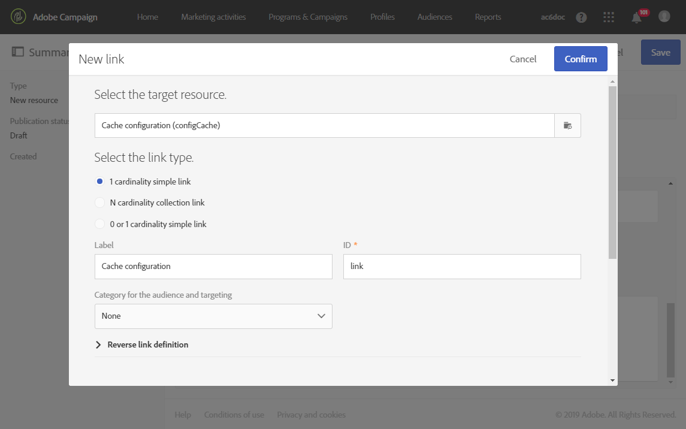

# 設定資源的資料結構{#configuring-the-resource-s-data-structure}

建立新的自訂資源後，您必須設定資料結構。

在編輯資源時，可在頁籤 **[!UICONTROL Data structure]** 中添加：

* [欄位](#adding-fields-to-a-resource)
* [識別鍵](#defining-identification-keys)
* [索引](#defining-indexes)
* [連結](#defining-links-with-other-resources)
* [傳送記錄檔](#defining-sending-logs-extension)

## 向資源添加欄位 {#adding-fields-to-a-resource}

您可以將新欄位新增至資源，以儲存非現成可用資料模型一部分的資料。

1. 使用按 **[!UICONTROL Create element]** 鈕建立欄位。
1. 指定標籤、ID、欄位類型，並定義此欄位所授權的最大長度。

   欄位 **[!UICONTROL ID]** 是必填欄位，且每個新增欄位必須是唯一的。

   >[!NOTE]
   >
   >最多使用30個字元。

   

1. 要修改其中一個欄位，請選中該 **[!UICONTROL Edit Properties]** 按鈕。

   

1. 在畫面 **[!UICONTROL Field definition]** 中，您可以定義將用於對象和定位的類別，或甚至新增說明。

   

1. 如果您 **[!UICONTROL Specify a list of authorized values]** 需要定義將提供給使用者的值（列舉值），請勾選此選項。

   然後，按一 **[!UICONTROL Create element]** 下並指定 **[!UICONTROL Label]** 和 **[!UICONTROL Value]**。 視需要新增多個值。

1. 在添加欄位後，選中該框 **[!UICONTROL Add audit fields]** 以包含詳細說明建立日期、建立資源的用戶、日期和上次修改的作者的欄位。
1. 核取方 **[!UICONTROL Add access authorization management fields]** 塊以包含欄位，指出誰擁有該特定資源的存取權。

   這些欄位會顯示在資料和中繼資料中，當進行資料庫更新後，這些欄位就會顯示出來。 有關詳細資訊，請參閱「更 [新資料庫結構](../../developing/using/updating-the-database-structure.md) 」部分。

1. 勾選欄 **[!UICONTROL Add automatic ID]** 位以自動產生ID。 請注意，現有實體將維持空白。 如需詳細資訊，請參閱「產生 [描述檔和自訂資源的唯一ID」](../../developing/using/configuring-the-resource-s-data-structure.md#generating-a-unique-id-for-profiles-and-custom-resources)。
1. 要修改資源元素名稱在清單和建立步驟中的顯示方式，請選中該 **[!UICONTROL Customize the title of the resource elements]** 框。 從為此資源建立的欄位中選擇一個欄位。

   

   >[!NOTE]
   >
   >如果不選中此選項，則在列出此表中的所有圖元時，將使用自動主鍵（每次將圖元添加到表中時都會自動建立主鍵）。

現在已定義資源的欄位。

## 定義標識鍵 {#defining-identification-keys}

每個資源至少必須有一個唯一密鑰。 例如，您可以指定索引鍵，讓兩個產品在購買表格中不能有相同的ID。

1. 如果要自動逐 **[!UICONTROL Automatic primary key]** 步生成技術密鑰，請在部分中指定儲存的大小。

   

1. 使用按 **[!UICONTROL Create element]** 鈕建立金鑰。

   預設 **[!UICONTROL Label]** 會完 **[!UICONTROL ID]** 成和欄位，但您可以編輯它們。

   >[!NOTE]
   >
   >最多使用30個字元。

1. 要定義構成此鍵的元素，請單 **[!UICONTROL Create element]** 擊並選擇為此資源建立的欄位。

   

   建立的鍵將顯示在節 **[!UICONTROL Custom keys]** 中。

現在會建立資源的識別碼。

>[!NOTE]
>
>若要瞭解建立識別索引鍵時的最佳實務，請參閱本 [節](../../developing/using/data-model-best-practices.md#keys)。

## 定義索引 {#defining-indexes}

索引可以引用一個或多個資源欄位。 索引允許資料庫對記錄進行排序，以便更輕鬆地恢復記錄。 它們優化了SQL查詢的效能。

建議定義索引，但不是強制性的。

1. 使用按 **[!UICONTROL Create element]** 鈕可建立索引。

   

1. 預設 **[!UICONTROL Label]** 會 **[!UICONTROL ID]** 填妥和欄位，但您可以加以編輯。

   >[!NOTE]
   >
   >最多使用30個字元。

1. 要定義構成此索引的元素，請從為此資源建立的欄位中選擇欄位。

   

1. 按一下 **[!UICONTROL Confirm]**.

已建立的索引將顯示在部分中的列 **[!UICONTROL Index]** 表中。

>[!NOTE]
>
>若要瞭解建立索引時的最佳實務，請參閱本 [節](../../developing/using/data-model-best-practices.md#indexes)。

## 定義與其他資源的連結 {#defining-links-with-other-resources}

連結詳細說明了一個表與其他表的關聯。

1. 使用按 **[!UICONTROL Create element]** 鈕可建立指向目標資源的連結。
1. 按一下 **[!UICONTROL Select a target resource]**.

   

1. 資源按字母順序顯示，並可按名稱篩選。 其技術名稱以方括弧顯示。

   從清單中選擇元素並按一下 **[!UICONTROL Confirm]**。

   

1. 根據基 **[!UICONTROL Link type]** 數選擇。 根據所選的基數類型，刪除或複製記錄時的行為可能會有所不同。

   各種連結類型如下：

   * **[!UICONTROL 1 cardinality simple link]**:源表的一個實例最多可以具有目標表的一個相應實例。
   * **[!UICONTROL N cardinality collection link]**:源表的一個出現次數可以具有多個目標表的相應出現次數，但目標表的一個出現次數最多可以具有源表的一個對應出現次數。
   * **[!UICONTROL 0 or 1 cardinality simple link]**:源表的一個實例最多可以具有目標表的一個相應實例或無。 請注意，這種類型可 **[!UICONTROL Link type]** 能會導致效能問題。
   

1. 在畫面 **[!UICONTROL New link]** 中，預設會 **[!UICONTROL Label]** 填 **[!UICONTROL ID]** 寫和欄位，但您可以加以編輯。

   >[!NOTE]
   >
   >最多使用30個字元。

   >[!CAUTION]
   >
   >建立後無法重新命名連結。 若要重新命名連結，您必須刪除連結並重新建立連結。

1. 該 **[!UICONTROL Category for the audience and targeting]** 清單允許您將此連結指派給類別，使其在查詢編輯器工具中更加可見。
1. 如果需要， **[!UICONTROL Reverse link definition]** 該部分允許您在目標資源中顯示資源的標籤和ID。
1. 定義該節中連結引用的記錄的行 **[!UICONTROL Behavior if deleted/duplicated]** 為。

   依預設，當連結不再參照目標籤錄時，就會將其刪除。

   

1. 在該部 **[!UICONTROL Join definition]** 分中，選擇了默 **[!UICONTROL Use the primary keys to make the join]** 認選項，但您可以選擇兩個選項：

   * **[!UICONTROL Use the primary key to make the join]**:此連接定義允許您使用配置檔案主鍵來協調購買的主鍵。
   * **[!UICONTROL Define specific join conditions]**:此連接定義允許您手動選擇將連接兩個資源的欄位。 請注意，如果資料未正確設定， **Purchase** record將不會顯示。
   

所建立的連結將顯示在部分中的列 **[!UICONTROL Links]** 表中。

>[!NOTE]
>
>若要瞭解建立索引時的最佳實務，請參閱本 [節](../../developing/using/data-model-best-practices.md#links)。

**範例：將建立的資源與「配置式」資源連結**

在此範例中，我們想將新的資源「購買」與 **「設定檔** 」自訂資 **源連結** :

1. 建立您的新 **購買** 資源。
1. 若要將其與「描述檔 **」自訂資源連結** ，請展開 **[!UICONTROL Links]** 標籤中的區段， **[!UICONTROL Data structure]** 然後按一下 **[!UICONTROL Create element]**。
1. 在此處選擇目標資源 **[!UICONTROL Profiles (profile)]**。
1. 在此範例中，請保留預設的「連 **[!UICONTROL 1 cardinality simple link]** 結」類型。

   

1. 選擇聯接定義，此處保留預設值 **[!UICONTROL Use the primary key to make the join]**。

   

1. 如有需要，您可以定義詳細資訊畫面，以便編輯「購買 **」** ，並將它連結至描述檔。

   展開該 **[!UICONTROL Detail screen configuration]** 部分並檢 **[!UICONTROL Define a detail screen]** 查以配置與資源的每個元素對應的螢幕。 如果不選中此框，則無法訪問此資源元素的詳細視圖。

1. 按一下 **[!UICONTROL Create element]**.
1. 選擇連結的資源，然後按一下 **[!UICONTROL Add]**。

   然後，您的新資源將可在進階功能表中透過選取 **[!UICONTROL Client data]** >取得 **[!UICONTROL Purchase]**。

   

1. 完成配置後，按一下 **[!UICONTROL Confirm]**。

   您現在可以發佈新資源。

透過新增此連結，「購 **買** 」標籤會從「 >」選單新增至描述檔詳細 **[!UICONTROL Profiles & audiences]** 資料畫 **[!UICONTROL Profiles]** 面。 請注意，這是資源的特 **[!UICONTROL Profile]** 定。

## 定義發送日誌擴展 {#defining-sending-logs-extension}

發送日誌擴展允許您：

* 若要透過新增描述檔自訂欄位來擴充 **動態報表功能**
* 使用區段代碼和描述檔資料來擴充 **傳送記錄檔資料**

**使用區段代碼擴充**

使用者可使用來自工作流程引擎的區段代碼來擴充記錄檔。

區段代碼必須定義至工作流程中。

若要啟用此擴充功能，請勾選選項 **[!UICONTROL Add segment code]**。

如需區段代碼的詳細資訊，請參閱「區 [段](../../automating/using/segmentation.md) 」區段。

**使用描述檔欄位擴充**

>[!NOTE]
>
>管理員應該已使用自定義欄位擴展配置檔案資源。

按一 **[!UICONTROL Add field]** 下並從描述檔資源中選取任何自訂欄位。

要生成連結到「配置檔案」維的新子維，請選中該 **[!UICONTROL Add this field in Dynamic reporting as a new dimension]** 選項。

從動態報表，您可以將自訂欄位維度拖放至自由表格。

有關動態報告的詳細資訊，請參閱 [元件清單](../../reporting/using/list-of-components-.md)。

>[!CAUTION]
>
>傳送至動態報表的欄位數限制為20。

## 編輯資源屬性 {#editing-resource-properties}

在自定義資源螢幕中，窗 **[!UICONTROL Summary]** 格指示新建立的資源的狀態。 您可以管理其存取權及其一般屬性。

1. 按一下 **[!UICONTROL Edit properties]** 按鈕以新增說明。

   

1. 如果需要，請修改資源的標籤和ID。

   >[!NOTE]
   >
   >最多使用30個字元。

1. 如果您需要限制對特定組織單位的此資源訪問，請在此處指定這些單位。 只有授權單位的使用者才能在應用程式中使用此資源。
1. 儲存修改。

您的修改會儲存。 您需要再次發佈資源以套用資源。

## 為描述檔和自訂資源產生唯一ID {#generating-a-unique-id-for-profiles-and-custom-resources}

依預設，設定檔和自訂資源在建立時沒有業務ID。 您可以啟用在建立元素時自動產生唯一ID的選項。 此ID可用於：

* 在外部工具中輕鬆識別匯出的記錄。
* 匯入在其他應用程式中處理的更新資料時，協調記錄。

僅可針對設定檔和自訂資源啟用。

1. 為配置檔案資源建立擴展或建立新資源。
1. 在資料結構定義中，選中 **[!UICONTROL Add automatic ID field]** 部分下的選 **[!UICONTROL Fields]** 項。

   

   >[!NOTE]
   >
   >只有新記錄有ACS ID。 在啟 **[!UICONTROL ACS ID]** 用此選項之前，對於已建立的配置檔案或元素，欄位將保持空。

1. 儲存並發佈對資源所做的修改。 如果您想要此機制套用至透過API建立的元素，請勾選擴充API的選項。

現在 **[!UICONTROL ACS ID]** 欄位可供使用，並在手動、從API或從匯入工作流程插入新元素時自動填入。 ACS ID欄位是UUID欄位，並且已編製索引。

現在，在導出配置檔案或自定義資源時，如果 **[!UICONTROL ACS ID]** 該列已為該資源啟用，則可以添加該列。 您可以在外部工具中重複使用此ID來識別記錄。

當重新匯入已在其他應用程式（例如CRM）中處理／更新的資料時，您可以輕鬆將其與此唯一ID協調。

>[!NOTE]
>
>在啟 **[!UICONTROL ACS ID]** 用選項之前，不會針對已建立的配置檔案或元素更新欄位。 只有新記錄有ACS ID。
>
>此欄位處於只讀模式。 您無法修改它。
