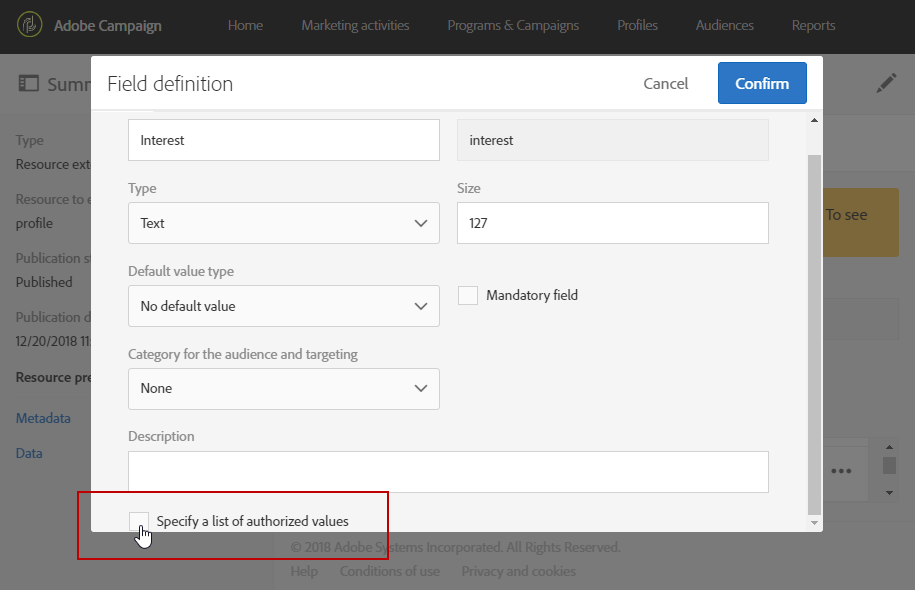
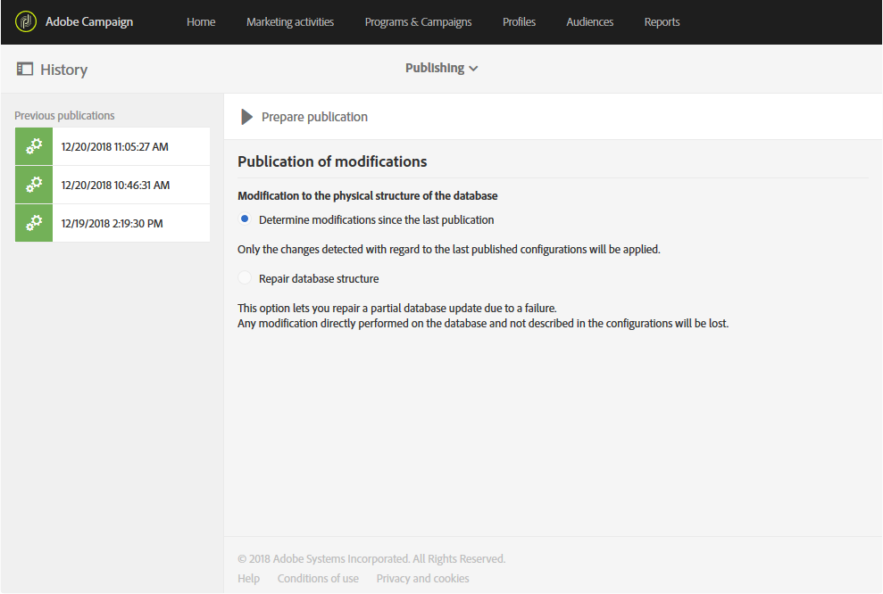

# 使用新欄位擴充設定檔資源{#extending-the-profile-resource-with-a-new-field}

## 關於擴展配置檔案 {#about-extending-profiles}

此使用案例詳細說明如何使用專用欄位擴充描述檔和測試描述檔。

在這裡，我們想使用著陸頁面，以新欄位更新我們的個人檔案，然後以符合他們興趣的電子報來定位個人檔案。

若要這麼做，請依照下列步驟進行：

* [步驟1:擴充描述檔資源](#step-1--extend-the-profile-resource)
* [步驟2:擴充測試描述檔](#step-2--extend-the-test-profile)
* [步驟3:發佈自訂資源](#step-3--publish-your-custom-resource)
* [步驟4:使用工作流程更新和定位描述檔](#step-4--update-and-target-profiles-with-a-workflow)

然後，下列欄位將新增至我們的設定檔，並可在傳送中定位：

相關主題：

* [關於自訂資源](../../developing/using/data-model-concepts.md)
* [管理設定檔](../../audiences/using/about-profiles.md)
* [管理測試設定檔](../../sending/using/managing-test-profiles-and-sending-proofs.md#managing-test-profiles)

## 步驟1:擴充描述檔資源 {#step-1--extend-the-profile-resource}

若要為我們的 **個人檔案建立新的** 「興趣」欄位，您必須先擴充現成可用的資 **[!UICONTROL Profiles (profile)]** 源。

1. 從進階功能表，透過Adobe Campaign標誌，選取 **[!UICONTROL Administration]** &gt; **[!UICONTROL Development]**，然後 **[!UICONTROL Custom resources]**。
1. 如果尚未擴展資 **[!UICONTROL Profiles]** 源，請按一下 **[!UICONTROL Create]**。
1. 選擇選 **[!UICONTROL Extend an existing resource]** 項。
1. 選擇資 **[!UICONTROL Profile (profile)]** 源。
1. Click **[!UICONTROL Create]**.

   

1. 在標籤 **[!UICONTROL Fields]** 的類別中， **[!UICONTROL Data structure]** 按一下 **[!UICONTROL Create element]**。

   >[!NOTE]
   >
   >請注意，如果您已將資源 **[!UICONTROL Profile]** 擴展到以前的用途，則可以按一下此步驟開始 **[!UICONTROL Add field]**。

   

1. 新增 **[!UICONTROL Label]** 和 **[!UICONTROL ID]**。 選擇類 **[!UICONTROL Text]** 型並按一下 **[!UICONTROL Add]**。

   

1. To configure your field, in the **[!UICONTROL Data structure]** tab under the **[!UICONTROL Fields]** drop-down, click  then  from your previously created field.
1. 在此範例中，我們要新增特定值，請按一下 **[!UICONTROL Specify a list of authorized values]**。

   

1. 按一 **[!UICONTROL Add an element]** 下，然後視需要新增值，方法是新增 **[!UICONTROL Label]** 和按 **[!UICONTROL ID]** 一下 **[!UICONTROL Add]**。

   在此，我們將建立「書籍」、「展覽」、「影片」和「不適用」值，供設定檔在這些選項中選擇。

   

1. 若要在畫面中新增此欄 **[!UICONTROL Profile]** 位，請按一下標 **[!UICONTROL Screen definition]** 簽。
1. 在下拉 **[!UICONTROL Detail screen configuration]** 式清單中，按一下 **[!UICONTROL Add a personalized fields section]** 並按一下 **[!UICONTROL Create element]**。

   

1. 選擇 **[!UICONTROL Type]**。 在這裡，我們要新增輸入欄位。 然後，選取您先前建立的欄位，然後按一下 **[!UICONTROL Add]**。

   

1. 若要新增分隔符號以更好地組織您的描述檔視窗，請按 **[!UICONTROL Create an element]** 一下並 **[!UICONTROL Separator]** 從下拉 **[!UICONTROL Type]** 式清單中選取。

   

您的欄位現在已設定。 現在，我們需要將它擴充至測試設定檔。

>[!NOTE]
>
>如果您不需要擴充測試描述檔資源，可跳至「發佈」步驟。

## 步驟2:擴充測試描述檔 {#step-2--extend-the-test-profile}

若要測試新建立的欄位是否已正確設定，您可以透過傳送傳送至測試描述檔來測試欄位。 首先，新領域還需要對測試剖面進行實現。

1. 從進階功能表，透過Adobe Campaign標誌，選取 **[!UICONTROL Administration]** &gt; **[!UICONTROL Development]**，然後 **[!UICONTROL Custom resources]**。
1. 如果尚未擴展資 **[!UICONTROL Profiles]** 源，請按一下 **[!UICONTROL Create]**。
1. 選擇選 **[!UICONTROL Extend an existing resource]** 項。
1. 選擇資 **[!UICONTROL Test profile (seedMember)]** 源。
1. Click **[!UICONTROL Create]**.

   

1. 在標籤 **[!UICONTROL Data structure]** 中，按一下 **[!UICONTROL Create element]**。

   

1. 選擇以前建立的資源欄位並按一下 **[!UICONTROL Add]**。

   

1. 從步驟11到13執行與上述延伸描述檔步驟相同的步驟，將此欄位新增至螢幕 **[!UICONTROL Test profile]** 中。
1. Click **[!UICONTROL Save]**.

現在，設定檔和測試設定檔都可使用您的新欄位。 若要正確設定，您必須發佈自訂資源。

## 步驟3:發佈自訂資源 {#step-3--publish-your-custom-resource}

要應用對資源執行的更改並能夠使用，必須執行資料庫更新。

1. 從進階功能表中，依序選 **取「管理** &gt;開 **發**」 **、「**&#x200B;發佈」。
1. 依預設會勾選 **[!UICONTROL Determine modifications since the last publication]** 選項，這表示僅套用自上次更新後所進行的變更。

   

1. 單 **[!UICONTROL Prepare publication]** 擊以啟動將更新資料庫的分析。
1. 發佈完成後，按一下「發 **布** 」按鈕以應用新配置。

   

1. 發佈後，每個資 **源的「摘要** 」窗格會指出狀態現在為「已發佈 **** 」，並指定上次發佈的日期。

   

1. 選取標 **[!UICONTROL Profiles]** 簽並按一 **[!UICONTROL New]** 下，查看變更是否已正確實作。

   

例如，您的新資源欄位現在已準備好在傳送中使用和定位。

## 步驟4:使用工作流程更新和定位描述檔 {#step-4--update-and-target-profiles-with-a-workflow}

若要使用新自訂欄位的資料更新描述檔，您可以使用範本建立著陸 **[!UICONTROL Profile acquisition]** 頁面。 如需著陸頁面的詳細資訊，請參閱此 [頁面](../../channels/using/about-landing-pages.md)。

在這裡，我們想要定位未填入此欄位的工作流程描述檔。 他們會收到電子郵件，要求他們更新個人檔案，以接收個人化的電子報和優惠。 然後，每個個人檔案都會收到個人化電子報，視其喜好而定。

首先，我們需要建立著陸頁面，以更新目標描述檔 **的** 「興趣」欄位：

1. 在中，單 **[!UICONTROL Marketing activities]**&#x200B;擊，然 **[!UICONTROL Create]** 後選擇 **[!UICONTROL Landing page]**。
1. 選取著陸頁面類型。 在這裡，由於我們要更新個人檔案，請選取 **[!UICONTROL Profile acquisition]**。
1. Click **[!UICONTROL Create]**.
1. 按一下 **[!UICONTROL Content]** 區塊以開始編輯著陸頁面的內容。

   

1. 視需要自訂您的登陸頁面。
1. 按一下您的描述檔所設定的欄位，以選擇「興趣」。 在左窗格中，選取您先前建立的 **Interest** 自訂資源。

   

1. 儲存著陸頁面並加以測試，以檢查欄位是否已正確設定。
1. 當您 **[!UICONTROL Publish]** 的著陸頁面準備就緒時，按一下。

您的登陸頁面現已準備就緒。 若要更新描述檔，您可以建立工作流程，然後根據所選的興趣傳送特殊選件。

1. 在標籤 **[!UICONTROL Marketing activities]** 中，按一下， **[!UICONTROL Create]** 然後選取 **[!UICONTROL Workflow]**。
1. 拖放活動以 **[!UICONTROL Query]** 定位您需要的個人檔案或對象。
1. 拖放活動 **[!UICONTROL Email delivery]** 以開始設定包含著陸頁面連結的電子郵件。 選擇 **[!UICONTROL Add an outbound transition with the population]**。

   

1. 視需要建立和設計您的電子郵件。 有關電子郵件個人化的詳細資訊，請參閱本 [頁](../../designing/using/quick-start.md)。
1. 新增按鈕至您的電子郵件，將描述檔重新導向至您的登陸頁面。
1. 選取新增的按鈕，  然後按一 **[!UICONTROL Link]** 下左側窗格的區段。

   

1. 在視窗 **[!UICONTROL Insert link]** 中，從下拉 **[!UICONTROL Landing page]** 式清單中 **[!UICONTROL Link type]** 選取，然後選取先前建立的著陸頁面。

   

1. Click **[!UICONTROL Save]**. 您的電子郵件現已準備就緒，您可以回到工作流程。
1. 新增活 **[!UICONTROL Wait]** 動，讓您的描述檔有時間填入著陸頁面。
1. 新增活 **[!UICONTROL Segmentation]** 動以依據對外轉場的興趣來分 **割**。
1. 為每個興趣建立對外 **區段**。

   

1. 在每次轉 **[!UICONTROL Email delivery]** 換後新增活動，並根據所選的興趣建立個人化 **電子郵件**。
1. 完成配置後啟動工作流。

   

設定檔現在會收到電子郵件，要求他們填寫此「興趣」欄位，接著會根據所選的值傳送個人化電子郵件。
