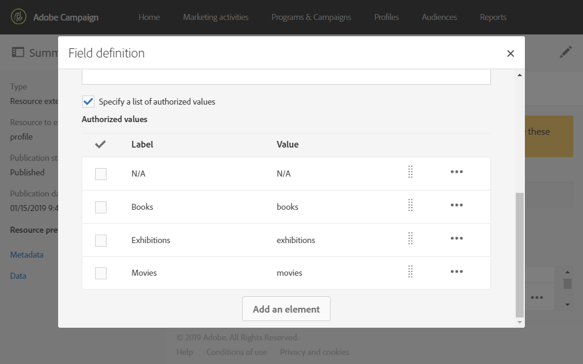

# Extending the profile resource with a new field{#extending-the-profile-resource-with-a-new-field}

## About extending profiles {#about-extending-profiles}

此使用案例詳細說明如何使用專屬欄位擴充描述檔和測試設定檔。

在這裡，我們想要使用著陸頁面來更新我們的個人檔案，然後使用特定客戶興趣的電子報來定位個人檔案。

若要這麼做，請遵循下列步驟：

* [步驟1：擴充描述檔資源](../../developing/using/extending-the-profile-resource-with-a-new-field.md#step-1--extend-the-profile-resource)
* [步驟2：擴充測試設定檔](../../developing/using/extending-the-profile-resource-with-a-new-field.md#step-2--extend-the-test-profile)
* [步驟3：發佈您的自訂資源](../../developing/using/extending-the-profile-resource-with-a-new-field.md#step-3--publish-your-custom-resource)
* [步驟4：使用工作流程更新和定位個人檔案](../../developing/using/extending-the-profile-resource-with-a-new-field.md#step-4--update-and-target-profiles-with-a-workflow)

下列欄位將會新增至我們的描述檔，並可在傳送中定位：

相關主題：

* [關於自訂資源](../../developing/using/data-model-concepts.md)
* [管理個人檔案](../../audiences/using/about-profiles.md)
* [管理測試設定檔](../../sending/using/managing-test-profiles-and-sending-proofs.md#managing-test-profiles)

## Step 1: Extend the profile resource {#step-1--extend-the-profile-resource}

To create the new **Interest** field for our profiles, you first need to extend the out-of-the-box **[!UICONTROL Profiles (profile)]** resource.

1. From the advanced menu, via the Adobe Campaign logo, select **[!UICONTROL Administration]** &gt; **[!UICONTROL Development]**, then **[!UICONTROL Custom resources]**.
1. If you have not extended the **[!UICONTROL Profiles]** resource yet, click **[!UICONTROL Create]**.
1. Choose the **[!UICONTROL Extend an existing resource]** option.
1. Select the **[!UICONTROL Profile (profile)]** resource.
1. Click **[!UICONTROL Create]**.

   

1. In the **[!UICONTROL Fields]** category of the **[!UICONTROL Data structure]** tab, click **[!UICONTROL Create element]**.

   >[!NOTE]
   >
   >Note that if you already extended the **[!UICONTROL Profile]** resource for previous purposes, you can start at this step by clicking **[!UICONTROL Add field]**.

   

1. Add a **[!UICONTROL Label]** and an **[!UICONTROL ID]**. Select the **[!UICONTROL Text]** type and click **[!UICONTROL Add]**.

   

1. To configure your field, in the **[!UICONTROL Data structure]** tab under the **[!UICONTROL Fields]** drop-down, click  then  from your previously created field.
1. In this example we want to add specific values, to do so click **[!UICONTROL Specify a list of authorized values]**.

   

1. Click **[!UICONTROL Add an element]** then add as many value as needed by adding a **[!UICONTROL Label]** and an **[!UICONTROL ID]** and clicking **[!UICONTROL Add]**.

   在這裡，我們將為設定檔建立「書籍」、「展示」、「影片」和「N/A」值，以選擇這些選項。

   

1. To add this field in the **[!UICONTROL Profile]** screen, click the **[!UICONTROL Screen definition]** tab.
1. In the **[!UICONTROL Detail screen configuration]** drop-down, click **[!UICONTROL Add a personalized fields section]** and click **[!UICONTROL Create element]**.

   

1. Select a **[!UICONTROL Type]**. 在這裡，我們想要新增輸入欄位。Then, select your previously created field and click **[!UICONTROL Add]**.

   

1. To add a separator to better organize your profile window, click **[!UICONTROL Create an element]** and select **[!UICONTROL Separator]** from the **[!UICONTROL Type]** drop-down.

   

您的欄位現在已設定。我們現在需要將它延伸至測試設定檔。

>[!NOTE]
>
>如果您不需要擴充測試描述檔資源，可以跳至「發佈」步驟。

## Step 2: Extend the test profile {#step-2--extend-the-test-profile}

若要測試新建立的欄位是否已正確設定，您可以傳送傳送至測試設定檔來測試它。首先，新欄位也必須執行至測試設定檔。

1. From the advanced menu, via the Adobe Campaign logo, select **[!UICONTROL Administration]** &gt; **[!UICONTROL Development]**, then **[!UICONTROL Custom resources]**.
1. If you have not extended the **[!UICONTROL Profiles]** resource yet, click **[!UICONTROL Create]**.
1. Choose the **[!UICONTROL Extend an existing resource]** option.
1. Select the **[!UICONTROL Test profile (seedMember)]** resource.
1. Click **[!UICONTROL Create]**.

   

1. In the **[!UICONTROL Data structure]** tab, click **[!UICONTROL Create element]**.

   

1. Select your previously created resource field and click **[!UICONTROL Add]**.

   

1. Carry out the same steps from step 11 to 13 as the extend profile walkthrough above to add this field in the **[!UICONTROL Test profile]** screen.
1. Click **[!UICONTROL Save]**.

設定檔和測試設定檔現在都將提供您的新欄位。若要正確設定，您必須發佈自訂資源。

## Step 3: Publish your custom resource {#step-3--publish-your-custom-resource}

若要套用在資源上執行的變更並能夠使用它，您必須執行資料庫更新。

1. From the advanced menu, select **Administration** &gt; **Development**, then **Publishing**.
1. By default, the option **[!UICONTROL Determine modifications since the last publication]** is checked, which means that only the changes carried out since the last update will be applied.

   

1. Click **[!UICONTROL Prepare publication]** to start the analysis which will update your database.
1. Once the publication has been carried out, click the **Publish** button to apply your new configurations.

   

1. Once published, the **Summary** pane of each resource indicates that the status is now **Published** and specifies the date of the last publication.

   

1. Select the **[!UICONTROL Profiles]** tab and click **[!UICONTROL New]** to see if your changes have been correctly implemented.

   

您的新資源欄位現在可供例如在散髮中使用和定位。

## Step 4: Update and target profiles with a workflow {#step-4--update-and-target-profiles-with-a-workflow}

To update profiles with data for the new custom field, you can create a landing page using the **[!UICONTROL Profile acquisition]** template. For more information on landing pages, refer to this [page](../../channels/using/about-landing-pages.md).

在這裡，我們想要定位未填入此欄位的工作流程設定檔。他們會收到電子郵件，要求他們更新個人檔案，以接收個人化電子報和優惠。然後，每個描述檔都會根據他們選擇的興趣收到個人化電子報。

First, we need to create a landing page that will update the **Interest** fields of the targeted profiles:

1. From the **[!UICONTROL Marketing activities]**, click **[!UICONTROL Create]** then select **[!UICONTROL Landing page]**.
1. 選取著陸頁面類型。Here, since we want to update our profiles, select **[!UICONTROL Profile acquisition]**.
1. Click **[!UICONTROL Create]**.
1. Click the **[!UICONTROL Content]** block to start editing the content of your landing page.

   

1. 視需要自訂著陸頁面。
1. 按一下設定個人檔案的欄位，以選擇興趣範圍。In the left pane, select your previously created **Interest** custom resource.

   

1. 儲存著陸頁面並測試它，檢查您的欄位是否已正確設定。
1. Click **[!UICONTROL Publish]** when your landing page is ready.

著陸頁面現在已就緒。若要更新描述檔，您可以建立工作流程，然後根據選擇的興趣傳送特別選件。

1. From the **[!UICONTROL Marketing activities]** tab, click **[!UICONTROL Create]** then select **[!UICONTROL Workflow]**.
1. Drag and drop a **[!UICONTROL Query]** activity to target the profiles or audiences you need.
1. Drag and drop an **[!UICONTROL Email delivery]** activity to start configuring your email which will contain a link to the landing page. Select the **[!UICONTROL Add an outbound transition with the population]**.

   

1. 視需要建立和設計您的電子郵件。For more information on email personalization, refer to this [page](../../designing/using/designing-content-in-adobe-campaign.md).
1. 新增按鈕至您的電子郵件，將描述檔重新導向至登陸頁面。
1. Select the added button and click  in the **[!UICONTROL Link]** section in the left pane.

   

1. **[!UICONTROL Insert link]** 在視窗中，從 **[!UICONTROL Landing page]****[!UICONTROL Link type]** 下拉式清單中選取，然後選取先前建立的登陸頁面。

   

1. Click **[!UICONTROL Save]**. 您的電子郵件現已就緒，您可以回到工作流程中。
1. Add a **[!UICONTROL Wait]** activity to let some time for your profiles to fill the landing page.
1. Add a **[!UICONTROL Segmentation]** activity to split the outbound transition depending on their **Interests**.
1. Create an outbound segment for each **Interest**.

   

1. Add an **[!UICONTROL Email delivery]** activity after each transition and create a personalized email depending on the chosen **Interest**.
1. 完成設定時，啓動工作流程。

   

設定檔現在會收到電子郵件，要求他們填寫本「興趣」欄位，並根據所選的值傳送個人化電子郵件。
