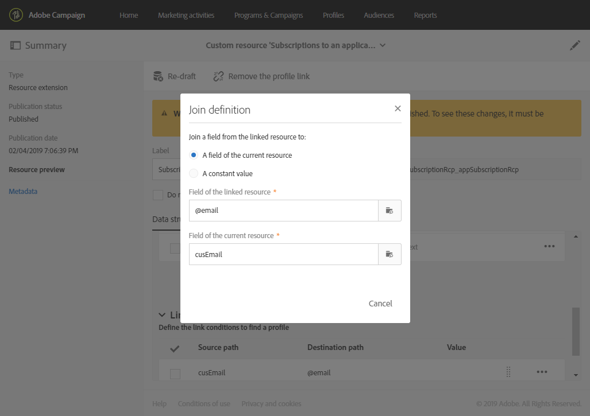

# 將訂閱擴充到應用程式資源{#extending-the-subscriptions-to-an-application-resource}

在 Adobe Campaign 中，由行動裝置傳送的行動設定檔屬性資料會儲存在 **[!UICONTROL Subscriptions to an application (appSubscriptionRcp)]** 資源中，您可藉此定義要從應用程式訂閱者收集的資料。如需自訂資源的詳細資訊，請參閱 [本頁](../../developing/using/key-steps-to-add-a-resource.md).

可擴充此資源，以收集您要從行動裝置傳送至Adobe Campaign的資料。

1. 從進階功能表，透過 Adobe Campaign 標誌，依序選取 **[!UICONTROL Administration]** > **[!UICONTROL Development]** 及 **[!UICONTROL Custom resources]**。
1. 按一下 **[!UICONTROL Create]** 並選擇 **[!UICONTROL Extend an existing resource]** 選項。
1. 選取 **[!UICONTROL Subscriptions to an application (appSubscriptionRcp)]** 資源，按一下 **[!UICONTROL Create]**.

   

1. 在 **[!UICONTROL Fields]** 類別 **[!UICONTROL Data structure]** 標籤，定義您要從行動應用程式擷取的客戶資料，方法是按一下 **[!UICONTROL Add field]** 按鈕。

   >[!NOTE]
   >
   >如果您管理多個行動應用程式，則必須列出所有應用程式使用的所有欄位。 iOS或Android會收集PII呼叫，定義每個應用程式擷取的欄位。

   

1. 新增 **[!UICONTROL Label]** 和 **[!UICONTROL ID]** 新欄位。 選取欄位的 **[!UICONTROL Type]**.

   

1. 在 **[!UICONTROL Link to profiles]** 類別中，設定調解金鑰，用於將設定檔從Adobe Campaign資料庫連結至應用程式的訂閱者，例如電子郵件。

   請注意，針對您的應用程式內訊息，您只能為所有行動應用程式定義一個調解金鑰。

   

1. **[!UICONTROL Save]** 和發佈自訂資源。 有關自定義資源發佈的詳細資訊，請參閱 [頁面](../../developing/using/updating-the-database-structure.md#publishing-a-custom-resource).
