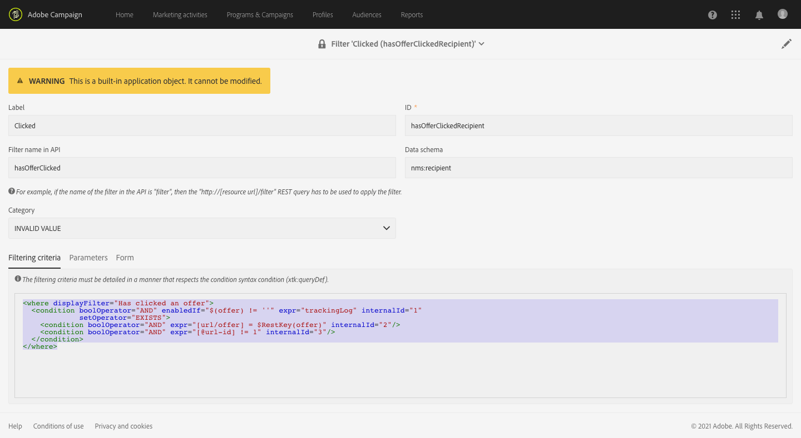

# 監控資料模型變更{#monitoring-data-model-changes}

您可以從&#x200B;**[!UICONTROL Diagnosis]**&#x200B;功能表檢視應用程式產生的技術物件，以便加以分析。

>[!NOTE]
>
>此選單中的畫面為唯讀。


您可以檢視下列物件型別：

* 資料方案
* 網頁
* 篩選器
* 導覽
* 元件
* 批次工作

您可以變更清單設定：

* 您可以新增和移除欄。
* 您可以定義欄名稱。
* 您可以定義清單中欄的顯示順序。
* 您可以選擇清單中值的排序順序。

您可以篩選清單：

* 您可以包含或排除原生資料結構、網頁、篩選器和導覽物件。
* 您可以依物件的名稱來搜尋物件。
* 您可以根據批次工作的狀態、開始日期和結束日期來篩選批次工作。

您可以下載以TXT格式顯示的清單（含逗號分隔值）。

您可以檢視所選物件的詳細資訊。

例如，您可以使用此功能來檢視現成篩選的篩選條件。 此範例顯示針對現成可用篩選器的篩選條件顯示的程式碼：

```xml
<where displayFilter="Has clicked an offer">
  <condition boolOperator="AND" enabledIf="$(offer) != ''" expr="trackingLog" internalId="1" setOperator="EXISTS">
    <condition boolOperator="AND" expr="[url/offer] = $RestKey(offer)" internalId="2"/>
    <condition boolOperator="AND" expr="[@url-id] != 1" internalId="3"/>
  </condition>
</where>
```

