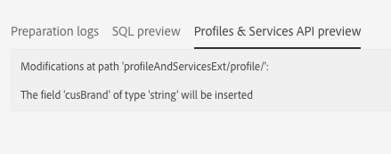

# 步驟 2：發佈擴充{#step-publish-the-extension}

1. 從進階功能表，透過 Adobe Campaign 標誌，依序選取 **[!UICONTROL Administration]** > **[!UICONTROL Development]** 及 **[!UICONTROL Publication]**。
1. 按一下 **[!UICONTROL Prepare Publication]** 按鈕。
1. 選擇&#x200B;**[!UICONTROL Create the Profiles & Services Ext API]**&#x200B;選項。

   

   >[!NOTE]
   >
   >如果API已發佈（亦即，若您已針對此資源或其他資源勾選此選項一次），則會強制進行API更新。

1. 按一下&#x200B;**[!UICONTROL Profiles & Services API Preview]**&#x200B;頁籤。

   這將顯示API的發佈將會套用至目前版本的profilesAndServicesExt API的變更。

   這裡是促銷代碼欄位(ID:cusBrand)將插入API。

   

1. 按一下 **[!UICONTROL Publish]** 按鈕。

