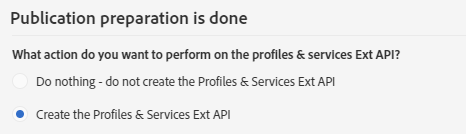

# 步驟 2：發佈擴充{#step-publish-the-extension}

1. 從進階功能表，透過Adobe Campaign標誌，選取 **[!UICONTROL Administration]** &gt; **[!UICONTROL Development]**，然後 **[!UICONTROL Publication]**。
1. Click the **[!UICONTROL Prepare Publication]** button.
1. 選擇選 **[!UICONTROL Create the Profiles & Services Ext API]** 項。

   

   >[!NOTE]
   >
   >如果API已發佈（亦即您已針對此資源或其他資源勾選此選項一次），則會強制進行API更新。

1. 按一下標 **[!UICONTROL Profiles & Services API Preview]** 簽。

   這將顯示API的發佈將會套用至目前版本的profilesAndServicesExt API的變更。

   這裡是促銷代碼欄位(ID:cusBrand)將插入API。

   

1. Click the **[!UICONTROL Publish]** button.

