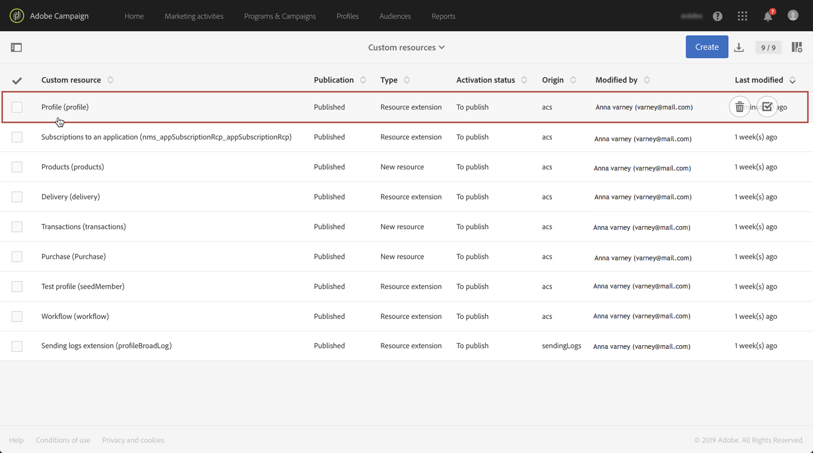

# 使用複合識別鍵呼叫資源{#calling-a-resource-using-a-composite-identification-key}

在某些情況下，您可能需要為資源定義由兩個欄位組成的標識鍵。 在設定識別金鑰後，您必須設定篩選定義，才能使用此識別金鑰（從Campaign Standard介面或API）呼叫資源。

在此使用案例中， **Profile** resource已擴充為自訂「CRM ID **」和「** category」欄位 **** 。 我們將為Profile資源建立一個標識鍵，該標識鍵將由這兩個欄位組成。 然後，我們將設定篩選定義，以便我們能夠使用識別碼存取描述檔資源。

此使用案例的主要步驟為：

1. 根據這兩個欄位，設定描述檔資源的識別碼。
1. 設定篩選定義，以便能夠使用其識別金鑰呼叫描述檔資源。
1. 從介面或從APi調用Profile資源。

相關主題：

* [建立或擴充資源](../../developing/using/creating-or-extending-the-resource.md)
* [定義標識鍵](../../developing/using/configuring-the-resource-s-data-structure.md#defining-identification-keys)
* [Campaign Standard REST API](../../api/using/about-campaign-standard-apis.md)

## 步驟1:配置標識密鑰{#step-1-configure-the-identification-key}

>[!NOTE]
> 配置標識密鑰時的全局概念將在本節 [中詳細說明](../../developing/using/configuring-the-resource-s-data-structure.md#defining-identification-keys)。

1. 在設定識別金鑰之前，請確定資源已擴充至所需欄位，且已發佈。 如需詳細資訊，請參閱[本小節](../../developing/using/creating-or-extending-the-resource.md)。

1. 轉到/ **[!UICONTROL Administration]** / **[!UICONTROL Developement]** / **[!UICONTROL Custom resources]** 菜單，然後開啟資 **[!UICONTROL Profile]** 源。

   

1. 在區段 **[!UICONTROL Identification keys]** 中，按一下按 **[!UICONTROL Create element]** 鈕。

   

1. 新增兩個自訂「CRM ID」和「類別」欄位，然後按一下 **[!UICONTROL Confirm]**。

   

   >[!NOTE]
   > 如果要在配置檔案的介面中顯示兩個自定義欄位，請配置該選 **[!UICONTROL Screen definition]** 項卡。 如需詳細資訊，請參閱[本小節](../../developing/using/configuring-the-screen-definition.md)。

1. 您現在可以設定篩選定義，以便能夠使用其識別碼呼叫資源。

## 步驟2:設定篩選定義{#step-2-configure-the-filter-definition}

>[!NOTE]
> 配置篩選器定義時的全域概念將在本節 [中詳細說明](../../developing/using/configuring-filter-definition.md)。

1. 在標籤 **[!UICONTROL Filter definition]** 中，按一 **[!UICONTROL Add an element]**&#x200B;下，然後輸入篩選定義的標籤和ID。

1. 編輯篩選定義的屬性以設定其規則。

   

1. 將包含標識鍵中使用的欄位的表拖放到工作區中。

   

1. 選取識別碼中使用的第一個欄位(「CRM ID」)，然後啟動選 **[!UICONTROL Switch to parameters]** 項。

   

1. 在區 **[!UICONTROL Filter conditions]** 段中，保留運 **[!UICONTROL Equal]** 算子，然後定義參數的名稱，然後按一下加號以建立。

   

   >[!NOTE]
   > 按一下加號按鈕後，就會自動產生參數的名稱。 請注意，因為您需要此項資訊才能使用API的篩選。

1. 使用構成識別碼的所有欄位（「類別」）重複上述步驟，然後儲存變更。

   

1. 現在已設定篩選定義。 您可以發佈資源，以便篩選器可用。

## 步驟3:根據資源的標識密鑰調用資源{#step-3-call-the-resource-based-on-its-identification-key}

一旦設定識別金鑰及其篩選定義後，您就可使用它們來呼叫資源，不論是從Campaign標準介面或REST API。

若要使用介面中的篩選定義，請在工 **[!UICONTROL Query]** 作流程中使用活動(請 [參閱本節](../../automating/using/query.md))。 然後，篩選器便可在左窗格中使用。


若要使用Campaign Standard REST API的篩選定義，請使用下列語法：

```
GET /profileAndServicesExt/<resourceName>/by<filterName>?<param1_parameter>=<value>&<param2_parameter>=<value>
```

>[!NOTE]
>若要呼叫客戶篩選，請在步驟2中設定篩選定義時，使用"by"前置詞，後面接著定義的篩選 [器名稱](../../developing/using/uc-calling-resource-id-key.md#step-2-configure-the-filter-definition)。

在本例中，從"spring"類別擷取具有"123456" CRM ID的描述檔的語法為：

```
GET https://mc.adobe.io/<ORGANIZATION>/campaign/profileAndServicesExt/profile/byidentification_key?category_parameter=spring&crm_id_parameter=123456
```

如需詳細資訊，請參閱 [Campaign Standard REST API檔案](../../api/using/filtering.md)。