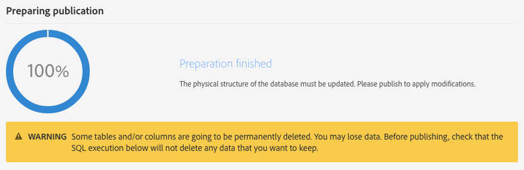

# 更新資料庫結構{#updating-the-database-structure}

若要讓您對資料模型進行修改生效並可供使用，需要更新資料庫結構。

>[!NOTE]
>
>在 Adobe 執行自動更新期間，會自動重新整理自訂資源。

## 發佈自訂資源 {#publishing-a-custom-resource}

若要套用對資源執行的變更，您必須執行資料庫更新。

>[!NOTE]
>
>如果修改或刪除用於事件之自訂資源的欄位，則相對應的事件將會自動取消發佈。請參閱[取消發佈事務性事件](../../channels/using/publishing-transactional-event.md#unpublishing-an-event)。

1. 從進階功能表，透過 Adobe Campaign 標誌，依序選取 **[!UICONTROL Administration]** > **[!UICONTROL Development]** 及 **[!UICONTROL Publishing]**。
1. 依預設，會核取 **[!UICONTROL Determine modifications since the last publication]** 選項，這代表僅會套用自上次更新後所進行的變更。

   >[!NOTE]
   >
   >如果 **[!UICONTROL Repair database structure]** 在發佈完成之前失敗，則應重新建立正確的設定。將刪除直接在資料庫中執行且未使用自訂資源的任何修改。

   

1. 按一下 **[!UICONTROL Prepare publication]** 按鈕以開始分析。請注意，當執行個體未因工作流程而忙碌時，應進行大型資料表更新。

   若要進一步瞭解在 Profiles &amp; Services API 上執行的動作，請參閱[使用 API 擴充功能發佈資源](#publishing-a-resource-with-api-extension)。

   

1. 發佈完成後，按一下 **[!UICONTROL Publish]** 按鈕以套用新的設定。
1. 發佈後，每個資源的 **[!UICONTROL Summary]** 窗格會指出狀態現在為 **[!UICONTROL Published]** 並指定上次發佈的日期。

   >[!NOTE]
   >
   >如果您對資源進行新的變更，則必須對要套用的變更重複執行此作業。

   如果資源在發佈前具有 **[!UICONTROL Pending re-draft]** 狀態，則會出現其他訊息並邀請您檢查動作，因為發佈會導致最終的變更（刪除欄、資料表…）。為協助您執行上次的變更，可使用 **[!UICONTROL SQL Script]** 標籤。它提供將在發佈期間執行的 SQL 命令。

   

   >[!NOTE]
   >
   >按一下 **[!UICONTROL Cancel re-draft]** 按鈕可停止「重新繪製」過程。此動作會將資源的狀態恢復到其原始狀態。

1. 如果您的出版物失敗，您隨時都可以按一下 **[!UICONTROL Back to latest successful publication]**，以返回上一個出版物。

   請注意，如果您的出版物處於失敗狀態，當您登入執行個體時，系統會立即開啟一個快顯視窗，提醒您修正此出版物。除非您的出版物已經修正，否則執行個體將不會升級為新產品版本。

   

## 使用 API 擴充功能發佈資源 {#publishing-a-resource-with-api-extension}

您可以在下列情況下建立「設定檔與服務 API」:

* 當您擴充自訂資源 **[!UICONTROL Profiles]** 或 **[!UICONTROL Services]**&#x200B;時，可執行「設定檔與服務 API」的更新，以整合自訂資源擴充功能中宣告的欄位。
* 當您定義自訂資源並建立自訂資源之間的連結 **[!UICONTROL Profiles]** 或 **[!UICONTROL Services]** 時，您可以執行更新並將新資源包含在 API 中。

您可以在出版物畫面中選取此選項。

* 如果尚未發佈 API（亦即，若您尚未擴充資源，或您尚未針對此資源或其他資源核取此選項），您可以選取是否要建立它。

   

* 如果已發佈 API（亦即，您已擴充資源並核取此選項一次），則會強制進行 API 更新。

   事實上，一旦建立 API 後，每當您再次發佈 API 時，API 就會自動更新。這是為了避免中斷此 API 的設定檔或服務資源，以及對您執行個體造成傷害。

請注意，自訂資源預設會進行整合，但針對此特定行為，若您不想發佈此資源，則可選取 **[!UICONTROL Resource Properties]** 中的可用 **[!UICONTROL Hide this resource from APIs]** 選項。

在 **[!UICONTROL Prepare Publication]** 步驟後，Adobe Campaign 會在標籤 **[!UICONTROL Profiles & Services API Preview]** 中的出版物之後顯示 API 目前版本與未來版本之間的差值。如果您是第一次擴充 API，差值會將現成的自訂資源定義和您的擴充功能進行比較。

此標籤中顯示的資訊分為三個部分：新增、刪除和修改的元素。

由於發佈步驟將修改 API 行為，而且很可能會因多米諾骨牌效應而影響周圍發展，因此會強制進行差值分析。

>[!NOTE]
>
>此出版物會更新 **[!UICONTROL profilesAndServicesExt]** API。未更新 **[!UICONTROL profilesAndServices]** API。

如需 Adobe Campaign API 的詳細資訊，請參閱 [Adobe IO](https://docs.campaign.adobe.com/doc/standard/en/adobeio.html) 上專屬的 Adobe Campaign 文件。
