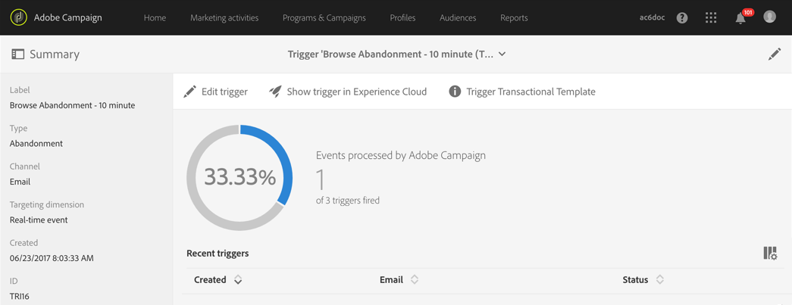

# 廢棄觸發程式使用案例{#abandonment-triggers-use-cases}

本節介紹可使用 Adobe Campaign 與 Experience Cloud 觸發程式之間的整合，以實施的不同使用案例。您會找到兩個使用案例的範例：

* [瀏覽放棄觸發程式](#browse-abandonment-trigger)：傳送通訊給放棄造訪您網站的客戶。
* [搜尋放棄觸發程式](#search-abandonment-trigger)：與在您網站上搜尋但未購買的訪客重新互動。

>[!NOTE]
>
>本節所述的使用案例取決於 Experience Cloud 訪客 ID。您也可以使用 Experience Cloud Delaced ID 來實作。也支援雜湊和加密的宣告 ID。您可以直接解密加密的電子郵件地址/行動電話號碼，將電子郵件/簡訊傳送至不存在 Campaign 的設定檔。但在此情況下，無法使用運用設定檔資料的個人化。

## 先決條件 {#pre-requisites}

為了實作這些使用案例，您需要存取下列解決方案/核心服務：

* Adobe Campaign
* Adobe Analytics Ultimate、Premium、Foundation、OD、Select、Prime、行動應用程式、Select 或 Standard。
* Experience Cloud 觸發程式核心服務
* Experience Cloud DTM 核心服務
* Experience Cloud 訪客 ID 及 Experience Cloud People Core Service

此外，您還需要有正常運作的網站。

如需詳細資訊，請參閱[設定解決方案及服務](../../integrating/using/configuring-triggers-in-experience-cloud.md#configuring-solutions-and-services)。

## 瀏覽放棄觸發程式 {#browse-abandonment-trigger}

在此使用案例中，我們將建立簡單觸發程式，每次客戶放棄瀏覽網站時都會觸發。此範例假設您已擁有 DTM 收集資料並推播至 Adobe Analytics，且已建立您的所有事件。

### 建立 Experience Cloud 觸發程式 {#creating-an-experience-cloud-trigger}

1. 從 Experience Cloud Activation Core Service 功能表選取 **[!UICONTROL Manage Triggers]**。

   

1. 選取觸發程式類型（在此案例中為　**[!UICONTROL Abandonment]**）。

   

1. 對於此使用案例，我們需要簡單的放棄觸發程式。其商業目的是識別瀏覽旅行預訂網站、瀏覽「交易」頁面但不預訂任何旅行的訪客。我們識別此對象之後，我們就會在短時間內與他們聯絡。在此範例中，我們選取在　10　分鐘後傳送觸發程式。

   

### 在　Adobe Campaign　中使用觸發程式 {#using-the-trigger-in-adobe-campaign}

既然我們已建立　Experience Cloud　觸發程式，現在就在　Adobe Campaign　中使用它吧。

在　Adobe Campaign　中，您需要建立連結至您在　Experience Cloud　中建立的觸發程式。

1. 若要在　Adobe Campaign　中建立觸發程式，請按一下左上方的標誌　**[!UICONTROL Adobe Campaign]**，然後選取 **[!UICONTROL Marketing plans]** > **[!UICONTROL Transactional messages]** > **[!UICONTROL Experience Cloud triggers]**。

   

1. 按一下 **[!UICONTROL Create]**。
1. 選取您先前建立的觸發器，然後按一下 **[!UICONTROL Next]**。

   

1. 選取　**[!UICONTROL Email]**　通道和 **[!UICONTROL Real-time event]** 目標維度，然後按一下 **[!UICONTROL Create]**。

   

1. 在　Adobe Campaign　中發佈觸發程式。此過程將自動建立交易式訊息範本。

   

1. 若要顯示訊息範本，請按一下右上方的　**[!UICONTROL More]**　按鈕，然後再按 **[!UICONTROL Trigger Transactional Template]**。

1. 個人化其內容和傳送者詳細資訊。

   

1. 發佈訊息範本。觸發程式現在已可正常運作。

   

### 執行情境 {#running-the-scenario}

1. 此使用案例始於使用　Adobe Campaign　傳送給對象的初始電子郵件。

   

1. 收件者會開啟電子郵件。

   

1. 他按一下連結，系統就會將他導向到您的網站。在此範例中，橫幅會將收件者導向到旅行預訂網站的首頁。

   

1. 收件者前往「交易」頁面，但突然停止瀏覽內容。在　10　分鐘後，Adobe Campaign　會觸發交易式訊息的傳送。

   

1. 您隨時都可以檢查　Experience Cloud　記錄檔，查看觸發程式觸發的次數。

   

1. 您也可以顯示　Adobe Campaign　觸發程式報表。

   

## 搜尋放棄觸發程式 {#search-abandonment-trigger}

在此使用案例中，我們將建立觸發程式，以與造訪旅行預訂網站、搜尋目的地、找不到成功結果且之後未預訂任何內容的訪客重新互動。一般程式與上一個使用案例相同（請參閱[瀏覽放棄觸發器](#browse-abandonment-trigger)）。我們此處著重於討論如何個人化再行銷電子郵件訊息。

### 建立 Experience Cloud 觸發程式 {#creating-an-experience-cloud-trigger-1}

請依照上述使用案例中所述的步驟，建立 Experience Cloud 觸發程式。請參閱[建立 Experience Cloud 觸發程式](#creating-an-experience-cloud-trigger)。主要差異在於觸發程式定義。

**[!UICONTROL Include Meta Data]** 區段可讓您將從 Analytics 收集到的任何資料傳遞至觸發裝載。在此範例中，我們會建立自訂 eVar（例如 eVar 3）以收集訪客輸入的搜尋詞。然後，此詞彙將用於傳送給相同訪客的交易式電子郵件訊息中。

### 在　Adobe Campaign　中使用觸發程式 {#using-the-trigger-in-adobe-campaign-1}

1. 請依照先前使用案例中所述的步驟，在 Adobe Campaign 中建立觸發程式。請參閱在[ Adobe Campaign 中使用觸發程式](#using-the-trigger-in-adobe-campaign)。主要差異在於我們在 Adobe Campaign 中存取和使用觸發程式裝載中推播之中繼資料的方式。
1. 在您於 Adobe Campaign 中建立的「搜尋放棄」觸發程式中，按一下 **[!UICONTROL Event content and enrichment]** 圖示以檢視推播至 Adobe Campaign 的裝載。

   

1. 如您所見，自訂 eVar 會傳遞至觸發裝載，並對應至&#x200B;**事件內容**&#x200B;表格 (ctx)。我們現在可以存取它，以個人化交易式訊息。

   

1. 在此範例中，我們選取將目標搜尋詞彙納入主旨行及電子郵件內文中。

   

1. 選取個人化欄位時，請先在&#x200B;**交易式事件** (rtEvent) 表格中尋找裝載中繼資料，然後在&#x200B;**事件內容** (ctx) 子表格中尋找。

   

### 執行情境 {#running-the-scenario-1}

1. 訪客前往旅行預訂網站並搜尋目的地。在此範例中，訪客正在尋找日本之旅，但找不到任何結果。這是我們回覆此訪客並建議其他旅行計畫的機會。

   

   >[!NOTE]
   >
   >在此使用案例中，我們假設訪客/收件者已開啟並按一下來自相同網站的電子郵件。這可讓我們使用和收集 VisitorID，並將它對應至收件者。我們只需執行這個作業一次。

1. 稍後，相同的訪客/收件者會收到再行銷訊息。訊息包含最近搜尋的目的地。

   

