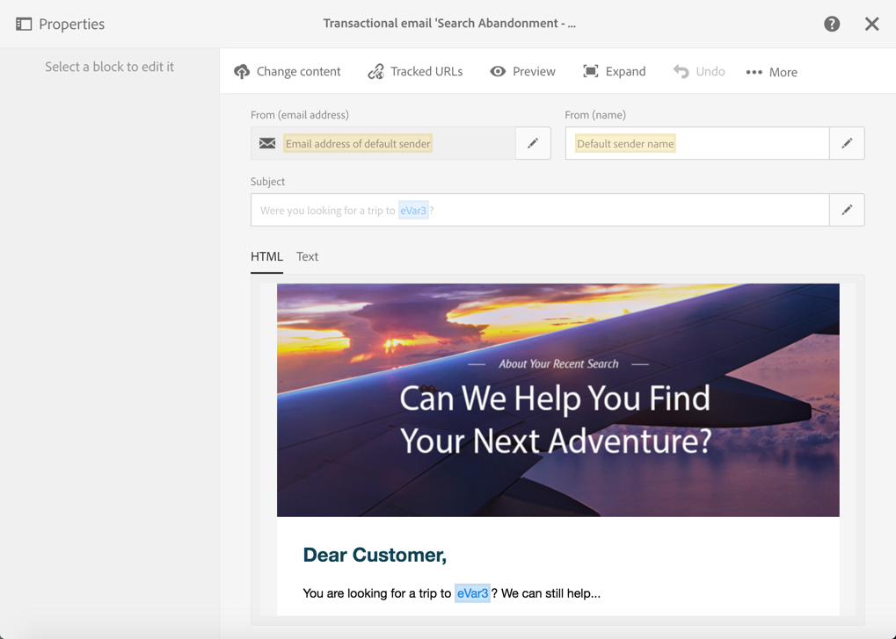

# 放棄觸發器使用案例{#abandonment-triggers-use-cases}

本節介紹可使用Adobe Campaign與Experience cloud觸發器之間的整合來實施的不同使用案例。 您會找到兩個使用案例的範例：

* [瀏覽放棄觸發器](#browse-abandonment-trigger):傳送通訊給在您網站上放棄造訪的客戶。
* [搜尋放棄觸發器](#search-abandonment-trigger):與在您網站上搜尋但未購買的訪客重新互動。

>[!NOTE]
>
>本節所述的使用案例取決於Experience cloud訪客ID。 您也可以使用Experience Cloud Delaced ID來實作。 也支援雜湊和加密的宣告ID。 您可以直接解密加密的電子郵件地址／行動電話號碼，將電子郵件／簡訊傳送至Campaign中不存在的描述檔。 但在此情況下，無法使用使用個人檔案資料的個人化。

## 先決條件 {#pre-requisites}

為了實作這些使用案例，您需要存取下列解決方案／核心服務：

* Adobe Campaign
* Adobe Analytics Ultimate、Premium、Foundation、OD、Select、Prime、Mobile Apps、Select或Standard。
* Experience cloud觸發器核心服務
* Experience Cloud DTM核心服務
* Experience cloud訪客ID和Experience cloud人員核心服務

此外，您還需要有有效的網站。

如需詳細資訊，請參閱「設 [定解決方案與服務」](../../integrating/using/configuring-triggers-in-experience-cloud.md#configuring-solutions-and-services)。

## 瀏覽放棄觸發器 {#browse-abandonment-trigger}

在此使用案例中，我們將建立簡單觸發器，每次客戶放棄在網站上的瀏覽時都會觸發。 此範例假設您已擁有DTM收集資料並推送至Adobe Analytics，且已建立您的所有事件。

### 建立Experience cloud觸發器 {#creating-an-experience-cloud-trigger}

1. 從Experience **[!UICONTROL Manage Triggers]** Cloud啟動核心服務選單中選擇。

   

1. 選擇觸發器類型(在我 **[!UICONTROL Abandonment]** 們的使用案例中)。

   

1. 對於此使用案例，我們需要簡單的放棄觸發。 其商業目的是識別瀏覽我們旅行預訂網站、瀏覽「交易」頁面但不預訂任何旅行的訪客。 一旦我們識別此受眾，我們就想在短時間內與他們聯絡。 在此範例中，我們選擇在10分鐘後傳送觸發器。

   

### 在Adobe Campaign中使用觸發器 {#using-the-trigger-in-adobe-campaign}

既然我們已建立Experience cloud觸發器，現在就讓我們在Adobe Campaign中使用它。

在Adobe Campaign中，您需要建立連結至您在Experience cloud中建立的觸發器。

1. 若要在Adobe Campaign中建立觸發器，請按一 **[!UICONTROL Adobe Campaign]** 下左上角的標誌，然後選取 **[!UICONTROL Marketing plans]** &gt; **[!UICONTROL Transactional messages]** &gt; **[!UICONTROL Experience Cloud triggers]**。

   

1. Click **[!UICONTROL Create]**.
1. 選取您先前建立的觸發器，然後按一下 **[!UICONTROL Next]**。

   

1. 選取頻 **[!UICONTROL Email]** 道和定位 **[!UICONTROL Real-time event]** 維度，然後按一下 **[!UICONTROL Create]**。

   

1. 在Adobe Campaign中發佈觸發器。 此過程將自動建立事務性消息模板。

   

1. 若要顯示訊息範本，請按一下右 **[!UICONTROL More]** 上方的按鈕，然後按一下 **[!UICONTROL Trigger Transactional Template]**。

1. 個人化其內容和傳送者詳細資訊。

   

1. 發佈訊息範本。 觸發器現在已可正常運作。

   

### 執行藍本 {#running-the-scenario}

1. 此使用案例始於使用Adobe Campaign傳送給您觀眾的初始電子郵件。

   

1. 收件者會開啟電子郵件。

   

1. 他點選連結，將他帶到您的網站。 在此範例中，橫幅會將收件者帶到旅行預訂網站的首頁。

   

1. 收件者前往「交易」頁面，但突然停止其瀏覽。 在10分鐘後，Adobe Campaign會觸發交易訊息的傳送。

   

1. 您隨時都可以檢查Experience cloud記錄檔，查看觸發器觸發的次數。

   

1. 您也可以顯示Adobe Campaign觸發器報表。

   

## 搜尋放棄觸發器 {#search-abandonment-trigger}

在此使用案例中，我們將建立觸發器，以與造訪我們旅行預訂網站、搜尋目的地、找不到成功結果且之後未預訂任何內容的訪客重新互動。 一般程式與上一個使用案例相同(請參閱「瀏 [覽放棄觸發器](#browse-abandonment-trigger)」)。 我們將著重討論如何個人化再行銷電子郵件訊息。

### 建立Experience cloud觸發器 {#creating-an-experience-cloud-trigger-1}

請依照上述使用案例中所述的步驟，建立Experience cloud觸發器。 請參 [閱建立Experience cloud觸發器](#creating-an-experience-cloud-trigger)。 主要區別在於觸發器定義。

此 **[!UICONTROL Include Meta Data]** 區段可讓您將從Analytics收集到的任何資料傳遞至觸發裝載。 在此範例中，我們建立自訂eVar（例如eVar 3）以收集訪客輸入的搜尋詞。 然後，此詞語將用於傳送給相同訪客的交易式電子郵件訊息中。

### 在Adobe Campaign中使用觸發器 {#using-the-trigger-in-adobe-campaign-1}

1. 請依照先前使用案例中所述的步驟，在Adobe Campaign中建立觸發器。 請參 [閱在Adobe Campaign中使用觸發器](#using-the-trigger-in-adobe-campaign)。 主要差異在於我們在Adobe Campaign中存取和使用觸發器裝載中推送的中繼資料的方式。
1. 在您在Adobe Campaign中建立的「搜尋放棄」觸發器中，按一下圖 **[!UICONTROL Event content and enrichment]** 示以檢視推送至Adobe Campaign的裝載。

   

1. 如您所見，自訂eVar會傳遞至「觸發裝載」，並對應至「事 **件內容** 」表格(ctx)。 我們現在可以存取它，以個人化交易訊息。

   

1. 在此範例中，我們選擇將目標搜尋詞納入主旨行以及電子郵件內文中。

   

1. 選取個人化欄位時，請先在 **Transactional event** (rtEvent)表格中尋找您的裝載中繼資料，然後在 **Event context** (ctx)子表格中尋找。

   

### 執行藍本 {#running-the-scenario-1}

1. 訪客前往旅行預訂網站，搜尋目的地。 在此範例中，訪客正在尋找日本之旅，但找不到任何結果。 這是我們回覆此訪客並建議其他旅行計畫的機會。

   

   >[!NOTE]
   >
   >在此使用案例中，我們假設訪客／收件者已開啟並點按來自相同網站的電子郵件。 這可讓我們使用和收集VisitorID，並將它對應至收件者。 我們只需做一次。

1. 稍後，相同的訪客／收件者會收到重新行銷訊息。 訊息包含最近搜尋的目的地。

   

