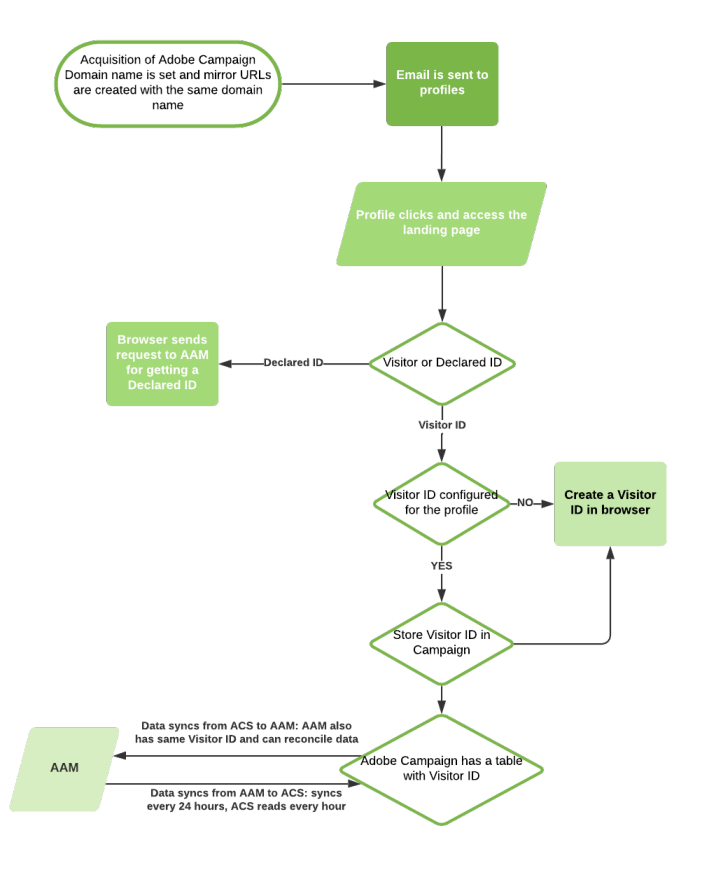

# 關於 Campaign-Audience Manager 或 People 核心服務整合{#about-campaign-audience-manager-or-people-core-service-integration}

>[!CAUTION]
>
>根據交換的資料，在Adobe Campaign中匯入對象可能會受到法律限制。

Adobe Campaign可讓您與不同的Adobe Experience Cloud應用程式交換和共用對象/區段。 整合 **Adobe Campaign** 替換為 **People核心服務** (也稱為 **設定檔與受眾核心服務**)或Adobe Audience Manager可讓您：

* 從不同的Adobe Experience Cloud解決方案匯入對象/區段至Adobe Campaign。 對象可從匯入 **[!UICONTROL Audiences]** Adobe Campaign中的功能表。
* 將受眾匯出為共用受眾/區段。 這些對象可用於您所使用的不同 Adobe Experience Cloud 解決方案。 在工作流程中定位活動後，可使用匯出對象。 **[!UICONTROL Save audience]** 活動。

整合支援兩種型別的Adobe Experience Cloud ID：

* **訪客ID**：此型別的ID可讓您調解Adobe Experience Cloud訪客與Adobe Campaign設定檔。 透過Adobe IMS啟用連線後，Marketing Cloud訪客ID服務就會啟用，取代Adobe Campaign使用的永久Cookie。 這可讓您識別訪客，然後將其連結至設定檔。
    訪客ID在設定檔點按透過Adobe Campaign傳送的電子郵件時，立即連結至設定檔：
   * 如果設定檔已有訪客ID，設定檔的瀏覽器資料可讓Adobe Campaign復原，並自動將設定檔連結至訪客ID。
   * 如果找不到訪客ID，則會建立新的ID。 此訪客ID會儲存在設定檔追蹤記錄中。

   之後，具有相同CNAME的其他Adobe Marketing Cloud應用程式將會辨識該ID。

* **宣告ID**：此型別的ID可讓您調解任何型別的資料與Adobe Campaign資料庫中的元素。 在 Adobe Campaign 中以預先定義的調解金鑰呈現。交換資料時，會雜湊處理Adobe Campaign資料庫識別碼。 這些雜湊ID接著會與匯入或匯出所涉及的Adobe Marketing Cloud對象的雜湊ID進行比較。
    此整合支援一般宣告ID、雜湊宣告ID和加密宣告ID。

   >[!NOTE]
   >
   >已宣告的 ID 資料來源現在也可搭配 People 核心服務整合使用。
   >
   >如果您使用 People 核心服務整合，且想要新增 Audience Manager 整合，則需要 Adobe Audience Manager 顧問的協助，以避免在 Adobe Audience Manager 內容中轉換為使用此宣告 ID 資料來源時，所收集的 ID 同步全部遺失。

   加密可讓您透過指定加密演演算法，使用宣告ID在資料來源（例如PII）中共用加密的資料。

   例如，透過解密加密的電子郵件地址或簡訊號碼的功能，您也可以傳送觸發式訊息給使用者，即使Adobe Campaign資料庫中沒有使用者的設定檔。

下圖詳細說明此整合的運作方式。此處，AAM代表Adobe Audience Manager，ACS代表Adobe Campaign Standard。

