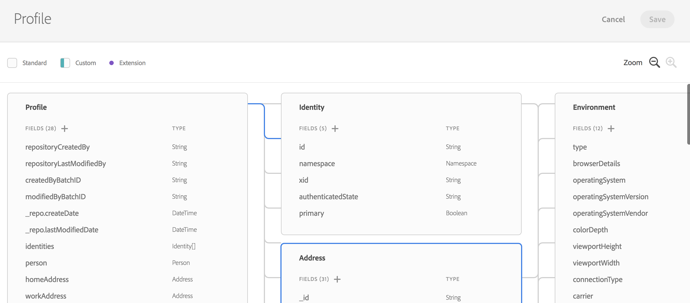

# 體驗資料模型概觀 {#experience-data-model-overview}

>[!IMPORTANT]
>
>Adobe Experience Platform Data Connector目前為測試版，可能會經常更新，恕不另行通知。 客戶必須在Azure上託管（目前僅北美地區適用Beta版）才能存取這些功能。 如果您想要存取許可權，請聯絡Adobe客戶服務。

Experience Data Model (XDM)是一組標準資料結構描述，其中的資料可能會被擷取以用於Adobe Experience Platform解決方案和產品。

XDM結構描述的建立和管理可透過專用API或XDM使用者介面使用。

## XDM工作區 {#xdm-workspace}

XDM工作區可讓您檢視、建立和擴充資料結構。

若要存取XDM使用者介面，請開啟Adobe Experience Platform。 導覽至「資料模型」視窗，以建立或擴充XDM結構。

請參閱完整版 [XDM工作區檔案](https://experienceleague.adobe.com/docs/experience-platform/xdm/api/getting-started.html).

## XDM API {#xdm-api}

您可以透過XDM結構描述API執行下列動作：

* 檢視現有結構描述的清單
* 檢視特定結構描述擴充現有結構描述
* 新增欄位至擴充功能
* 建立和更新新結構描述
* 檢視結構描述項
* 建立、更新和刪除結構描述項

操縱API呼叫的所有詳細資訊可在 [開發人員指南](https://experienceleague.adobe.com/docs/experience-platform/xdm/api/getting-started.html).
