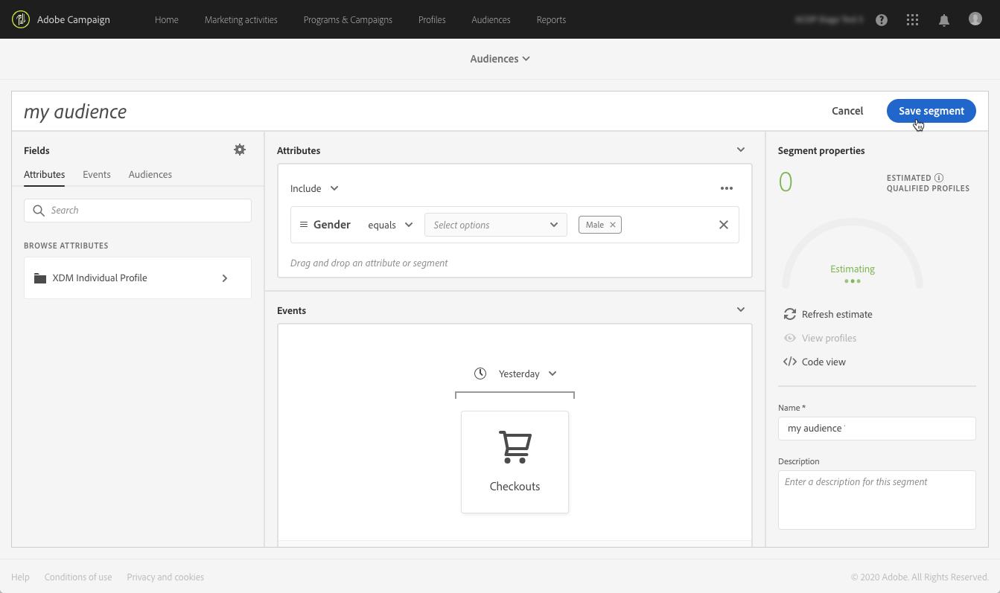

# 管理 Adobe Experience Platform 客群 {#about-audiences}

>[!IMPORTANT]
>
>Audience Destinations Service目前為測試版，可能會經常更新，恕不另行通知。 客戶需在Azure上代管（目前僅限北美地區使用Beta版）才能存取這些功能。 如果您想要存取許可權，請聯絡Adobe客戶服務。

## 存取Adobe Experience Platform受眾

若要存取Adobe Experience Platform區段產生器，請導覽至Campaign Standard首頁上的&#x200B;**[!UICONTROL Audiences]**&#x200B;卡片（或標頭中的&#x200B;**[!UICONTROL Audiences]**&#x200B;連結），然後選取&#x200B;**[!UICONTROL Adobe Experience Platform]**&#x200B;環境。

您會先進入Adobe Experience Platform區段清單頁面，您可在此存取現有的Adobe Experience Platform區段以供進一步編輯。

搜尋列和篩選器可協助您找到所需的Adobe Experience Platform區段。

## 建立Adobe Experience Platform對象

若要直接在Campaign Standard中建立Adobe Experience Platform對象，請遵循下列步驟：

1. 從Adobe Experience Platform區段清單頁面，按一下位於右角的&#x200B;**[!UICONTROL New audience]**&#x200B;按鈕。

   

1. 區段產生器現在應該會顯示在您的工作區中。 它可讓您使用Adobe Experience Platform的資料來建立區段，這些資料最終將用來建立您的對象。

1. 在右窗格中命名區段，並輸入說明（選擇性）。

   

1. 為了成功建立區段，您必須選取符合您針對此區段行銷目的的&#x200B;**合併原則**。

   在設定窗格中，選取Platform預設合併原則。 如需合併原則的詳細資訊，請參閱[區段產生器使用手冊](https://experienceleague.adobe.com/docs/experience-platform/segmentation/ui/overview.html?lang=zh-Hant)中的專屬章節。

   

1. 定義規則，用於識別將在對象中擷取的設定檔。

   若要這麼做，請從左側窗格將所需的屬性和/或事件拖曳至工作區，定義對應的規則，然後按一下&#x200B;**[!UICONTROL Create segment]**&#x200B;按鈕以儲存區段（請參閱[使用區段產生器](../../integrating/using/aep-using-segment-builder.md)）。

   

對象現在已準備好啟動，您可以將其用作行銷活動的目標(請參閱[鎖定Adobe Experience Platform對象](../../integrating/using/aep-targeting-audiences.md))。

## 編輯對象

若要編輯對象，請視需要在「區段產生器」介面中開啟對象並修改規則（請參閱[使用區段產生器](../../integrating/using/aep-using-segment-builder.md)）。

完成變更後，按一下&#x200B;**[!UICONTROL Save segment]**&#x200B;按鈕以更新您的對象。

