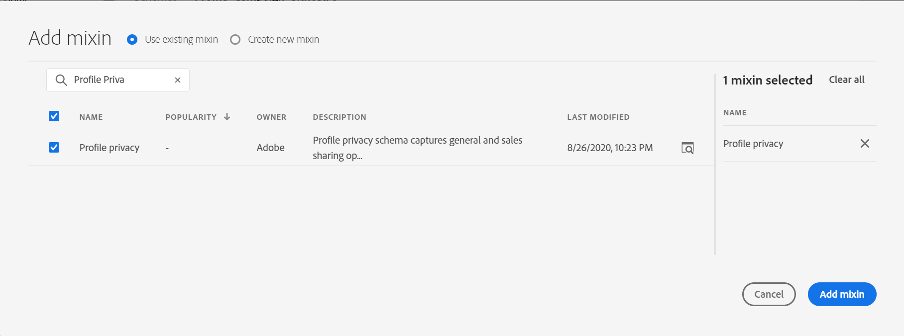
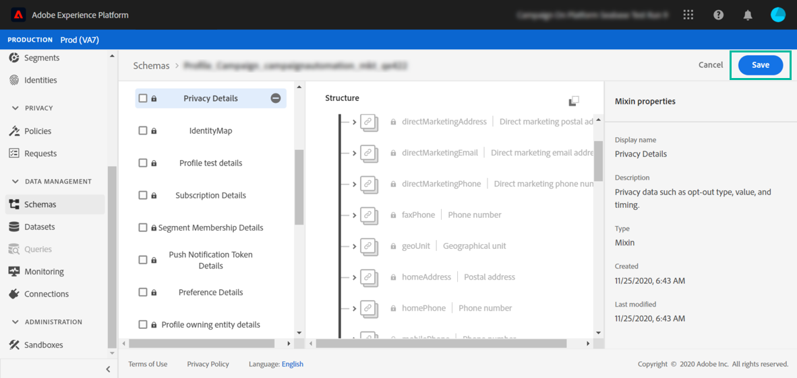

# 對應啟動 {#mapping-activation}

>[!IMPORTANT]
>
>Adobe Experience Platform Data Connector目前為測試版，可能會經常更新，恕不另行通知。 客戶必須在Azure上託管（目前僅北美地區適用Beta版）才能存取這些功能。 如果您想要存取許可權，請聯絡Adobe客戶服務。

完成對應定義後，即可發佈對應。 在部署步驟後，Campaign Standard和Adobe Experience Platform之間的資料復寫會自動啟動。 您隨時可以按一下 **[!UICONTROL Stop]** 按鈕。

視您的對應修改而定，您可以選擇將所有記錄重新傳送至Adobe Experience Platform。

從部署圖磚中，您可以存取發佈記錄檔和匯出記錄檔。

在 **[!UICONTROL Export jobs]** 索引標籤中，您可以監視已發佈對應的匯出作業。

如果要監視所有資料匯出作業，請移至 **[!UICONTROL Administration]** > **[!UICONTROL Development]** > **[!UICONTROL Platform]** > **[!UICONTROL Status of data export to platform]** 功能表。

資料擷取工作狀態為：

* **[!UICONTROL Created]**：已建立資料擷取作業，且正在進行資料擷取。
* **[!UICONTROL Failed]**：資料擷取工作失敗。 原因欄位說明失敗的原因。 失敗可以是暫時性或永久性。 如果暫時失敗，會在設定的間隔之後建立新的擷取工作。 作為疑難排解的第一步，使用者可以檢查失敗的原因欄位。 如果原因將使用者重新導向至Adobe Experience Platform UI，使用者可以登入Adobe Experience Platform並檢查資料集中的批次狀態，以判斷確切的失敗原因。
* **[!UICONTROL Uploaded]**：首先，在Adobe Experience Platform中建立批次，接著將資料擷取至該批次。 「批次ID」欄位會顯示Adobe Experience Platform中批次的批次ID。 Adobe Experience Platform也會對批次執行post驗證。 該批次會先標示為已上傳，直到Adobe Experience Platform完成發佈驗證步驟為止。 工作會持續在上傳後輪詢Adobe Experience Platform中的批次狀態。 批次可在Adobe Experience Platform中處於失敗或成功狀態後驗證。
* **[!UICONTROL Success]**：將批次上傳到Adobe Experience Platform後，會在設定的間隔後檢查作業狀態（在Platform中發佈驗證）。 「成功」狀態表示已成功擷取Adobe Experience Platform中的資料。

在某些情況下，發佈對應時可能會出現以下驗證錯誤。

如果您使用的XDM結構描述尚未更新與隱私權管理相關的最新XDM欄位，且仍包含已過時的「ccpa」XDM欄位，就會發生這種情況。

若要更新XDM結構，請遵循下列步驟：

1. 使用XDM對應頁面上提供的連結前往Adobe Experience Platform上的資料集。

1. 導覽至您的XDM結構描述。

1. 新增 **[!UICONTROL Profile Privacy]** mixin到結構描述。

   

1. 儲存結構描述，然後重試發佈對應。 發佈現在應該會通過。

   
