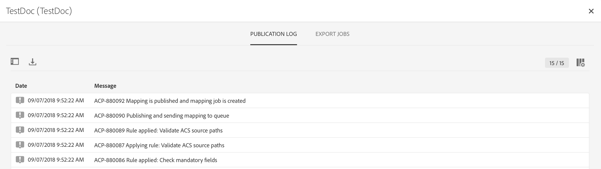

# 對應啟動 {#mapping-activation}

>[!IMPORTANT]
>
>Adobe Experience Platform Data Connector目前為測試版，可能會經常更新，恕不另行通知。 客戶必須在Azure上托管（目前測試版僅供北美使用），才能存取這些功能。 如果您想要存取權限，請聯絡Adobe客戶服務。

完成對應定義後，可以發佈對應。 部署步驟後，Campaign Standard和Adobe Experience Platform之間的資料復寫會自動啟動。 您隨時可以按一下&#x200B;**[!UICONTROL Stop]**&#x200B;按鈕來停止復寫。

視您的對應修改而定，您可以選擇將所有記錄重新傳送至Adobe Experience Platform。

從部署表徵圖，您可以訪問發佈日誌和導出日誌。

在&#x200B;**[!UICONTROL Export jobs]**&#x200B;標籤中，可以監視已發佈映射的導出作業。

如果要監視所有資料導出作業，請轉至&#x200B;**[!UICONTROL Administration]** > **[!UICONTROL Development]** > **[!UICONTROL Platform]** > **[!UICONTROL Status of data export to platform]**&#x200B;菜單。

資料擷取工作狀態為：

* **[!UICONTROL Created]**:已建立資料擷取工作，且資料擷取正在進行中。
* **[!UICONTROL Failed]**:資料獲取作業失敗。原因欄位描述了失敗的原因。 故障可能是暫時的或永久的。 如果發生暫時性故障，則會在設定的間隔後建立新的擷取作業。 作為疑難排解的第一步，使用者可以檢查失敗的原因欄位。 如果原因將使用者重新導向至Adobe Experience Platform UI，則使用者可登入Adobe Experience Platform，並檢查資料集中的批次狀態，以判斷確切的失敗原因。
* **[!UICONTROL Uploaded]**:系統會先在Adobe Experience Platform中建立批次資料，接著將資料內嵌至該批次。批次ID欄位會顯示Adobe Experience Platform中批次的批次ID。 Adobe Experience Platform也會對批次執行貼文驗證。 批次會先標示為已上傳，直到Adobe Experience Platform完成貼文驗證步驟為止。 工作會在上傳後持續輪詢Adobe Experience Platform的批次狀態。 批次可在Adobe Experience Platform中進入「失敗」或「成功」狀態，進行貼文驗證。
* **[!UICONTROL Success]**:將批次上傳至Adobe Experience Platform後，系統會在設定的間隔後檢查作業狀態（平台中的驗證後）。狀態「成功」在Adobe Experience Platform中識別了成功擷取資料。

在某些情況下，發佈對應時，您可能會收到以下驗證錯誤。

使用的XDM架構未更新為與隱私權管理相關的最新XDM欄位，且仍包含已棄用的「ccpa」XDM欄位時，即會發生此情況。

若要更新XDM結構，請執行下列步驟：

1. 使用XDM對應頁面上顯示的連結，前往Adobe Experience Platform上的資料集。

1. 導覽至您的XDM結構。

1. 將&#x200B;**[!UICONTROL Profile Privacy]** mixin新增至架構。

   

1. 儲存結構，然後重試發佈對應。 出版物現在應已通過。

   
