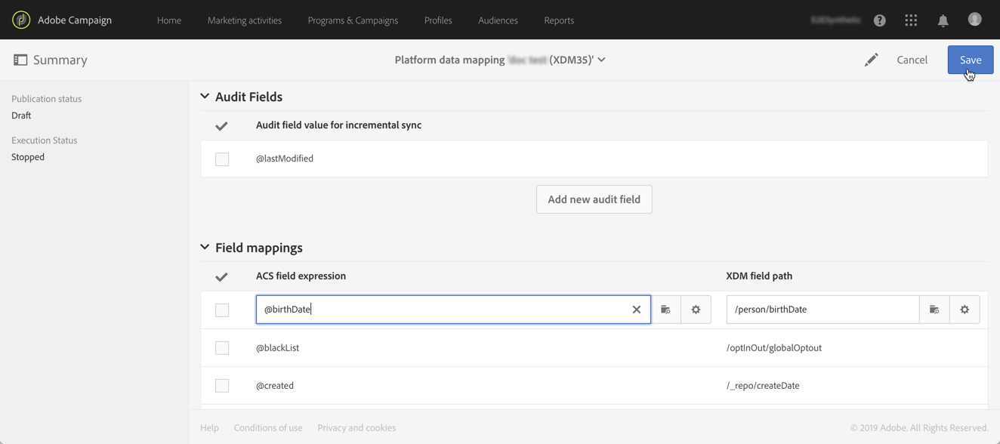

# 對應定義 {#mapping-definition}

>[!IMPORTANT]
>
>Adobe Experience Platform Data Connector目前為測試版，可能會經常更新，恕不另行通知。 客戶必須在Azure上托管（目前測試版僅供北美使用），才能存取這些功能。 如果您想要存取權限，請聯絡Adobe客戶服務。

在本節中，您將探索如何將Campaign Standard欄位與體驗資料模型(XDM)欄位對應。

要執行此任務，必要條件是：

* 透過介面或使用與XDM相關聯的REST API來定義XDM結構
* 根據XDM架構定義建立資料集

1. 前往 **[!UICONTROL Administration]** > **[!UICONTROL Development]** > **[!UICONTROL Platform]** 並選擇 **[!UICONTROL Data mappings]** 的下界。

1. 按一下 **[!UICONTROL Create]** 來啟動新的XDM對應。

   

1. 填寫必填欄位並選取：

   * a **目標維度**:這是要映射的Campaign Standard結構
   * a **資料集**:這是與Adobe Experience Platform中XDM架構相關聯的資料套件。

>[!NOTE]
>
>若要將批次資料擷取至即時客戶個人檔案或Identity Service，資料集必須 [為即時客戶設定檔啟用](https://experienceleague.adobe.com/docs/experience-platform/rtcdp/intro/get-started.html).
>
>如果您選取的資料集已用於現有資料對應，系統會顯示警告，通知您的資料可能會在Adobe Experience Platform上覆寫。 使用相同資料集的資料綁架中有某些常見收件者時，即會發生此情況。

下列畫面會顯示 **[!UICONTROL Field mappings]** 區段中，您可以為Campaign Standard架構中的每個欄位建立新對應。

此 **[!UICONTROL Create new field mapping]** 按鈕可讓您選取XDM架構中的「Campaign Standard」欄位和對應的欄位路徑運算式。

如果您找不到Adobe Campaign Standard欄位，可以使用搜尋欄位來搜尋欄位。 目前，搜尋只適用於階層中開啟的欄位。

Campaign Standard中定義的擴充資源會對應至所有原生欄位。 這些範本定義在XDM的_customer/default擴充功能中。

您可以透過API自訂XDM擴充功能，並定義自己的擴充功能，以更妥善地控制對應。

請參閱 [Schema Registry API教學課程](https://experienceleague.adobe.com/docs/experience-platform/xdm/api/getting-started.html) 以取得XDM API的詳細資訊。

若要對應分項清單欄位，您需要使用運算式編輯器來定義與XDM值對應的每個分項清單值。 例如，後置定址欄位需定義為：

如果XDM值在XDM結構中定義為分項清單，您可以使用原生EXDM函式，自動取代 **lif** 語法。

若要編輯XDM對應，請開啟該對應，修改所需資訊，然後儲存。

>[!IMPORTANT]
>
>目前，若您在 **[!UICONTROL Field mappings]** 區段，然後按一下欄位外部，在您按一下「 」之前，介面中不會顯示您的變更 **[!UICONTROL Save]** 按鈕。 此行為只會在 **[!UICONTROL Field Mappings]** 是頁面上的首次編輯。
