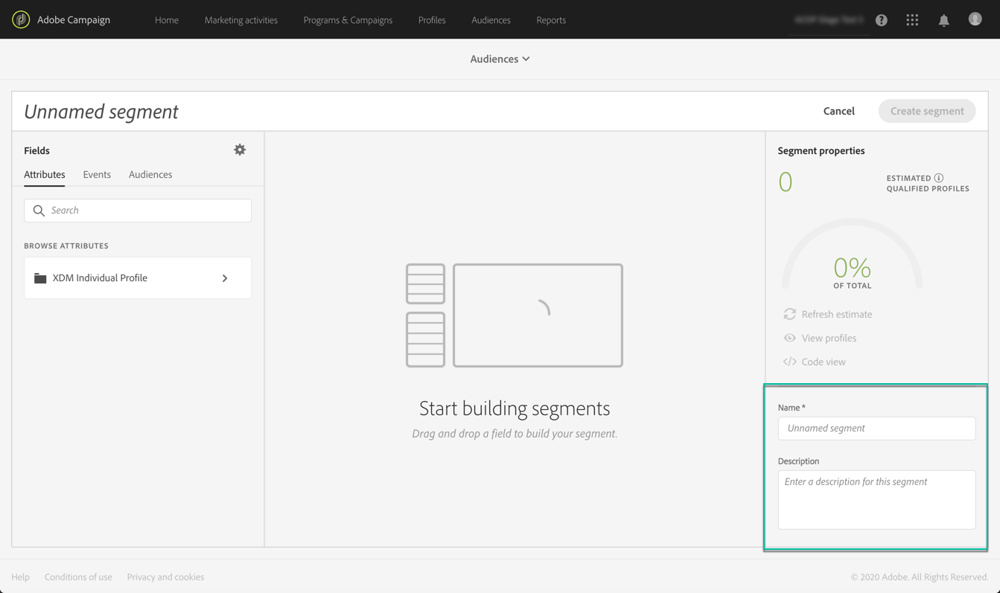

# 使用區段產生器 {#using-the-segment-builder}

>[!IMPORTANT]
>
>Audience Destinations服務目前為測試版，可能會經常更新，恕不另行通知。 客戶必須在Azure上托管（目前測試版僅供北美使用），才能存取這些功能。 如果您想要存取權限，請聯絡Adobe客戶服務。

區段產生器可讓您根據來自[即時客戶設定檔](https://experienceleague.adobe.com/docs/experience-platform/profile/home.html)的資料定義規則，以建立受眾。

本節介紹建立區段時的全域概念。 如需區段產生器本身的詳細資訊，請參閱[區段產生器使用指南](https://experienceleague.adobe.com/docs/experience-platform/segmentation/ui/overview.html)。

「區段產生器」介面的組成如下：

* 左窗格提供所有屬性、事件和對象，您可將所需欄位拖曳至區段產生器工作區中，借此建立區段。
* 中心區域提供工作區，讓您從可用欄位定義並結合規則，以建立區段。
* 標題和右窗格會顯示區段的屬性（例如名稱、說明和區段的預計合格設定檔）。

## 建立區段

若要建立區段，請依照下列步驟操作：

「區段產生器」現在應會顯示在您的工作區中。 它可讓您使用Adobe Experience Platform中的資料來建立區段，這些資料最終將用來建立您的對象。

1. 為區段命名，然後輸入說明（選用）。

   

1. 確保在設定窗格中選擇了所需的合併策略。

   如需合併原則的詳細資訊，請參閱[區段產生器使用手冊](https://experienceleague.adobe.com/docs/experience-platform/segmentation/ui/overview.html)中的專屬區段。

   

1. 在左窗格中尋找所需欄位，並將其拖曳至中央工作區。

   

1. 設定與拖曳欄位對應的規則。

   

1. 按一下 **[!UICONTROL Create segment]** 按鈕。

## 尋找區段的正確欄位

左窗格列出可用於建構規則的所有屬性、事件和對象。

列出的欄位是您公司擷取的屬性，已透過[Experience Data Model(XDM)System](https://experienceleague.adobe.com/docs/experience-platform/xdm/home.html)提供使用。

欄位可組織為標籤：

* **[!UICONTROL Attributes]**:可能源自您的Adobe Campaign資料庫和/或Adobe Experience Platform的現有設定檔屬性。它們是指附加至設定檔的靜態資訊（例如，電子郵件地址、居住國、忠誠計畫狀態等）。

   

* **[!UICONTROL Events]**:可識別與貴公司客戶接觸點有互動之消費者的活動，例如「兩週內訂購過兩次的任何人」。這可從Adobe Analytics串流，或使用協力廠商ETL工具直接擷取至Adobe Experience Platform。

   

>[!NOTE]
>
>**多實體** 區段可讓您根據產品、商店或其他非設定檔類別，以其他資料擴充設定檔資料。連線後，其他類別的資料就可供使用，就像它們是設定檔架構的原生資料。
>
>如需詳細資訊，請參閱[專屬文件](https://experienceleague.adobe.com/docs/experience-platform/segmentation/multi-entity-segmentation.html)。

依預設，「區段產生器」會顯示已有資料的欄位。 要顯示完整架構，包括不存在資料的欄位，請從設定中啟用&#x200B;**[!UICONTROL Show full XDM schema]**&#x200B;選項。

每個欄位結尾的符號提供關於屬性及其使用方式的其他資訊。

## 定義區段的規則

>[!NOTE]
>
>下節提供規則定義的全域資訊。 如需詳細資訊，請參閱[區段產生器使用手冊](https://experienceleague.adobe.com/docs/experience-platform/segmentation/ui/overview.html)。

若要建立規則，請依照下列步驟操作：

1. 從左窗格中尋找反映規則所依據之屬性或事件的欄位。

1. 將欄位拖曳至中心工作區，然後根據所需的區段定義進行設定。 若要這麼做，可使用數個字串和日期/時間函式。

   在下列範例中，規則將目標定位為性別等於「男性」的所有設定檔。

   

   在&#x200B;**[!UICONTROL Segment Properties]**&#x200B;區段中自動重新計算與區段對應的預計母體。

1. **[!UICONTROL View Profiles]**&#x200B;按鈕可讓您預覽與規則對應的前20個記錄，讓您快速驗證區段。

   

   您可以視需要新增任意數量的其他規則，以定位正確的設定檔。

   將規則新增至容器時，會附加至具有AND邏輯運算子的任何現有規則。 如果需要，請按一下邏輯運算子以修改它。

   

一旦連結在一起，這兩個規則就會形成容器。

## 比較欄位

區段產生器可讓您比較兩個欄位以定義規則。 例如，其住所地址與工作地址的郵遞區號不同的女性。

要執行此操作，請依照下列步驟執行：

1. 將您要比較的第一個欄位（例如，首頁地址郵遞區號）拖曳至中心工作區。

   

1. 選取將與第一個欄位比較的第二個欄位（例如，工作地址郵遞區號）。

   將其拖曳至&#x200B;**[!UICONTROL Drop here to compare operands]**&#x200B;方塊中與第一個欄位相同的容器中的中央工作區。

   

1. 視需要在兩個欄位之間設定運算子。 在此範例中，我們希望我們的區段以不同於工作地址的首頁位址來定位設定檔。

   

規則現在已設定完畢，且可供作為對象啟動。
