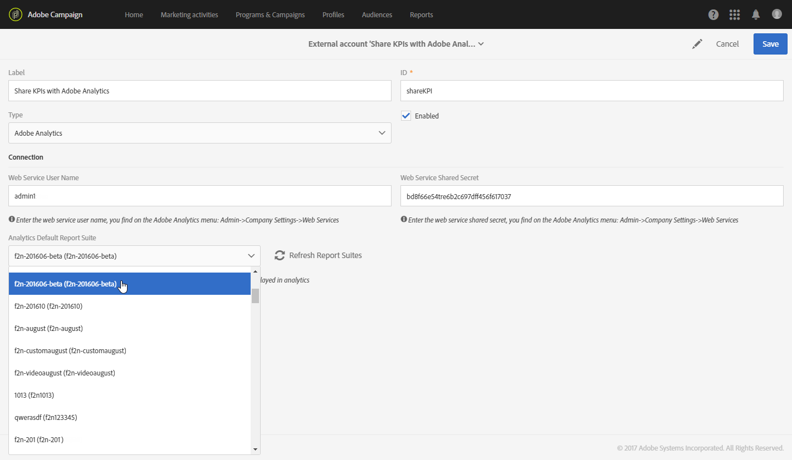

# 設定 Campaign-Analytics 整合{#configure-campaign-analytics-integration}

此整合可讓您直接從Adobe Campaign將關鍵績效指標資料分享至Adobe Analytics Standard或Premium。

若要開始整合Adobe Campaign Standard和Adobe Analytics，您必須先設定連結至Adobe Analytics的外部帳戶。

外部帳戶和技術工作流程只能由平台的功能管理員管理。

1. 從進階功能表，透過Adobe Campaign標誌，選取 **[!UICONTROL Administration > Application settings > External accounts]**。
1. 選擇外 **[!UICONTROL Share KPIs with Adobe Analytics]** 部帳戶。

   

1. 在欄位 **[!UICONTROL Web services user name]** 中指 **[!UICONTROL Web services share secret]** 定您的 **[!UICONTROL Connection]** 和。

   您可在Analytics中選取這些參數 **[!UICONTROL Admin > Company settings > Web services]**。

   

1. Click the **[!UICONTROL Refresh report suites]** button.
1. 從下拉式 **[!UICONTROL Analytics default report suite]** 清單中選取您要使用Adobe Campaign資料豐富的Adobe Analytics報表套裝。

   您的外部帳戶現已準備就緒，並可與Adobe Analytics連結。 您可以隨時勾選方塊來停用 **[!UICONTROL Enabled]** 它。

   

技術 **[!UICONTROL Share KPIs with Adobe Analytics]** 工作流程現在會自動啟動，並可從進階選單中選取以檢視 **[!UICONTROL Administration > Application settings > Workflow]**。 此技術工作流程將每15分鐘自動執行一次，並在Adobe Analytics中推播最多6個月的舊資料。

您的資料現在可在Adobe Analytics中使用。

**相關主題：**

* [外部帳戶](../../administration/using/external-accounts.md)
* [技術工作流程](../../administration/using/technical-workflows.md)
* [共用整合式促銷活動報告視訊的KPI](https://helpx.adobe.com/marketing-cloud/how-to/email-marketing.html)

