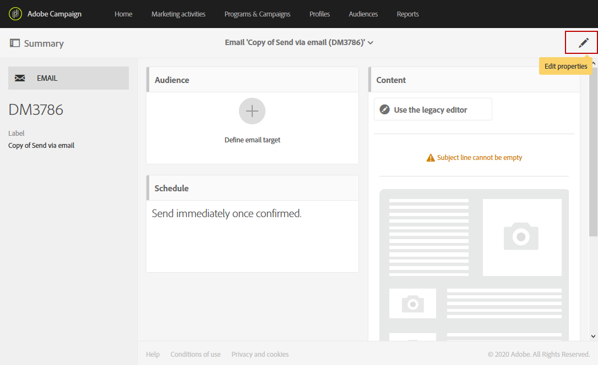

# 設定Campaign-Experience manager整合 {#configuration-aem}

Adobe Campaign standard與Adobe Experience manager的整合可讓您在Adobe Campaign電子郵件中使用在Adobe Experience manager中建立的內容。

透過此使用案例，您將學習如何在Adobe Experience Manager中建立和管理電子郵件內容，然後將這些內容匯入Adobe Campaign Standard，以用於您的行銷宣傳。

## 必要條件 {#prerequisites}

您應事先確定您有下列元素：

* Adobe Experience Manager製作 **實例**
* Adobe Experience Manager發佈 **實例**
* Adobe Campaign例項

## Adobe Campaign standard中的設定 {#config-acs}

若要搭配使用這兩個解決方案，您必須將它們設定為彼此連線。
若要設定Adobe Campaign:

1. 您必須先在> **[!UICONTROL Adobe Experience Manager instance]** >下設定外部帳戶 **[!UICONTROL Administration]****[!UICONTROL Application settings]****[!UICONTROL External accounts menu]**。

1. 使用您的 **[!UICONTROL Server]** URL設定Adobe Experience Manager輸入外部帳戶 **[!UICONTROL Account]** 和 **[!UICONTROL Password]**。

   

1. 檢查選項 **[!UICONTROL AEMResourceTypeFilter]** 是否已正確配置。 存取「 > **[!UICONTROL Options]** > >功能表 **[!UICONTROL Administration]** 」 **[!UICONTROL Application settings]** 下的功 **[!UICONTROL Options]** 能表。

1. 在欄位 **[!UICONTROL Value (text)]** 中，檢查下列語法是否正確：

   ```
   mcm/campaign/components/newsletter,mcm/campaign/components/campaign_newsletterpage,mcm/neolane/components/newsletter
   ```

   

1. 然後，在「 > > **[!UICONTROL Resources]** > **[!UICONTROL Templates]****[!UICONTROL Delivery templates]**」下的進階功能表中，複製其中一個現有範本，以建立Adobe Experience Manager專用的電子郵件範本。

   

1. 按一下 **[!UICONTROL Edit properties]** 圖示。

   

1. 在下拉 **[!UICONTROL Content]** 式清單下，選取欄 **[!UICONTROL Adobe Experience Manager]** 位中的 **[!UICONTROL Content source]** ，然後在中選取您先前建立的外部帳戶 **[!UICONTROL Adobe Experience Manager account]**。

您現在需要在Adobe Experience manager中設定整合。

## Adobe Experience manager中的設定 {#config-aem}

若要使用Adobe Campaign standard設定Adobe Experience Manager，您必須遵循下列步驟：

1. 您首先需要在Adobe Experience Manager編寫和發佈實例之間配置複製。 請參閱本 [節](https://docs.adobe.com/content/help/en/experience-manager-65/administering/integration/campaignstandard.html#configuring-adobe-experience-manager)。

1. 然後，設定專屬的Adobe Experience manager與Adobe Campaign連接 **[!UICONTROL Cloud Service]**。 請參閱本 [節](https://docs.adobe.com/content/help/en/experience-manager-65/administering/integration/campaignstandard.html#connecting-aem-to-adobe-campaign)。

1. 您現在需要在作者實例的Adobe Experience manager中設定外部化程式。 請參閱本 [節](https://docs.adobe.com/content/help/en/experience-manager-65/administering/integration/campaignstandard.html#configuring-the-externalizer)。

