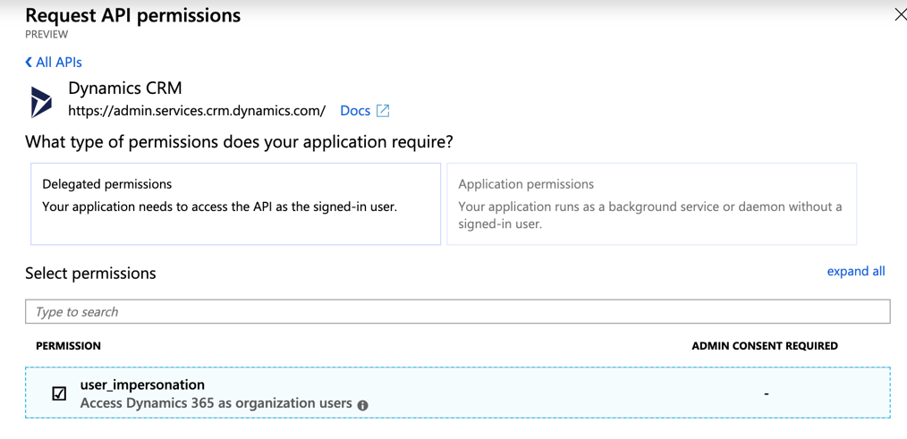

# 設定Microsoft Dynamics 365以進行促銷活動整合

瞭解如何設定Microsoft Dynamics 365整合，並透過Adobe Campaign Standard的跨通道通訊啟動您的CRM資料。

## 概觀

Adobe Campaign Standard - Microsoft Dynamics 365整合在本頁 [中說明](../../integrating/using/working-with-campaign-standard-and-microsoft-dynamics-365.md)。

需要為此整合布建三個系統：

1. Adobe Campaign Standard —— 瞭解 [更多資訊](../../integrating/using/configure-adobe-io-for-ms-dynamic.md)
1. Microsoft Dynamics 365 for Sales —— 說明如下
1. Unifi —— 了 [解詳情](../../integrating/using/configure-unifi-for-microsoft-dynamics-365-integration.md)

在設定後，這些系統需要由管理員配置。

本文著重說明在Microsoft Dynamics 365端，布建後期所需的步驟，讓客戶能夠使用Adobe Campaign Standard - Microsoft Dynamics 365整合。

## 必要條件

在本檔案中執行布建後步驟之前，我們假定您已布建並擁有組織Microsoft Dynamics 365例項的管理員存取權。  如果未發生此情況，則您需要與Microsoft客戶支援聯絡，以完成Dynamics 365布建。

## 設定應用程式和權限

OAuth存取Token可讓Unifi透過網頁API與您的Microsoft Dynamics 365例項驗證，以便將Campaign Standard體驗事件張貼至Microsoft Dynamics 365介面的時間軸檢視。

以下視訊概述了主要步驟：

>[!VIDEO](https://video.tv.adobe.com/v/27637)

若要產生OAuth存取Token，請遵循下列步驟。

### 註冊新應用程式

1. 在您的管理員登入下，登入portal.azure.com。

1. 按一下左 **[!UICONTROL Azure Active Directory]** 側菜單中的；然後按 **[!UICONTROL App registrations]** 一下顯示的子功能表。

1. 按一 **[!UICONTROL New registration]** 下畫面頂端的。

   

1. 填寫應用程式註冊畫面：

   * 名稱：adobe campaign
   * 支援的帳戶類型： **[!UICONTROL Accounts in this organizational directory only]** （預設值）

有關建立新應用程式的詳細資訊，請參 [閱本節](https://docs.microsoft.com/en-us/azure/active-directory/develop/quickstart-register-app)。

>[!NOTE]
>
>Azure AD會為您的應用程式指派唯一的應用程式（用戶端）ID。 您稍後在設定Dynamics 365以及執行Unifi後置配置步驟時，都需要此ID。

### 產生用戶端密碼

1. 從應用程式概述畫面，在左側的子選單上，按一下 **[!UICONTROL Certificates and Secrets > New client secret]**

   

1. 輸入說明、設定持續時間，然後按一下 **[!UICONTROL OK]**。

您的客戶機密碼現在已建立。  保留完成Unifi置備後步驟的值。

>[!CAUTION]
>
>視需要保留此值，以完成Unifi布建後步驟。 以後無法檢索。

有關生成客戶機密碼的詳細資訊，請參閱本節。

### 設定權限

1. 在此畫面或應用程式概述畫面中，按一 **[!UICONTROL API permissions]** 下左側子選單中的。  按一 **[!UICONTROL Add a permission]**&#x200B;下後，您必須在功能 **[!UICONTROL Dynamics CRM]** 表中選取。

   

1. 然後核取方塊 **[!UICONTROL user_impersonation]**，然後按一下按 **[!UICONTROL Add permissions]** 鈕。

   

如需權限設定的詳細資訊，請參閱 [本節](https://docs.microsoft.com/en-us/azure/active-directory/develop/quickstart-configure-app-access-web-apis#add-permissions-to-access-web-apis)。

### 建立應用程式使用者

此新使用者是一般使用者。 應用程式將會使用它：使用API對Microsoft Dynamics 365所做的任何變更，都將由此使用者完成。 若要建立它，請依照下列步驟：

1. 導覽至您的Dynamics 365例項，並以管理員身分登入。

1. 按一下右上角的齒輪表徵圖，然後按一下 **[!UICONTROL Advanced Settings]**。 在頂端橫幅中，按一下旁邊的下拉式清 **[!UICONTROL Settings]**&#x200B;單，按一下 **[!UICONTROL Security > Users]**。

1. 按一下下拉式功能表，前往 **[!UICONTROL Application Users]**。 按一下 **[!UICONTROL New]**.

1. 確保使用者圖示旁的下拉式清單顯示 **[!UICONTROL USER:APPLICATION USER]**。

   為新使用者填寫螢幕。  參數建議：

   * **[!UICONTROL User Name]** （電子郵件）:adobeapi@`<hostname>`，其中 `<hostname>` 是Dynamics 365例項的主機名稱
   * **[!UICONTROL Application ID]**:您在Azure AD中註冊的應用程式ID（此為必要項）
   * 您可以留空 **[!UICONTROL Application ID URI]** 和 **[!UICONTROL Azure AD Object ID]**
   * **[!UICONTROL Full Name]**:Adobe API
   * **[!UICONTROL Email]**:與(或 **[!UICONTROL User Name]** 管理員的電子郵件（如果您願意）相同
   如需建立應用程式使用者的詳細資訊，請參 [閱本節](https://docs.microsoft.com/en-gb/power-platform/admin/create-users-assign-online-security-roles#create-an-application-user)。

1. 按一下使用者圖示並上傳Adobe Campaign圖示；這是當Dynamics 365中出現新的Adobe事件時，在「時間軸」檢視中顯示的圖示。

<!-- ***getfile*** adobe campaign logo-->

1. 按一下頂部功能區中的，開啟 **[!UICONTROL MANAGE ROLES]** 用戶角色清單。

1. 向下捲動並選取 **[!UICONTROL System administrator]** 此使用者的存取權。

1. 按一下 **[!UICONTROL OK]**.

### 取得租用戶ID

請依照下列連結中的指示，尋找您的租用戶ID。  在Unifi的布建後期間，您將需要此ID: [https://docs.microsoft.com/en-us/onedrive/find-your-office-365-tenant-id](https://docs.microsoft.com/en-us/onedrive/find-your-office-365-tenant-id)。

## 安裝Microsoft Dynamics 365適用的Campaign Standard

若要將Dynamics 365應用程式整合至您的Campaign Standard環境，請遵循下列步驟：

1. 導覽至下列連結： [https://appsource.microsoft.com/en-us/marketplace/apps](https://appsource.microsoft.com/en-us/marketplace/apps) ，並在搜尋 _列中搜尋Adobe Campaign for Dynamics 365_ 。
或者，您也可以導覽至此 [連結](https://appsource.microsoft.com/en-us/product/dynamics-365/adobecampaign.re4snj-a4n7-5t6y-a14br-d5d1b?flightCodes=adobesignhide&amp;tab=Overview)。
1. 請依照指示，為您的Dynamics 365例項安裝應用程式。
1. 安裝後，導覽至您的Dynamics 365例項，並以管理員身分登入。
1. 按一下右上角的齒輪表徵圖，然後按一下 **[!UICONTROL Advanced Settings]**。 在頂端橫幅中，按一下旁邊的下拉式清 **[!UICONTROL Settings]**&#x200B;單，按一下 **[!UICONTROL Processes]** 下方 **[!UICONTROL Process Center]**。
1. 搜索任 **[!UICONTROL Adobe Campaign Email Bounce]** 務並按一下。
1. 在標籤 **[!UICONTROL Administration]** 上，將擁有者變更為先前建立的Adobe API應用程式使用者，方法是從頂端功能區按一下，然後選 **[!UICONTROL Actions]** 取選項，從下拉式清單 **[!UICONTROL Assign to another User]****[!UICONTROL Adobe API application user]** 中選取以進行指派。
1. 重新啟動程式。
1. 對任務執行同樣 **[!UICONTROL Adobe Campaign Email Click]** 操作。

>[!NOTE]
>
>如果您想要隨時停用這些程式，可以在此螢幕中執行此 **[!UICONTROL Processes]** 操作。

完成此配置後，您可以設定Unifi配置。 For more on this, refer to this [page](../../integrating/using/working-with-campaign-standard-and-microsoft-dynamics-365.md).

**相關主題**

* [Campaign Standard - Microsoft Dynamics 365整合](../../integrating/using/working-with-campaign-standard-and-microsoft-dynamics-365.md)
* [配置Adobe IO for Microsoft Dynamics 365整合](../../integrating/using/configure-adobe-io-for-ms-dynamic.md)
* [設定Unifi for Campaign - Microsoft Dynamics 365整合](../../integrating/using/configure-unifi-for-microsoft-dynamics-365-integration.md)
