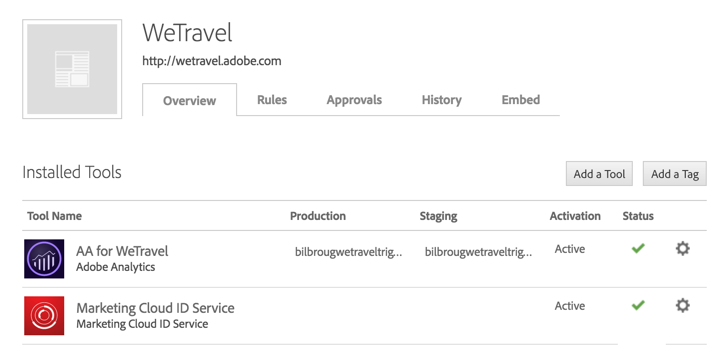
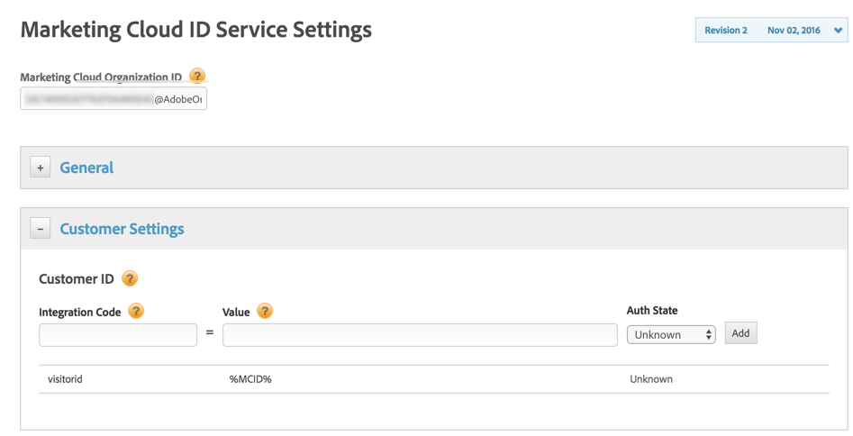

# 在 Experience Cloud 中設定觸發程式{#configuring-triggers-in-experience-cloud}

## 啟動功能 {#activating-the-functionality}

此功能必須由Adobe在Adobe Campaign中啟動。 請聯絡您的Adobe銷售代表或專業服務合作夥伴。

Adobe團隊需要下列資訊才能啟動觸發器：

* Marketing Cloud公司名稱
* IMS組織ID
* Analytics登入公司（可與Marketing Cloud公司名稱相同）

## 設定解決方案與服務 {#configuring-solutions-and-services}

若要使用此功能，您需要存取下列解決方案／核心服務：

* Adobe Campaign
* Adobe Analytics Ultimate、Premium、Foundation、OD、Select、Prime、Mobile Apps、Select或Standard。
* Experience Cloud觸發器核心服務

   

* Experience Cloud DTM核心服務

   

* Experience Cloud訪客ID和Experience Cloud人員核心服務

   

此外，您還需要有有效的網站。

>[!CAUTION]
>
>子域委派是傳遞性的關鍵要素。 請確定Adobe Campaign電子郵件是從網站使用的相同網域傳送。

您必須設定 [Experience Cloud DTM核心服務](#configuring-experience-cloud-dtm-core-service)、 [Experience Cloud People Core Service](#configuring-experience-cloud-people-core-service) 和 [Campaign](#configuring-triggers-and-aliases-in-campaign) ，才能執行這些使用案例。

### 設定Experience Cloud DTM核心服務 {#configuring-experience-cloud-dtm-core-service}

1. 在Experience Cloud DTM核心服務（動態標籤管理）中，為您的網站頁面啟用Experience Cloud ID和Adobe Analytics。

   

1. 網站、Adobe Analytics和Adobe Campaign之間的ID協調需要使用鋸齒。 例如，建立別名&quot;visitorid&quot;。

   

### 設定Experience Cloud人員核心服務 {#configuring-experience-cloud-people-core-service}

先前在DTM中參考的別名必須透過客戶屬性在Experience Cloud人員核心服務中建立。 請確定您建立新的別名，並在整合程式碼中參照相同的DTM別名（例如&quot;visitorid&quot;）。

>[!NOTE]
>
>我們將在Adobe Campaign的「資料來源」中使用此「客戶屬性」（下一步）。

### 在Campaign中設定觸發程式和別名 {#configuring-triggers-and-aliases-in-campaign}

1. 請確定您已在 **[!UICONTROL Experience Cloud triggers]** Adobe Campaign Standard例項中看到。 如果您不這麼做，請連絡Adobe Campaign管理員。

   

1. 別名可讓Analytics中的連絡人與促銷活動中的描述檔協調。 您需要將Experience Cloud ID服務中定義的別名與促銷活動中的共用資料來源相符。 您必須透過資料來源( **[!UICONTROL Administration]** > **[!UICONTROL Application Settings]** > **[!UICONTROL Shared Data Sources]** )，在Adobe Campaign中設定別名解析度。 請務必在下拉式選單中選擇正確的 **[!UICONTROL Data Source/Alias]** 資料來源，此資料來源會與先前步驟中建立的相同客戶屬性資料來源對應。

   

   >[!NOTE]
   >
   >您可以協調匿名和登入使用者的觸發程式。 對於匿名使用者，描述檔應存在於Adobe Campaign中，而且之前已傳送電子郵件給使用者。 因此，訪客ID設定就足夠了。 但是，如果要協調已登錄用戶的觸發器，則需要設定「聲明的ID資料源」。 如需詳細資訊，請參閱「資 [料來源設定」](../../integrating/using/provisioning-and-configuring-integration-with-audience-manager-or-people-core-service.md#step-2--configure-the-data-sources)。

## 在Experience Cloud介面中建立觸發器 {#creating-a-trigger-in-the-experience-cloud-interface}

您必須建立Adobe Experience Cloud觸發器，才能在Campaign中使用它。

在Experience Cloud中建立新觸發器，並確定您選取了網站上使用的報表套裝。 請確定您選擇了正確的尺寸，如此觸發器就會啟動。

請參閱 [Adobe Experience Cloud檔案](https://docs.adobe.com/content/help/en/core-services/interface/activation/triggers.html) ，觀看此 [影片](https://helpx.adobe.com/marketing-cloud/how-to/email-marketing.html#step-two)。

## 觸發最佳實務和限制 {#triggers-best-practices-and-limitations}

以下是使用「促銷活動——觸發器」整合的最佳實務和限制清單：

* 如果您有多個Campaign Standard例項，則只要所有例項位於相同的IMS組織ID，就可接收觸發器。 Analytics也必須位於相同的IMS組織ID上。
* 您無法使用來自兩個不同報表套裝的事件，在「觸發核心服務」中建立觸發器。
* 觸發器基於事務性消息。 只要您必須非常快地傳送訊息，就會使用交易式訊息。 您不能將事務性消息排入隊列，然後以批次方式循環。
* 觸發器在本質上並非決定性的。 產生觸發器時，會傳送與Cookie相關的所有別名，因此，若是共用瀏覽器(例如零售資訊站、資料庫、網路咖啡館或家中的共用裝置（夫妻從同一裝置登入），就無法對應至正確的ID。 使用瀏覽器登入的所有ID都會傳送至促銷活動，促銷活動會根據第一次的協調傳送訊息。 如果有多個「電子郵件ID」符合協調的資格，則Campaign不會傳送電子郵件。 除非Analytics擷取並傳送正確的電子郵件ID，否則Campaign無法得知該ID。
* 您無法在Campaign中儲存裝載內容。 觸發器無法用於更新描述檔資料。
* 觸發器不支援客戶屬性（亦即，只有報表套裝資料可用來定義觸發器業務規則）。
* 促銷活動不支援系列的集合。

>[!CAUTION]
>
>您的網站必須與Adobe Campaign伺服器在相同的網域上執行。 否則，您無法使用訪客ID協調並以匿名方式聯絡造訪網站的使用者。

