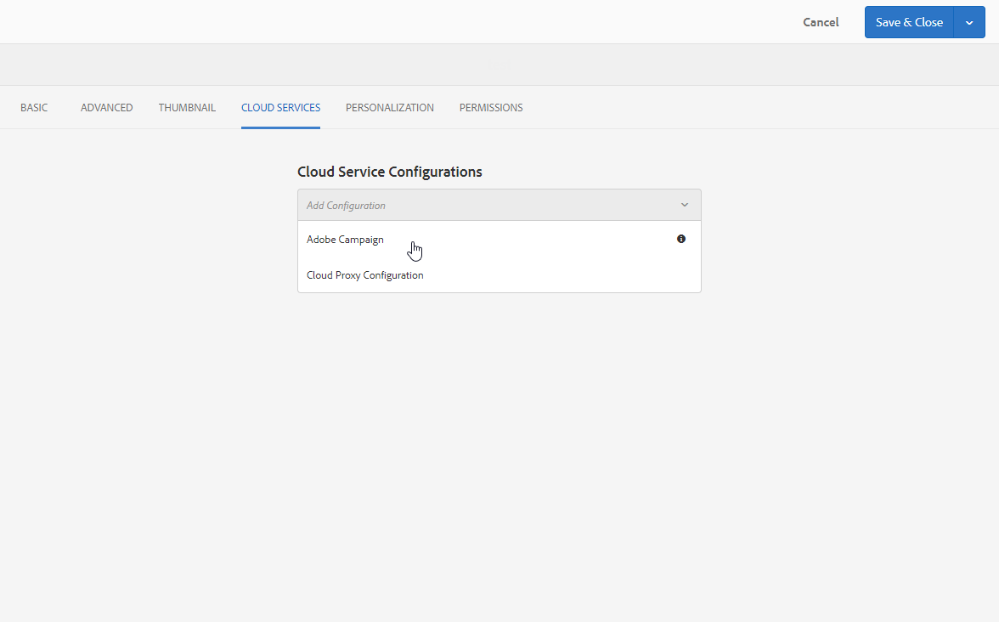

# 在 Experience Manager 中建立 Campaign 表單 {#creating-a-campaign-form-in-experience-manager}

您可以在您的AEM網站上建立「表單」，並將表單中的欄位對應至Adobe Campaign資料庫中的欄位。 這可讓您建立和更新設定檔，或管理服務的訂閱。

若要在您的AEM網站上建立Adobe Campaign表單：

1. 在您的AEM網站中，根據&#x200B;**Adobe Campaign設定檔**&#x200B;範本建立新頁面。

   

1. 在頁面屬性中，選取與您的Adobe Campaign執行個體相對應的&#x200B;**[!UICONTROL Cloud Service]**。

   

1. 從&#x200B;**[!UICONTROL Form Start]**&#x200B;元件中選取表單型別：

   * **Adobe Campaign：儲存設定檔**
   * **Adobe Campaign：訂閱服務**
   * **Adobe Campaign：取消訂閱服務**

1. 新增可對應至Adobe Campaign資料庫欄位的不同欄位和元件，以編輯表單內容。
1. 測試並發佈表單，使其可在您的AEM網站上存取。

如需詳細資訊，請參閱[詳細文件](https://experienceleague.adobe.com/docs/experience-manager-65/authoring/aem-adobe-campaign/adobe-campaign-forms.html?lang=zh-Hant)以瞭解詳情。
