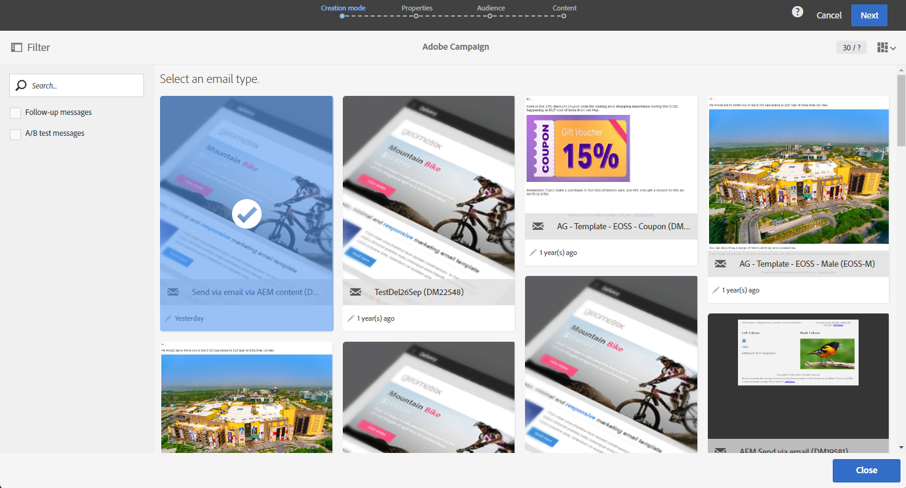

# 將Adobe Experience Manager內容匯入Adobe Campaign電子郵件 {#creating-email-aem}

使用本檔案，您將瞭解如何在Adobe Experience Manager中建立和管理電子郵件內容，然後將其匯入您的Adobe Campaign Standard中，用於行銷活動。

先決條件為：

* 存取為整合設定的AEM執行個體。
* 存取為整合設定的Adobe Campaign執行個體。
* 設定為可接收AEM內容的Adobe Campaign電子郵件範本。

## 在Adobe Experience Manager中存取電子郵件 {#email-content-aem}

登入您的Adobe Experience Manager編寫執行個體，並瀏覽您的網站以存取包含電子郵件內容的資料夾。

>[!VIDEO](https://video.tv.adobe.com/v/29996)

## 在Adobe Experience Manager中建立新的電子郵件內容 {#creating-email-content-aem}

有數個Adobe Campaign專屬的範本可供使用。 您必須使用其中一個範本，因為它們包含Adobe Campaign支援的預先定義元件。

依預設，有兩個預先定義的範本，可讓您建立Adobe Campaign的電子郵件內容。

* **[!UICONTROL Adobe Campaign Email]**：此範本包含您可以個人化的標準內容。 您可以在Adobe Campaign電子郵件(AC6.1)和Adobe Campaign電子郵件(ACS)之間選擇。
* **[!UICONTROL Importer Page]**：此範本可讓您匯入包含HTML檔案的ZIP檔案，其中包含您之後可個人化的內容。

1. 在Adobe Experience Manager中建立新的&#x200B;**[!UICONTROL Page]**。

1. 選取&#x200B;**[!UICONTROL Adobe Campaign Email]**&#x200B;範本。 如需詳細步驟，請參閱以下影片。

   >[!VIDEO](https://video.tv.adobe.com/v/29997)

1. 開啟您的新電子郵件內容。

1. 在&#x200B;**[!UICONTROL Page properties]**&#x200B;中，將&#x200B;**[!UICONTROL Adobe Campaign]**&#x200B;設為&#x200B;**[!UICONTROL Cloud Service Configuration]**。 如此一來，您的內容就能與Adobe Campaign執行個體通訊。

   如需詳細資訊，請觀看下列影片：

   >[!VIDEO](https://video.tv.adobe.com/v/29999)

## 編輯和傳送電子郵件 {#editing-email-aem}

您可以新增元件和資產來編輯電子郵件內容。 個人化欄位可用於根據Adobe Campaign中的收件者資料，傳遞更具相關性的訊息。

若要在Adobe Experience Manager中建立電子郵件內容：

1. 從Sidekick存取&#x200B;**[!UICONTROL Plain text]** > **[!UICONTROL Page properties]**&#x200B;索引標籤，以編輯您的電子郵件主旨及&#x200B;**[!UICONTROL Email]**&#x200B;版本。

1. 透過&#x200B;**[!UICONTROL Personalization fields]**&#x200B;元件新增&#x200B;**[!UICONTROL Text & Personalization]**。 每個元件都與特定的使用方式相對應：插入影像、新增個人化等。

   如需詳細資訊，請觀看下列影片：

   >[!VIDEO](https://video.tv.adobe.com/v/29998)

1. 從&#x200B;**[!UICONTROL Workflow]**&#x200B;索引標籤中，選取&#x200B;**[!UICONTROL Approve for Adobe Campaign]**&#x200B;驗證工作流程。 如果您使用Adobe Campaign中尚未核准的內容，將無法傳送電子郵件。

若要在Adobe Campaign Standard中傳送電子郵件：

1. 定義內容和傳送引數後，請根據Adobe Campaign Standard中AEM專屬的電子郵件範本建立電子郵件。

   +++ 深入瞭解AEM專屬範本。

   1. 從進階功能表，存取&#x200B;**[!UICONTROL Resources]** `>` **[!UICONTROL Templates]** `>` **[!UICONTROL Delivery templates]**。

      

   1. 複製或選取其中一個傳遞範本。

   1. 從範本的&#x200B;**[!UICONTROL Properties]**，在&#x200B;**[!UICONTROL Content]**&#x200B;下拉式清單中，選取&#x200B;**[!UICONTROL Adobe Experience Manager as Content mode]**，然後選取您的Adobe Experience Manager帳戶。

      

   +++

   

1. 填寫電子郵件的屬性，然後按一下&#x200B;**[!UICONTROL Create]**&#x200B;以選取您的AEM內容。

1. 存取&#x200B;**[!UICONTROL Content]**&#x200B;區塊。

   

1. 從&#x200B;**[!UICONTROL Use Adobe Experience Manager content]**&#x200B;功能表，按一下&#x200B;**[!UICONTROL Link AEM content]**。

   然後，選取您要在電子郵件中使用的內容。

   

1. 透過控制面板指定其他引數（例如目標對象和執行排程），進一步自訂您的電子郵件。 設定之後，您現在可以傳送電子郵件傳遞。 [了解更多](../../sending/using/confirming-the-send.md)

