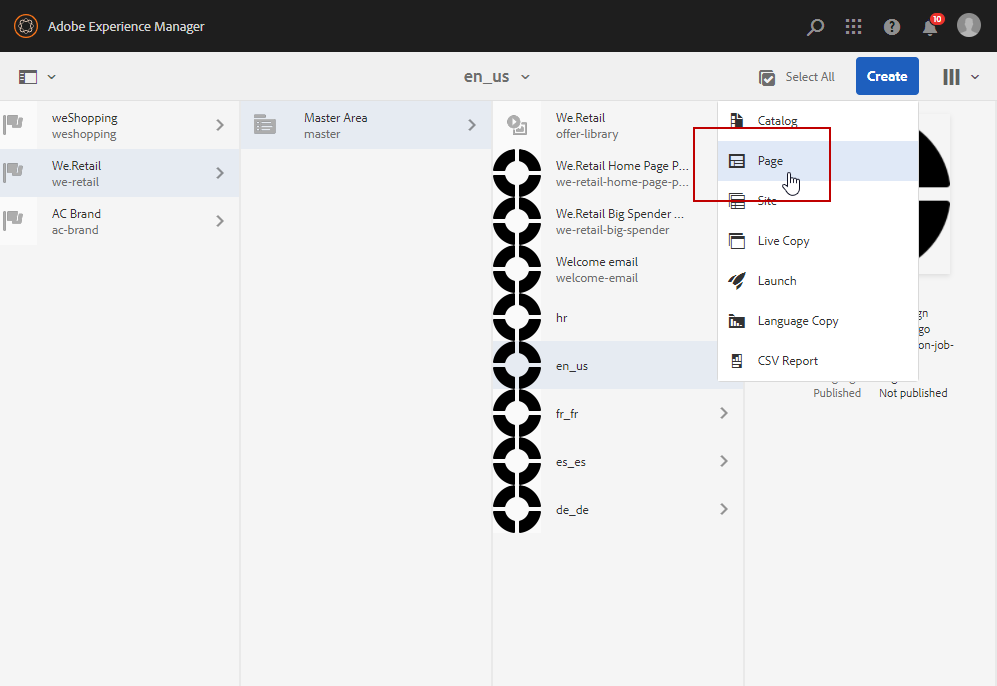
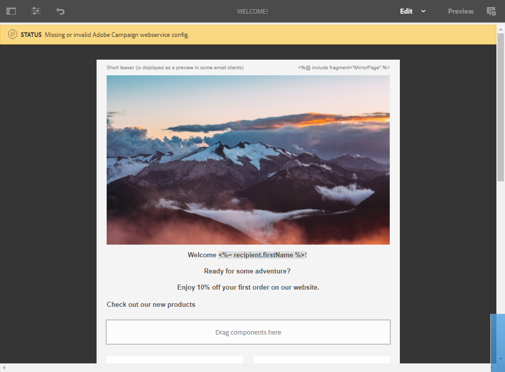
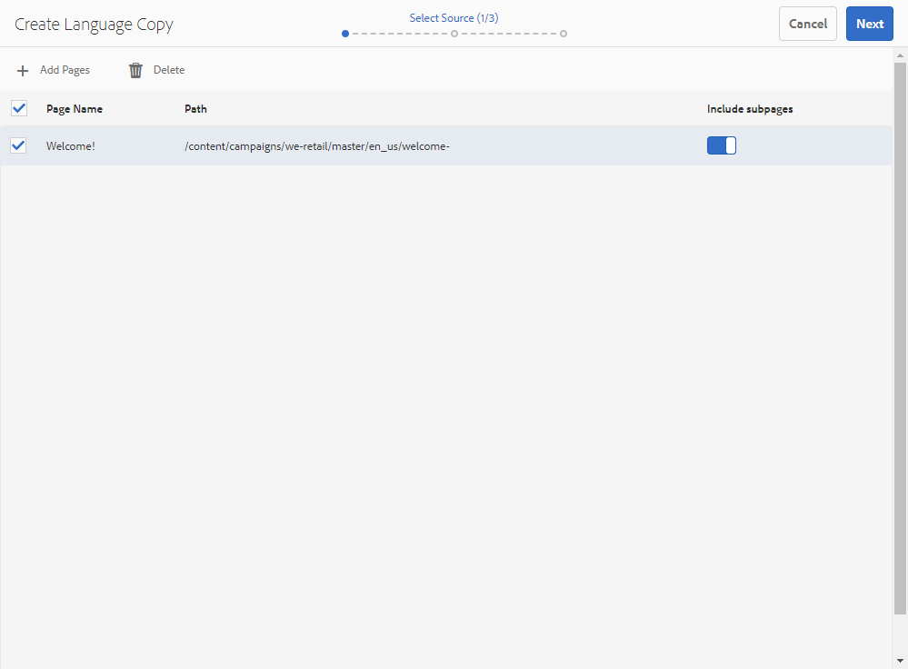

# 使用Adobe Experience Manager整合{#creating-multilingual-email-aem}建立多語言電子郵件

使用本檔案，您將瞭解如何使用Adobe Experience Manager內容和語言副本建立多語言電子郵件。

先決條件為：

* 存取為整合設定的AEM例項。
* 存取為整合設定的Adobe Campaign例項。
* Adobe Campaign多語言電子郵件範本，已設定為接收AEM內容。

## 在Adobe Experience Manager中建立新的電子郵件內容{#creating-email-content-aem}

1. 從Adobe Experience Manager首頁，選擇&#x200B;**[!UICONTROL Site]**。

   

1. 選擇要在其中建立頁面的資料夾，然後按一下&#x200B;**[!UICONTROL Create]** ，然後按一下&#x200B;**[!UICONTROL Page]**。 在這裡，我們會在en_us檔案夾中建立我們的頁面，這將是我們的預設語言。

   

1. 選擇&#x200B;**[!UICONTROL Adobe Campaign Email (ACS)]**&#x200B;模板。

1. 填寫電子郵件的屬性，然後按一下&#x200B;**[!UICONTROL Create]**。

   

1. 開啟您的新電子郵件內容，並視需要個人化。 如需關於此項目的詳細資訊，請參閱此[頁面](../../integrating/using/creating-email-experience-manager.md#editing-email-aem)。

   

1. 從&#x200B;**[!UICONTROL Workflow]**&#x200B;標籤中，選擇&#x200B;**[!UICONTROL Approve for Adobe Campaign]**&#x200B;驗證工作流。 如果Adobe Campaign使用的內容未經核准，您將無法在Adobe Campaign中傳送電子郵件。

   

1. 從&#x200B;**[!UICONTROL Complete work item]**&#x200B;視窗按一下&#x200B;**[!UICONTROL Complete]**，然後按一下&#x200B;**[!UICONTROL Newsletter review]**。

1. 按一下 **[!UICONTROL Complete]**，之後 **[!UICONTROL Newsletter approval]**。在定義內容和傳送參數後，您就可以在Adobe Campaign Standard中繼續核准、準備和傳送電子郵件。

   

## 建立語言副本{#creating-language-copies}

在設計您的電子郵件內容後，您現在需要建立語言副本，這些副本將與Adobe Campaign Standard同步為變體。

1. 選擇您先前建立的頁面，按一下&#x200B;**[!UICONTROL Create]**，然後按一下&#x200B;**[!UICONTROL Language Copy]**。

   

1. 選擇您先前建立的電子郵件內容，這些內容將以選擇的語言翻譯，然後按一下&#x200B;**[!UICONTROL Next]**。

   

1. 在&#x200B;**[!UICONTROL Target language(s)]**&#x200B;下拉式清單中，選取要翻譯內容的語言，然後按一下&#x200B;**[!UICONTROL Next]**。

   

1. 按一下 **[!UICONTROL Create]**。

您的語言副本現在已建立，您現在可以根據所選的語言來編輯內容。

>[!CAUTION]
>
>每個語言副本都需要透過&#x200B;**[!UICONTROL Approve for Adobe Campaign]**&#x200B;驗證工作流程進行核准。 如果Adobe Campaign使用的內容未經核准，您將無法在Adobe Campaign中傳送電子郵件。

## 在Adobe Campaign Standard {#multilingual-acs}中建立您的多語言內容

1. 從Adobe Campaign Standard首頁，按一下&#x200B;**[!UICONTROL Create an email]**。

   

1. 選取您的Adobe Campaign多語言電子郵件範本，此範本設定為接收Adobe Experience Manager內容。 若要進一步瞭解如何建立連結至Adobe Experience Manager例項的範本，請參閱此[頁面](../../integrating/using/configure-experience-manager.md#config-acs)。

   >[!NOTE]
   >
   >在這種情況下，您需要複製內建範本&#x200B;**[!UICONTROL Multilingual email (mailMultiLang)]**，才能傳送多語言電子郵件。

   

1. 填寫電子郵件的&#x200B;**[!UICONTROL Properties]**&#x200B;和&#x200B;**[!UICONTROL Audience]**，然後按一下&#x200B;**[!UICONTROL Create]**。

1. 在&#x200B;**[!UICONTROL Edit properties]**&#x200B;中，請確定您的Adobe Experience Manager帳戶已在&#x200B;**[!UICONTROL Content]**&#x200B;下拉式清單中正確設定。

   

1. 按一下 **[!UICONTROL Language copy creation]**。

   

1. 選取您先前建立的Adobe Experience Manager內容，然後按一下&#x200B;**[!UICONTROL Confirm]**。 此處顯示的Adobe Experience Manager內容僅是已驗證的內容，可在&#x200B;**[!UICONTROL Label]**&#x200B;和&#x200B;**[!UICONTROL Path]**&#x200B;上篩選。

   >[!NOTE]
   >
   >所選語言副本將設定為預設，您稍後可以在&#x200B;**[!UICONTROL Content variant]**&#x200B;塊中更改。

   

1. 按一下&#x200B;**[!UICONTROL Create variants]**&#x200B;連結您的多語言內容。 然後，Adobe Campaign Standard會自動將其他語言副本連結至此內容。 所建立的變數會與Adobe Experience Manager中選擇的變數具有相同的標籤和程式碼語言。

   

1. 如果需要，按一下&#x200B;**[!UICONTROL Content variant]**&#x200B;塊以更改預設變體，然後按一下&#x200B;**[!UICONTROL Confirm]**。

   

1. 如果您的內容或變體已在Adobe Experience Manager中更新，您可以直接在Adobe Campaign Standard中與&#x200B;**[!UICONTROL Refresh AEM contents]**&#x200B;按鈕同步化。

1. 您的電子郵件現在已可供傳送。 有關此問題的詳細資訊，請參閱此[頁](../../sending/using/get-started-sending-messages.md)。

您的觀眾將會收到您的電子郵件，視其&#x200B;**[!UICONTROL Profiles]**&#x200B;中設定的&#x200B;**[!UICONTROL Preferred languages]**&#x200B;而定。 若要進一步瞭解如何編輯描述檔和慣用語言，請參閱此[頁面](../../audiences/using/editing-profiles.md)。
