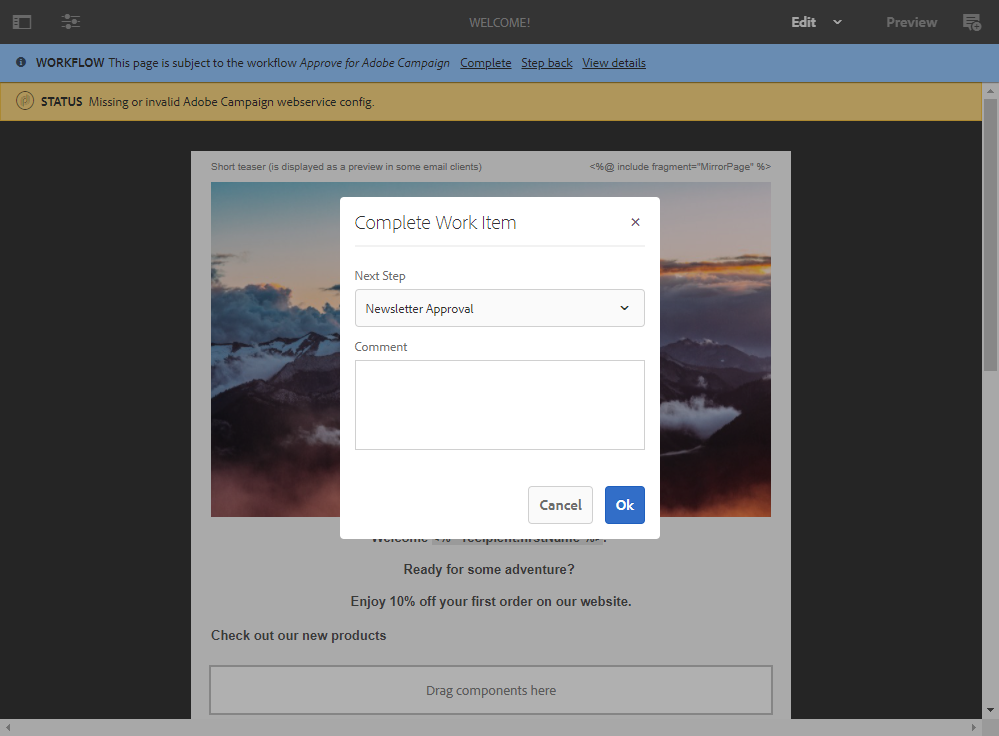

# 使用 Adobe Experience Manager 整合建立多語言電子郵件 {#creating-multilingual-email-aem}

使用本檔案，您將了解如何使用Adobe Experience Manager內容和語言副本建立多語言電子郵件。

先決條件為：

* 存取針對整合設定的AEM例項。
* 存取針對整合設定的Adobe Campaign執行個體。
* 設定為接收AEM內容的Adobe Campaign多語言電子郵件範本。

## 在Adobe Experience Manager中建立新電子郵件內容 {#creating-email-content-aem}

1. 從Adobe Experience Manager首頁，選取 **[!UICONTROL Site]**.

   

1. 選取您要建立頁面的資料夾，然後按一下 **[!UICONTROL Create]** then **[!UICONTROL Page]**. 在此，我們會在en_us資料夾中建立頁面，這將是我們的預設語言。

   

1. 選取 **[!UICONTROL Adobe Campaign Email (ACS)]** 範本。

1. 填寫電子郵件的屬性，然後按一下 **[!UICONTROL Create]**.

   

1. 開啟您的新電子郵件內容，並視需要加以個人化。 如需關於此項目的詳細資訊，請參閱此[頁面](../../integrating/using/creating-email-experience-manager.md#editing-email-aem)。

   

1. 從 **[!UICONTROL Workflow]** 頁簽，選擇 **[!UICONTROL Approve for Adobe Campaign]** 驗證工作流程。 如果Adobe Campaign使用的內容尚未核准，您將無法傳送電子郵件。

   

1. 按一下 **[!UICONTROL Complete]** then **[!UICONTROL Newsletter review]** 從 **[!UICONTROL Complete work item]** 窗口。

1. 按一下 **[!UICONTROL Complete]**，之後 **[!UICONTROL Newsletter approval]**。定義內容和傳送參數後，您就可以繼續在Adobe Campaign Standard中核准、準備和傳送電子郵件。

   

## 建立語言副本 {#creating-language-copies}

設計電子郵件內容後，您現在需要建立語言副本，這些副本會以變體形式與Adobe Campaign Standard同步。

1. 選取您先前建立的頁面，按一下 **[!UICONTROL Create]** then **[!UICONTROL Language Copy]**.

   

1. 選取您先前建立的電子郵件內容，這些內容將以選擇的語言翻譯，然後按一下 **[!UICONTROL Next]**.

   

1. 在 **[!UICONTROL Target language(s)]** 下拉式清單，選取內容要翻譯的語言，然後按一下 **[!UICONTROL Next]**.

   

1. 按一下&#x200B;**[!UICONTROL Create]**。

您的語言副本現在已建立，您現在可以根據所選的語言編輯內容。

>[!CAUTION]
>
>每個語言副本都必須透過 **[!UICONTROL Approve for Adobe Campaign]** 驗證工作流程。 如果Adobe Campaign使用的內容尚未核准，您將無法傳送電子郵件。

## 在Adobe Campaign Standard中建立您的多語言內容 {#multilingual-acs}

1. 從Adobe Campaign Standard首頁，按一下 **[!UICONTROL Create an email]**.

   

1. 選取您設定為接收Adobe Campaign內容的Adobe Experience Manager多語言電子郵件範本。 若要進一步了解如何建立連結至您的Adobe Experience Manager例項的範本，請參閱 [頁面](../../integrating/using/configure-experience-manager.md#config-acs).

   >[!NOTE]
   >
   >在此情況下，您需要複製內建範本 **[!UICONTROL Multilingual email (mailMultiLang)]** 來傳送您的多語言電子郵件。

   

1. 填入 **[!UICONTROL Properties]** 和 **[!UICONTROL Audience]** 的 **[!UICONTROL Create]**.

1. 在 **[!UICONTROL Edit properties]**，請確定您的Adobe Experience Manager帳戶已正確設定於 **[!UICONTROL Content]** 下拉式清單。

   

1. 按一下&#x200B;**[!UICONTROL Language copy creation]**。

   

1. 選取您先前建立的Adobe Experience Manager內容，然後按一下 **[!UICONTROL Confirm]**. 此處顯示的Adobe Experience Manager內容只是已驗證的內容，可依其篩選 **[!UICONTROL Label]** 和 **[!UICONTROL Path]**.

   >[!NOTE]
   >
   >選取的語言副本將設為預設，您稍後可以在 **[!UICONTROL Content variant]** 封鎖。

   

1. 按一下 **[!UICONTROL Create variants]** 連結您的多語言內容。 Adobe Campaign Standard便會自動將其他語言副本連結至此內容。 建立的變體會與Adobe Experience Manager中選擇的變體具有相同的標籤和程式碼語言。

   

1. 按一下 **[!UICONTROL Content variant]** 如有需要，封鎖以變更預設變體，然後按一下 **[!UICONTROL Confirm]**.

   

1. 如果您的內容或變體已在Adobe Experience Manager中更新，則可以在Adobe Campaign Standard中直接與 **[!UICONTROL Refresh AEM contents]** 按鈕。

1. 您的電子郵件現在已可供傳送。 有關詳細資訊，請參閱 [頁面](../../sending/using/get-started-sending-messages.md).

   >[!NOTE]
   >
   >如果Adobe Campaign使用尚未核准的AEM內容，便無法傳送電子郵件。

您的對象會收到您的電子郵件，具體取決於 **[!UICONTROL Preferred languages]** 設定 **[!UICONTROL Profiles]**. 若要進一步了解如何編輯設定檔和慣用語言，請參閱 [頁面](../../audiences/using/editing-profiles.md).
