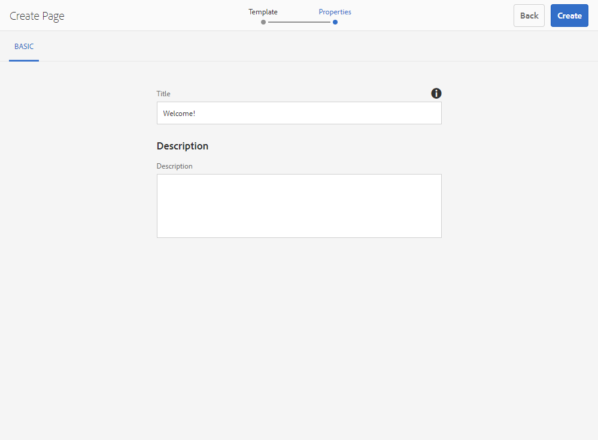
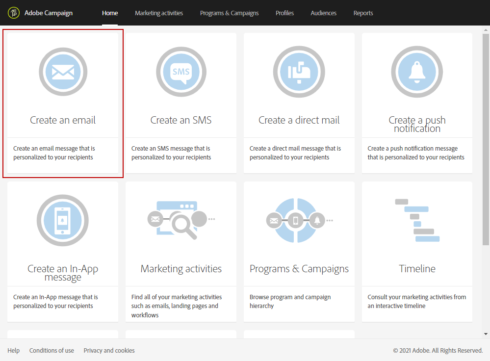

# 使用 Adobe Experience Manager 整合建立多語言電子郵件 {#creating-multilingual-email-aem}

透過此檔案，您將瞭解如何使用Adobe Experience Manager內容和語言副本建立多語言電子郵件。

先決條件為：

* 存取為整合設定的AEM執行個體。
* 存取為整合設定的Adobe Campaign執行個體。
* 設定為可接收AEM內容的Adobe Campaign多語言電子郵件範本。

## 在Adobe Experience Manager中建立新的電子郵件內容 {#creating-email-content-aem}

1. 在Adobe Experience Manager首頁中，選取 **[!UICONTROL Site]**.

   

1. 選取您要建立頁面的資料夾，然後按一下 **[!UICONTROL Create]** 則 **[!UICONTROL Page]**. 在此，我們在en_us資料夾中建立頁面，此資料夾將是我們的預設語言。

   

1. 選取 **[!UICONTROL Adobe Campaign Email (ACS)]** 範本。

1. 填寫電子郵件的屬性並按一下 **[!UICONTROL Create]**.

   

1. 開啟您的新電子郵件內容，並視需要加以個人化。 如需關於此項目的詳細資訊，請參閱此[頁面](../../integrating/using/creating-email-experience-manager.md#editing-email-aem)。

   

1. 從 **[!UICONTROL Workflow]** 索引標籤中，選取 **[!UICONTROL Approve for Adobe Campaign]** 驗證工作流程。 如果您使用Adobe Campaign中尚未核准的內容，將無法傳送電子郵件。

   

1. 按一下 **[!UICONTROL Complete]** 則 **[!UICONTROL Newsletter review]** 從 **[!UICONTROL Complete work item]** 視窗。

1. 按一下 **[!UICONTROL Complete]** 則 **[!UICONTROL Newsletter approval]**. 定義內容和傳送引數後，您可以在Adobe Campaign Standard中繼續核准、準備和傳送電子郵件。

   

## 建立語言副本 {#creating-language-copies}

設計電子郵件內容後，您現在需要建立語言副本，並以變體形式與Adobe Campaign Standard同步。

1. 選取您先前建立的頁面，按一下 **[!UICONTROL Create]** 則 **[!UICONTROL Language Copy]**.

   

1. 選取您先前建立的電子郵件內容（將翻譯成所選語言），然後按一下 **[!UICONTROL Next]**.

   

1. 在 **[!UICONTROL Target language(s)]** 下拉式清單，選取將翻譯內容的語言，然後按一下 **[!UICONTROL Next]**.

   

1. 按一下&#x200B;**[!UICONTROL Create]**。

您的語言副本現已建立，您現在可以根據所選的語言編輯內容。

>[!CAUTION]
>
>每個語言副本都必須透過 **[!UICONTROL Approve for Adobe Campaign]** 驗證工作流程。 如果您使用Adobe Campaign中尚未核准的內容，將無法傳送電子郵件。

## 在Adobe Campaign Standard中建立您的多語言內容 {#multilingual-acs}

1. 從Adobe Campaign Standard首頁，按一下 **[!UICONTROL Create an email]**.

   

1. 選取您設定為接收Adobe Experience Manager內容的Adobe Campaign多語言電子郵件範本。 要瞭解有關如何建立連結至Adobe Experience Manager執行個體的範本的詳細資訊，請參閱本 [頁面](../../integrating/using/configure-experience-manager.md#config-acs).

   >[!NOTE]
   >
   >在此情況下，您將需要複製內建範本 **[!UICONTROL Multilingual email (mailMultiLang)]** 以傳送您的多語言電子郵件。

   

1. 填入 **[!UICONTROL Properties]** 和 **[!UICONTROL Audience]** ，然後按一下 **[!UICONTROL Create]**.

1. 在 **[!UICONTROL Edit properties]**，請確認您的Adobe Experience Manager帳戶已正確設定於 **[!UICONTROL Content]** 下拉式清單。

   

1. 按一下&#x200B;**[!UICONTROL Language copy creation]**。

   

1. 選取您先前建立的Adobe Experience Manager內容，然後按一下 **[!UICONTROL Confirm]**. 此處顯示的Adobe Experience Manager內容僅為已驗證的內容，您可以依其進行篩選 **[!UICONTROL Label]** 和 **[!UICONTROL Path]**.

   >[!NOTE]
   >
   >所選的語言副本將設定為預設，您稍後可以在 **[!UICONTROL Content variant]** 區塊。

   

1. 按一下 **[!UICONTROL Create variants]** 以連結您的多語言內容。 Adobe Campaign Standard會自動將其他語言副本連結至此內容。 建立的變體將與Adobe Experience Manager中選擇的變體具有相同的標籤和程式碼語言。

   

1. 按一下 **[!UICONTROL Content variant]** 封鎖以視需要變更您的預設變體，然後按一下 **[!UICONTROL Confirm]**.

   

1. 如果您的內容或變體在Adobe Experience Manager中更新，則可以直接在Adobe Campaign Standard中將其與同步 **[!UICONTROL Refresh AEM contents]** 按鈕。

1. 您的電子郵件現在已可供傳送。 如需詳細資訊，請參閱此 [頁面](../../sending/using/get-started-sending-messages.md).

   >[!NOTE]
   >
   >如果電子郵件使用Adobe Campaign中尚未核准的AEM內容，您將無法在AEM中傳送電子郵件。

您的對象會根據 **[!UICONTROL Preferred languages]** 設定於其 **[!UICONTROL Profiles]**. 要瞭解有關如何編輯設定檔和偏好語言的詳細資訊，請參閱此 [頁面](../../audiences/using/editing-profiles.md).
