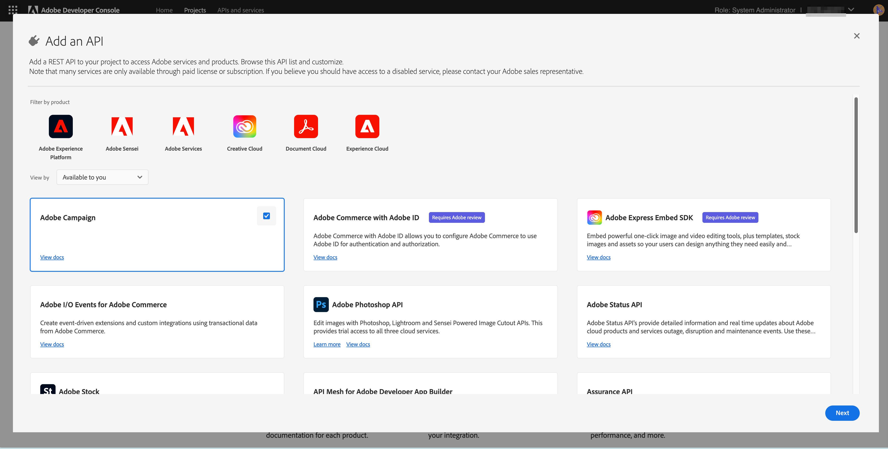

# Microsoft Dynamics 365整合的Adobe Campaign Standard和Adobe I/O設定

本文將說明如何設定Adobe Campaign Standard和Adobe I/O，讓整合應用程式存取資料。

## 設定Adobe Campaign Standard {#campaign-standard}

### 描述檔擴充功能

請在Adobe Campaign Standard中啟用「設定檔擴充功能」。   這是必要的，以便從Microsoft Dynamics 365同步描述檔資源中的自訂欄位。   啟用這些功能的步驟包括：

1. 前往「設定」->「管理」->「開發」->「發佈」。
1. 按一下「準備出版物」以準備出版物。
1. 準備完成後，請勾選「建立描述檔與服務Ext API」，然後按一下「發佈」。

## 設定 Adobe I/O {#adobe-io}

Adobe I/O可讓您啟用Adobe Campaign Standard和其他Adobe產品的API存取權。   本文將詳細說明如何設定Adobe I/O，以便讓Adobe Campaign Standard與Microsoft Dynamics 365整合，以同步化資料。

### 概觀

在本文中執行預先整合設定之前，我們假定您已布建，並擁有組織「促銷活動標準」例項的管理員存取權。  如果未發生此情況，則您需要聯絡Adobe客戶服務以完成促銷活動布建。

>[!CAUTION]
>
>管理員需要執行下列步驟。

### 配置

您需要建立新的Adobe IO專案，並加以設定以進行整合。

#### 建立新專案

若要達成此目的，請依照下列程式：

1. 導覽至[Adobe IO Console](https://console.adobe.io/home#)，然後從畫面右上角的下拉式選單中選取您的Adobe IMS組織ID。

1. 然後按一下&#x200B;**[!UICONTROL Quick Start]**&#x200B;下方的&#x200B;**[!UICONTROL Create new project]**。

   

1. 在&#x200B;**[!UICONTROL Get started with your new project]**&#x200B;下，按一下&#x200B;**[!UICONTROL Add API]**。

   

1. 選取Adobe Campaign API（您可能需要向下捲動），然後按一下&#x200B;**[!UICONTROL Next]**。

   

1. 在下一個畫面中，您可以選擇上傳您自己的公開金鑰，或讓Adobe IO為您產生金鑰對。 這些指示將遵循後一個選項。 如果您決定讓Adobe IO產生金鑰對，請按一下選項1;然後按一下&#x200B;**[!UICONTROL Generate keypair]**&#x200B;按鈕。

   

1. 在下一個畫面中，系統會提示您命名並選取金鑰對zip檔案的下載位置。

下載後，您就可以解壓縮檔案，以顯示公開和私密金鑰。 Adobe IO已將公開金鑰套用至您的Adobe IO專案。 您以後需要保留您的私密金鑰；在整合工具的預先整合設定期間，將會使用私密金鑰。

1. 按一下&#x200B;**[!UICONTROL Next]**&#x200B;繼續

   

1. 在下一個畫面中，您將選取要與此專案關聯的產品設定檔。 選取標題中包含的產品設定檔：促銷活動例項的租用戶ID - [!UICONTROL Administrators]

   範例：Campaign Standard - your-campaign-tenantID —— 管理員

1. 按一下 **[!UICONTROL Save configured API]**。

   

1. 在下一個畫面中，您會看到新Adobe IO專案的詳細資訊。 按一下畫面左上角的&#x200B;**[!UICONTROL Add to Project]**，然後從下拉式清單中選取&#x200B;**API**。

   

1. 在下一個畫面中，您需要選擇I/O事件API，然後按一下&#x200B;**[!UICONTROL Next]**。

1. 在下一個畫面上按一下&#x200B;**[!UICONTROL Save the configured API]**。  您將會回到專案詳細資訊畫面。

1. 現在按一下畫面左上角的&#x200B;**[!UICONTROL Add to Project]**，然後從下拉式清單中選取&#x200B;**API**，就像您先前所做的一樣。

1. 在下一個螢幕上，您需要選擇I/O管理API並按一下&#x200B;**[!UICONTROL Next]**。

1. 在下一個畫面上按一下&#x200B;**[!UICONTROL Save the configured API]**。

促銷活動中的預先整合設定現在已完成。

**相關主題**

* [設定Adobe IO for Microsoft Dynamics 365整](../../integrating/using/d365-acs-configure-adobe-io.md) 合是設定整合的下一步
* [整合自助服務應用](../../integrating/using/d365-acs-self-service-app-quick-start-guide.md) 程式概觀包含完整的步驟清單，讓您啟動並執行整合。

* [Adobe IO —— 服務帳戶整合](https://www.adobe.io/authentication/auth-methods.html#!AdobeDocs/adobeio-auth/master/AuthenticationOverview/ServiceAccountIntegration.md)
* [促銷活動標準- API存取設定](../../api/using/setting-up-api-access.md)
* [Campaign Standard - Dynamics 365整合](../../integrating/using/d365-acs-configure-d365.md)
