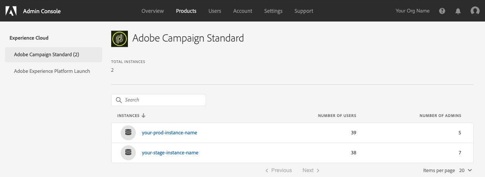

# 存取與Microsoft Dynamics 365自助服務應用程式整合的Adobe Campaign Standard

此設定將要求您為組織與Experience Cloud(EC)管理員合作。 這些是提供您存取自助服務整合應用程式介面的初始步驟。 在您存取該工具後，您將設定資料連線，並設定Adobe Campaign和Microsoft Dynamics 365之間的資料流程。

>[!NOTE]
>
>您必須聯絡您的Adobe代表，並提供Adobe Campaign Standard組織和例項名稱。 系統會記錄票證，以要求為您的組織啟用整合應用程式。

## 新增產品設定檔

在本節中，您將學習如何授與Microsoft Dynamics 365自助服務應用程式的Adobe Campaign Standard整合存取權。 在Adobe Experience Cloud中可存取您組織的使用者將無法存取整合自助服務應用程式，除非您依照下列步驟授與他們存取權。

>[!IMPORTANT]
>
> 這些步驟需要您組織的Experience Cloud中的&#x200B;**管理員**&#x200B;角色。

1. 瀏覽至https://experience.adobe.com/並登入Adobe Experience Cloud。
1. 訪問&#x200B;**管理控制台**。

   

1. 按一下&#x200B;**[!UICONTROL Products]**&#x200B;以存取您的Experience Cloud解決方案。

   

   >[!IMPORTANT]
   >
   >本節中的其餘步驟將針對您的每個促銷活動例項（開發、文字、生產）執行。

1. 按一下要設定的第一個例項。

   

   例項頁面應如下所示：

   

1. 按一下&#x200B;**[!UICONTROL New Profile]**&#x200B;按鈕並添加一個名為：**Campaign Standard - your-prod-instance-name - D365/ACS Integration**

   * 如果您在清單中看到此項目，則不需要繼續。 按一下左側功能表中的&#x200B;**Adobe Campaign Standard**，並檢查其他促銷活動例項。

   * 請務必將「your-prod-instance-name」取代為實例的實際名稱。

1. 您可以保留&#x200B;**[!UICONTROL Permission Group]**&#x200B;下拉式清單中的預設值。

1. 如果您的項目看起來類似下列，請按一下&#x200B;**[!UICONTROL Done]**&#x200B;按鈕。

   

   已新增產品設定檔。

   

## 授予用戶{#add-users-to-profile}訪問權限

從&#x200B;**[!UICONTROL Products]**&#x200B;頁面中，選取您的促銷活動例項，並遵循下列步驟：

1. 按一下您先前建立的新描述檔： **Campaign Standard - your-prod-instance-name - D365/ACS Integration**

   

1. 按一下&#x200B;**[!UICONTROL Developers]**&#x200B;頁籤。

   

1. 按一下&#x200B;**[!UICONTROL Add Developer]**&#x200B;按鈕

1. 輸入您要新增之使用者的名稱或電子郵件地址。  選擇與用戶匹配的結果。

   如果這是用戶首次被添加到組織中，請輸入詳細資訊。

1. 按一下&#x200B;**[!UICONTROL Save]**&#x200B;進行確認。
