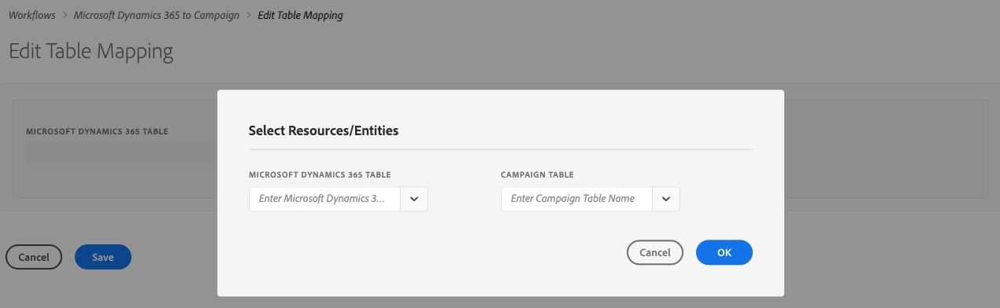

# 同步資料

您可以將Microsoft Dynamics 365中的表格同步到Microsoft Dynamics 365的「促銷活動」和「促銷活動」行銷量度到Microsoft Dynamics 365。 同步通過三個專用的技術工作流程執行：**[!UICONTROL Microsoft Dynamics 365 to Campaign]**、**[!UICONTROL Campaign to Microsoft Dynamics 365]**、**[!UICONTROL Opt-In/Out]**。 請參閱本節至[瞭解詳細內容](../../integrating/using/d365-acs-self-service-app-workflows.md)。

>[!IMPORTANT]
>您必須停止／啟動&#x200B;**[!UICONTROL Microsoft Dynamics 365 to Campaign]**&#x200B;工作流程，才能將您的變更納入考量。 [進一步瞭解](../../integrating/using/d365-acs-self-service-app-workflows.md)

## 將表格從Microsoft Dynamics 365對應至Campaign

**[!UICONTROL Microsoft Dynamics 365 to Campaign]**&#x200B;頁面顯示Microsoft Dynamics 365中的實體清單，以及將與之同步的Adobe Campaign中的自訂資源。 您可以新增映射、編輯或刪除現有映射。

下表說明此表中的各列：

* **[!UICONTROL MICROSOFT DYNAMICS 365 TABLE]**:此欄會識別Microsoft Dynamics 365中的哪個實體將是映射的資料來源。

* **[!UICONTROL CAMPAIGN TABLE]**:此欄會識別Adobe Campaign中哪些資源將是對應資料的目的地。

* **[!UICONTROL ACTIONS]**:可能的動作列於下方：

   * 按一下&#x200B;**[!UICONTROL Edit]**&#x200B;表徵圖可編輯此映射。

   * 使用&#x200B;**[!UICONTROL Delete]**&#x200B;表徵圖刪除表映射。

   * 按一下&#x200B;**[!UICONTROL Replay Data]**&#x200B;圖示，重新同步Microsoft Dynamics 365表格中的所有資料。 通常，整合應用程式只會同步Microsoft Dynamics 365中最近變更的資料。  但是，在某些情況下（例如，您做了變更或犯了錯誤），您可能會希望所有資料重新同步。  在這些情況下，您可以按一下此按鈕，下次停止／啟動&#x200B;**[!UICONTROL Microsoft Dynamics 365 to Campaign]**&#x200B;工作流時，您的資料將開始同步。

      如果按一下&#x200B;**[!UICONTROL Replay Data]**&#x200B;按鈕並且檢查成功，則表徵圖將被禁用：它表示此表映射對的資料將與&#x200B;**[!UICONTROL Microsoft Dynamics 365 to Campaign]**&#x200B;工作流的下次執行重新同步。

      當以下條件成立時，您無法選擇重放資料：

      * 如果「積壓」量度中有2,000,000（或更多）項目與&#x200B;**[!UICONTROL Microsoft Dynamics 365 to Campaign]**&#x200B;工作流程相關（顯示在&#x200B;**[!UICONTROL Workflows]**&#x200B;頁面中）
      * 如果Microsoft Dynamics 365表中有2,000,000個或更多記錄

      需要重新同步的記錄數量會有所不同。 如果您有大量記錄，完成同步過程可能需要一些時間。 當整合應用程式運作以完成同步程式時，請參閱&#x200B;**[!UICONTROL Workflows]**&#x200B;頁面中的&#x200B;**[!UICONTROL Backlog]**&#x200B;量度。

      >[!IMPORTANT]
      >
      > 強烈建議您在發佈Adobe Campaign Standard或Microsoft Dynamics 365的變更時，停止整合工作流程。 適用的變更包括：資源／實體（及其關聯欄位）、連結、識別碼欄等的更新。 目前正由整合使用中。

## 建立新映射{#add-a-new-mapping}

要建立新映射，請遵循以下步驟：

1. 在&#x200B;**[!UICONTROL Microsoft Dynamics 365 to Campaign]**&#x200B;頁面中，按一下&#x200B;**[!UICONTROL Add New Mapping]**&#x200B;按鈕。

1. 使用下拉式清單來選擇要對應的Microsoft Dynamics 365和Campaign表格。
頁面上的大部分其他輸入都將視您選擇的表格而定。

   

   >[!NOTE]
   >不能多次映射每個表。 因此，您會注意到下拉式選擇將不包含已映射的表。

1. 按一下&#x200B;**[!UICONTROL OK]**&#x200B;確認：應用程式需要短暫的時間才能讀取與所選表格相關的欄位資訊。

然後，可以繼續映射配置。 [進一步瞭解](#new-mapping-settings)

>[!IMPORTANT]
>
>只有在首次添加映射時，才能選擇此頁中的表。 在按一下&#x200B;**[!UICONTROL Save]**&#x200B;按鈕之前，請確保已選擇了正確的表：保存後，表選擇欄位將為&#x200B;**只讀**。

### 編輯現有映射

如果您編輯現有的映射，則會看到表選擇不可編輯。

這是依設計而定，因為頁面中的進一步輸入是以這些表格相關的欄位為基礎。 更改表會使與這些表關聯的所有欄位都無效。  如果要將表更改為映射，則需要返回上一頁、刪除要更改的映射，並添加新映射。

### 配置單個表映射{#new-mapping-settings}

在本節中，您將學習如何設定一個Microsoft Dynamics 365表格與一個Adobe Campaign表格的&#x200B;**single**&#x200B;對應。

您可以定義下列設定：

* **[!UICONTROL Tables]**:本節列出Microsoft Dynamics 365表格的名稱，以及要映射該表格的促銷活動表格。
* **[!UICONTROL Field Mappings]**:在本節中進 [一步瞭解](#field-mappings)
* **[!UICONTROL Field Replacements]**:在本節中進 [一步瞭解](#field-replacements)
* **[!UICONTROL Filters]**:在本節中進 [一步瞭解](#filters)
* **[!UICONTROL Advanced Settings]**:在本節中進 [一步瞭解](#advanced-settings)

### 欄位映射{#field-mappings}

#### 主鍵

將新的Microsoft Dynamics 365新增至「促銷活動」表格對應時，您需要識別ID欄位。

Microsoft Dynamics 365主鍵是唯讀的，因為應用程式會偵測到它。

對於促銷活動，您需要選擇將是唯一關鍵字的欄位。 它必須配置為[CRM ID自訂資源](../../developing/using/uc-calling-resource-id-key.md)，且不得有重複項。

>[!NOTE]
>
>只有在選擇&#x200B;**[!UICONTROL Add New Mapping]**&#x200B;後，才能選擇表中的ID欄位。 如果按一下編輯按鈕編輯現有表映射，則ID欄位將為只讀欄位。

主鍵始終是&#x200B;**[!UICONTROL Field Mappings]**&#x200B;部分中列出的第一個欄位名。 提醒您，右側會列出下列圖示，提醒您這些是主要按鍵。

#### 新增其他欄位對應

**[!UICONTROL Field Mappings]**&#x200B;部分允許您添加除主鍵之外的欄位映射。 若要新增欄位從Microsoft Dynamics 365到Adobe Campaign的對應，請按一下&#x200B;**[!UICONTROL Add new field mapping]**&#x200B;按鈕。

在清單中選取「Microsoft Dynamics 365」和「促銷活動」欄位：

這些清單包含與您在頁面頂端選取的Microsoft Dynamics 365和促銷活動表格相關聯的欄位名稱。

**[!UICONTROL Apply updates]**&#x200B;切換器可讓您控制此欄位的更新是否會從Microsoft Dynamics 365傳播至Campaign:
* 如果它已開啟，則更新時，Microsoft Dynamics 365中值的更新會傳播至Adobe Campaign。

* 如果您關閉，則值將在最初載入（或重新播放）資料時傳播，但Microsoft Dynamics 365中欄位的增量更新將不傳播。

>[!NOTE]
>
>按一下&#x200B;**[!UICONTROL Apply updates]**&#x200B;列標題，將&#x200B;**所有**&#x200B;的交換機更新為開啟或關閉。

當您選取欄位值時，您會看到下拉式選單下方顯示的資料類型。   在將值從一個欄位對應至另一個欄位時，請記住這一點。

>[!NOTE]
>
> 您無法將多個Microsoft Dynamics 365欄位對應至單一促銷活動欄位。

### 現場更換{#field-replacements}

使用&#x200B;**[!UICONTROL Add New Field Replacement]**&#x200B;按鈕定義新的欄位取代。

現場更換可讓您識別：

* a Microsoft Dynamics 365欄位名稱（已在欄位對應區段中新增）,
* 現有值（存在於Microsoft Dynamics 365中），以及
* 寫入Adobe Campaign的新值

將提供picklist、enumeration和boolean值的下拉式清單。 文本框將用於其他字串和數字類型。

### 篩選器{#filters}

使用&#x200B;**[!UICONTROL Add New Filter]**&#x200B;按鈕來選擇將哪些Microsoft Dynamics 365記錄傳播至促銷活動。 您可以選擇與記錄關聯的任何欄位以添加到篩選器（無需將欄位名添加到欄位映射）。

您可以填寫下列資訊來指定篩選：

* Microsoft Dynamics 365欄位名稱
* 比較值，以及
* a值（來自Microsoft Dynamics 365）
如果指定記錄的欄位名稱、比較和值評估為true，則記錄將傳播至Adobe Campaign。

您可以設定標示為&#x200B;**[!UICONTROL Choose the filter comparison operator]**&#x200B;的輸入，來選擇如何評估這些篩選。  如果您選擇&#x200B;**And**，則記錄要傳播至促銷活動，所有篩選條件都必須為true。 如果您選擇&#x200B;**Or**，如果其中任何記錄評估為true，則會傳播記錄。

選項&#x200B;**[!UICONTROL Do you want to delete records in Adobe Campaign Standard that will be filtered out from Microsoft Dynamics 365?]**&#x200B;會控制您是否要將篩選出的記錄從促銷活動中刪除。 如果您選取&#x200B;**否**，則記錄將保留在Adobe Campaign中。 選擇&#x200B;**是**，讓整合邏輯刪除它們。

>[!NOTE]
>
> 如果未新增任何篩選器，所有已修改的記錄都將傳播至Adobe Campaign。

### 進階設定{#advanced-settings}

在配置映射時，可以設定以下附加選項：

* 如果您想要將Microsoft Dynamics 365中發生的刪除部分傳播到Adobe Campaign中的對應欄位（根據欄位名稱對應），請將&#x200B;**[!UICONTROL Apply deletes in Microsoft Dynamics 365 to Campaign?]**&#x200B;選項設為&#x200B;**Yes**。 選擇&#x200B;**否**&#x200B;以忽略Microsoft Dynamics 365中的刪除。

* 如果要將與Microsoft Dynamics 365選取清單關聯的顯示值傳播至「促銷活動」，請將&#x200B;**[!UICONTROL Use technical values in Microsoft Dynamics 365 picklists?]**&#x200B;選項設為&#x200B;**No**。 選擇&#x200B;**是**&#x200B;傳播技術值。

## 將促銷活動行銷事件同步至Microsoft Dynamics 365

**[!UICONTROL Campaign to Microsoft Dynamics 365]**&#x200B;頁面可讓您識別哪些電子郵件行銷事件將從Adobe Campaign對應至Microsoft Dynamics 365。

您可以控制的4個度量為：**Sends**、**Clicks**、**Opens**&#x200B;和&#x200B;**Bounces**。

選擇&#x200B;**是**&#x200B;以確認您確實希望該類型的事件流到Microsoft Dynamics 365。

按一下[此處](../../integrating/using/d365-acs-self-service-app-workflows.md)以瞭解有關這些電子郵件事件流的詳細資訊。

## 選擇加入／退出工作流程{#opt-in-out-wf}

**選擇加入／退出**&#x200B;工作流程可讓您識別Microsoft Dynamics 365與Adobe Campaign之間選擇加入／退出資訊的流程。 這會假設資料與Microsoft Dynamics 365實體「連絡人」和Adobe Campaign資源「設定檔」相關聯。

進一步瞭解[本節](../../integrating/using/d365-acs-notices-and-recommendations.md#opt-out)中的退出管理。

請記住，您必須按一下「儲存」以儲存您的選擇。 另請記住，您必須停止「**促銷活動至Microsoft Dynamics 365**」工作流程，然後按一下「播放」進行整合，以合併您的變更。

### 選擇加入／退出同步方向

以下是同步資料的可用選項清單：

* **[!UICONTROL Disabled]**:選取此選項時，Adobe Campaign和Microsoft Dynamics 365之間不會移動任何選擇加入／退出資訊。

* **[!UICONTROL Unidirectional (Microsoft Dynamics 365 to Campaign)]**:此選項僅用於將選擇加入／退出從Microsoft Dynamics 365流入Adobe Campaign。整合應用程式不會讓您在此畫面中設定流程；請改為按一下&#x200B;**[!UICONTROL Save button]**，然後導覽至&#x200B;**[!UICONTROL Microsoft Dynamics 365 to Campaign]**&#x200B;工作流程。 在此工作流中，您可以編輯聯繫人／配置檔案表映射，以確定您希望選擇加入／退出欄位的映射方式。

* **[!UICONTROL Unidirectional (Campaign to Microsoft Dynamics 365)]**:此選項將使映射節 **** 可見。這些輸入可讓您定義哪些Adobe Campaign欄位將資料對應至Microsoft Dynamics 365中的欄位。 這表示如果您碰巧在Microsoft Dynamics 365中手動更新值，則Adobe Campaign值若有變更，將會覆寫其值。

* **[!UICONTROL Bidirectional]**:此選項將使映射節 **** 可見。這些配對將識別Microsoft Dynamics 365和Adobe Campaign中哪些欄位將彼此對應。 [進一步瞭解](../../integrating/using/d365-acs-notices-and-recommendations.md)。

### 映射

此部分僅在「選擇加入／退出」同步方向欄位設定為&#x200B;**[!UICONTROL Unidirectional (Campaign to Microsoft Dynamics 365)]**&#x200B;或&#x200B;**[!UICONTROL Bidirectional]**&#x200B;時適用。 您可以定義Microsoft Dynamics 365中哪些欄位對應至Adobe Campaign中的哪些輸入。

Microsoft Dynamics 365欄位名稱包含所有類型為&#x200B;**boolean**&#x200B;的欄位名稱。

Adobe Campaign欄位名稱是一組固定值，專用於選擇加入／退出。 Adobe Campaign欄位名稱是一組固定值，專用於選擇加入／退出。 **此清單中的值集無法變更**。
